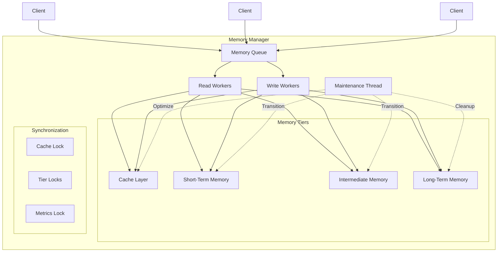
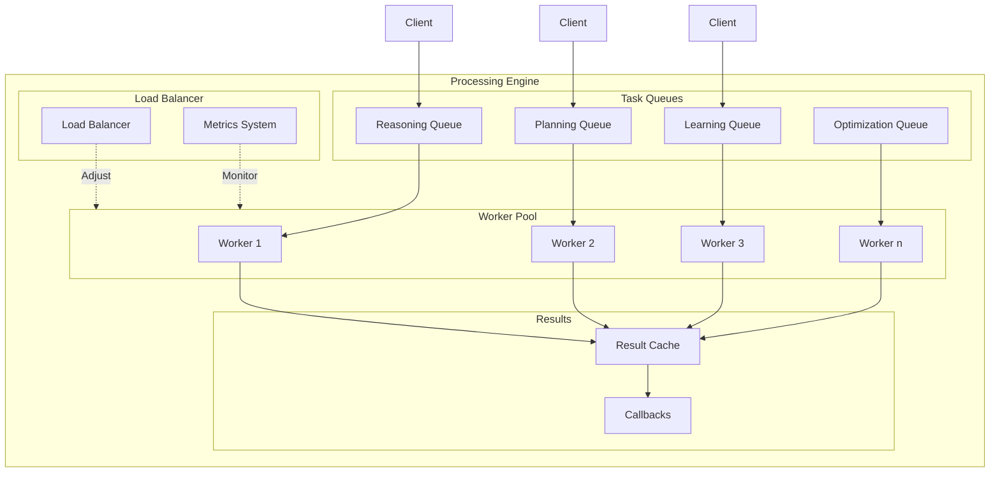
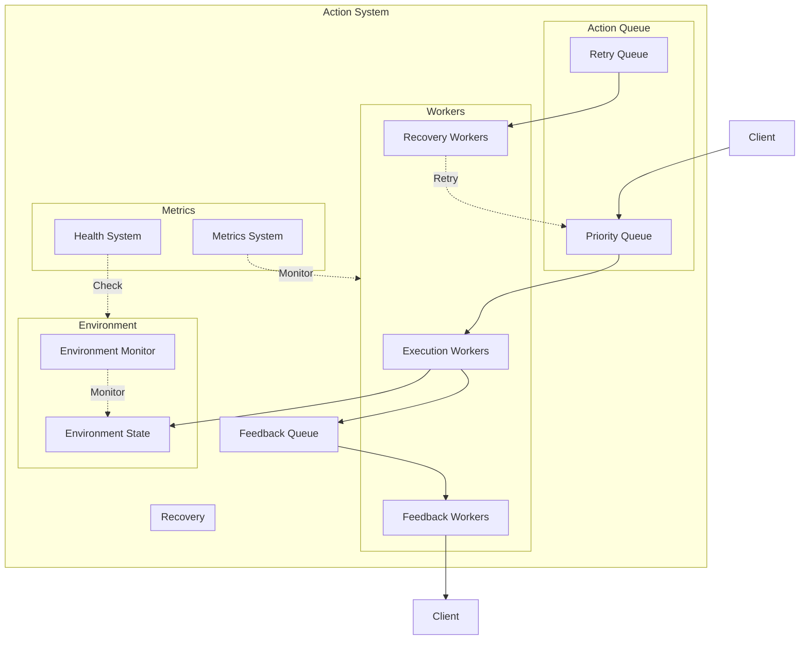
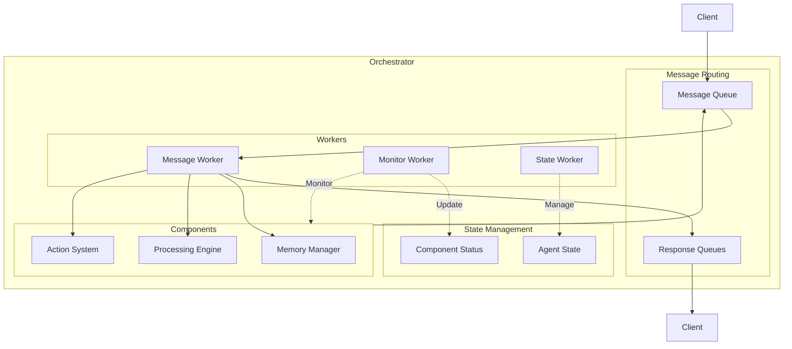
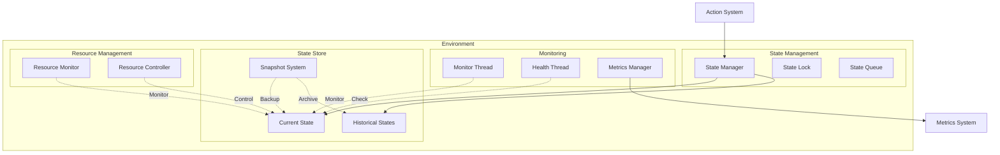

# Multi-Threaded Agent Architecture

## Overview

This document outlines a comprehensive approach to implementing an efficient multi-threaded architecture for agents with memory, processing, and action components. The architecture is designed to work optimally with the four-tier memory system while maintaining the intended complexity and functionality.

## Architecture Diagram


## Component Breakdown

### 1. Memory Manager Thread Pool

#### Architecture Diagram



#### Implementation Example

```python
from dataclasses import dataclass
from enum import Enum
from typing import Any, Dict, List, Optional, Union
import threading
import time
import redis
import sqlite3
from queue import Queue, PriorityQueue

class MemoryTier(Enum):
    CACHE = 0
    STM = 1
    IM = 2
    LTM = 3

@dataclass
class MemoryConfig:
    cache_size: int
    stm_ttl: int
    im_ttl: int
    maintenance_interval: int
    compression_enabled: bool

class MemoryEntry:
    def __init__(self, key: str, value: Any, importance: float = 0.5):
        self.key = key
        self.value = value
        self.importance = importance
        self.created_at = time.time()
        self.last_accessed = time.time()
        self.access_count = 0

class MemoryManager:
    def __init__(self, config: MemoryConfig):
        # Configuration
        self.config = config
        
        # Memory tiers
        self.cache = {}  # In-memory cache
        self.stm = redis.Redis(db=0)  # Short-term memory
        self.im = redis.Redis(db=1)   # Intermediate memory
        self.ltm = sqlite3.connect('ltm.db')  # Long-term memory
        
        # Thread pools
        self.cache_pool = ThreadPool(2)
        self.stm_pool = ThreadPool(5)
        self.im_pool = ThreadPool(5)
        self.ltm_pool = ThreadPool(3)
        
        # Operation queues
        self.read_queue = PriorityQueue()
        self.write_queue = PriorityQueue()
        self.maintenance_queue = Queue()
        
        # Synchronization
        self.cache_lock = threading.RWLock()
        self.tier_locks = {
            MemoryTier.STM: threading.Lock(),
            MemoryTier.IM: threading.Lock(),
            MemoryTier.LTM: threading.Lock()
        }
        
        # Metrics
        self.metrics = {
            'cache_hits': 0,
            'cache_misses': 0,
            'stm_hits': 0,
            'im_hits': 0,
            'ltm_hits': 0,
            'writes': 0,
            'maintenance_runs': 0
        }
        self.metrics_lock = threading.Lock()
        
        # Start worker threads
        self._start_workers()
        
    def _start_workers(self):
        """Initialize and start all worker threads."""
        # Start read workers
        self.read_threads = []
        for i in range(10):  # Total read workers
            thread = threading.Thread(
                target=self._read_worker,
                name=f"read-worker-{i}",
                daemon=True
            )
            thread.start()
            self.read_threads.append(thread)
            
        # Start write workers
        self.write_threads = []
        for i in range(8):  # Total write workers
            thread = threading.Thread(
                target=self._write_worker,
                name=f"write-worker-{i}",
                daemon=True
            )
            thread.start()
            self.write_threads.append(thread)
            
        # Start maintenance thread
        self.maintenance_thread = threading.Thread(
            target=self._maintenance_worker,
            name="maintenance-worker",
            daemon=True
        )
        self.maintenance_thread.start()
    
    def _read_worker(self):
        """Worker thread for read operations."""
        while True:
            priority, operation = self.read_queue.get()
            try:
                result = None
                start_time = time.time()
                
                # Try cache first
                with self.cache_lock.read_lock():
                    result = self.cache.get(operation.key)
                    if result:
                        with self.metrics_lock:
                            self.metrics['cache_hits'] += 1
                        operation.result_queue.put(result)
                        continue
                
                # Try other tiers in order
                for tier in [MemoryTier.STM, MemoryTier.IM, MemoryTier.LTM]:
                    result = self._read_from_tier(tier, operation.key)
                    if result:
                        # Update cache asynchronously
                        self.write_queue.put((0, {  # Priority 0 for cache updates
                            'tier': MemoryTier.CACHE,
                            'key': operation.key,
                            'value': result
                        }))
                        operation.result_queue.put(result)
                        break
                
                if not result:
                    operation.result_queue.put(None)
                    
            except Exception as e:
                operation.result_queue.put(e)
            finally:
                self.read_queue.task_done()
    
    def _write_worker(self):
        """Worker thread for write operations."""
        while True:
            priority, operation = self.write_queue.get()
            try:
                start_time = time.time()
                tier = operation['tier']
                
                with self.tier_locks[tier]:
                    if tier == MemoryTier.CACHE:
                        with self.cache_lock.write_lock():
                            if len(self.cache) >= self.config.cache_size:
                                self._evict_from_cache()
                            self.cache[operation['key']] = operation['value']
                    elif tier == MemoryTier.STM:
                        self.stm.setex(
                            operation['key'],
                            self.config.stm_ttl,
                            operation['value']
                        )
                    elif tier == MemoryTier.IM:
                        self.im.setex(
                            operation['key'],
                            self.config.im_ttl,
                            operation['value']
                        )
                    elif tier == MemoryTier.LTM:
                        cursor = self.ltm.cursor()
                        cursor.execute(
                            "INSERT OR REPLACE INTO memories VALUES (?, ?, ?)",
                            (operation['key'], operation['value'], time.time())
                        )
                        self.ltm.commit()
                
                with self.metrics_lock:
                    self.metrics['writes'] += 1
                    
            except Exception as e:
                logger.error(f"Write error: {e}")
            finally:
                self.write_queue.task_done()
    
    def _maintenance_worker(self):
        """Worker thread for memory maintenance operations."""
        while True:
            try:
                # Run maintenance cycle
                self._transition_memories()
                self._optimize_cache()
                self._cleanup_expired()
                
                with self.metrics_lock:
                    self.metrics['maintenance_runs'] += 1
                    
                # Sleep until next maintenance cycle
                time.sleep(self.config.maintenance_interval)
                
            except Exception as e:
                logger.error(f"Maintenance error: {e}")
                time.sleep(1)  # Sleep briefly on error
    
    def _transition_memories(self):
        """Transition memories between tiers based on access patterns."""
        # STM to IM transition
        stm_keys = self.stm.keys("*")
        for key in stm_keys:
            entry = self._get_memory_entry(MemoryTier.STM, key)
            if entry and self._should_transition_to_im(entry):
                self._transition_to_im(entry)
        
        # IM to LTM transition
        im_keys = self.im.keys("*")
        for key in im_keys:
            entry = self._get_memory_entry(MemoryTier.IM, key)
            if entry and self._should_transition_to_ltm(entry):
                self._transition_to_ltm(entry)
    
    def _optimize_cache(self):
        """Optimize cache contents based on access patterns."""
        with self.cache_lock.write_lock():
            # Sort cache entries by score (access frequency and recency)
            scored_entries = [
                (self._compute_cache_score(k, v), k, v)
                for k, v in self.cache.items()
            ]
            scored_entries.sort(reverse=True)
            
            # Keep only top entries within cache size limit
            self.cache = {
                k: v for _, k, v in scored_entries[:self.config.cache_size]
            }
    
    def _cleanup_expired(self):
        """Clean up expired entries from STM and IM."""
        # STM cleanup
        self.stm.delete(*[
            key for key in self.stm.keys("*")
            if not self.stm.ttl(key)
        ])
        
        # IM cleanup
        self.im.delete(*[
            key for key in self.im.keys("*")
            if not self.im.ttl(key)
        ])
    
    def get(self, key: str, priority: int = 1) -> Optional[Any]:
        """Retrieve data from memory with priority."""
        result_queue = Queue()
        self.read_queue.put((priority, {
            'key': key,
            'result_queue': result_queue
        }))
        result = result_queue.get()
        
        if isinstance(result, Exception):
            raise result
        return result
    
    def store(self, key: str, value: Any, importance: float = 0.5):
        """Store data in memory with importance-based prioritization."""
        # Compress if enabled
        if self.config.compression_enabled:
            value = self._compress_value(value)
            
        # Store in STM
        self.write_queue.put((
            1,  # Priority 1 for normal writes
            {
                'tier': MemoryTier.STM,
                'key': key,
                'value': value,
                'importance': importance
            }
        ))
        
        # Update cache
        self.write_queue.put((
            0,  # Priority 0 for cache updates
            {
                'tier': MemoryTier.CACHE,
                'key': key,
                'value': value
            }
        ))
    
    def get_metrics(self) -> Dict[str, int]:
        """Get current memory system metrics."""
        with self.metrics_lock:
            return self.metrics.copy()
```

### 2. Processing Engine Thread Pool

#### Architecture Diagram



#### Implementation Example

```python
from dataclasses import dataclass
from enum import Enum
from typing import Any, Dict, List, Optional, Callable
import threading
import time
from queue import PriorityQueue
import numpy as np

class TaskType(Enum):
    REASONING = 0
    PLANNING = 1
    LEARNING = 2
    OPTIMIZATION = 3

class TaskPriority(Enum):
    CRITICAL = 0
    HIGH = 1
    NORMAL = 2
    LOW = 3

@dataclass
class Task:
    id: str
    type: TaskType
    priority: TaskPriority
    data: Any
    callback: Optional[Callable] = None
    created_at: float = time.time()
    timeout: Optional[float] = None
    max_retries: int = 3
    retry_count: int = 0

class TaskResult:
    def __init__(self, success: bool, data: Any = None, error: Optional[Exception] = None):
        self.success = success
        self.data = data
        self.error = error
        self.completed_at = time.time()

class ProcessingEngine:
    def __init__(self, config: Dict[str, Any]):
        # Core configuration
        self.min_workers = config.get('min_workers', 4)
        self.max_workers = config.get('max_workers', 16)
        self.queue_size = config.get('queue_size', 1000)
        
        # Task queues
        self.task_queues = {
            TaskType.REASONING: PriorityQueue(),
            TaskType.PLANNING: PriorityQueue(),
            TaskType.LEARNING: PriorityQueue(),
            TaskType.OPTIMIZATION: PriorityQueue()
        }
        
        # Result tracking
        self.results = {}
        self.result_callbacks = {}
        
        # Worker management
        self.workers = []
        self.worker_status = {}  # worker_id -> status
        self.worker_tasks = {}   # worker_id -> current_task
        
        # Load balancing
        self.queue_lengths = {task_type: 0 for task_type in TaskType}
        self.worker_loads = {}  # worker_id -> load_metric
        
        # Synchronization
        self.worker_lock = threading.Lock()
        self.result_lock = threading.Lock()
        self.queue_lock = threading.Lock()
        self.shutdown_event = threading.Event()
        
        # Metrics
        self.metrics = {
            'tasks_completed': 0,
            'tasks_failed': 0,
            'avg_processing_time': 0.0,
            'queue_wait_times': {},
            'worker_utilization': 0.0
        }
        self.metrics_lock = threading.Lock()
        
        # Start workers and monitoring
        self._start_workers(self.min_workers)
        self._start_monitoring()
    
    def _start_workers(self, count: int):
        """Start worker threads."""
        with self.worker_lock:
            for i in range(count):
                worker_id = len(self.workers)
                thread = threading.Thread(
                    target=self._worker_loop,
                    args=(worker_id,),
                    name=f"processing-worker-{worker_id}",
                    daemon=True
                )
                thread.start()
                self.workers.append(thread)
                self.worker_status[worker_id] = "idle"
                self.worker_loads[worker_id] = 0.0
    
    def _start_monitoring(self):
        """Start monitoring thread."""
        self.monitor_thread = threading.Thread(
            target=self._monitor_loop,
            name="processing-monitor",
            daemon=True
        )
        self.monitor_thread.start()
    
    def _worker_loop(self, worker_id: int):
        """Main worker thread loop."""
        while not self.shutdown_event.is_set():
            try:
                # Get next task from queues
                task = self._get_next_task(worker_id)
                if not task:
                    time.sleep(0.1)  # No tasks available
                    continue
                
                # Update worker status
                with self.worker_lock:
                    self.worker_status[worker_id] = "processing"
                    self.worker_tasks[worker_id] = task
                
                # Process task
                start_time = time.time()
                try:
                    result = self._process_task(task)
                    success = True
                except Exception as e:
                    result = TaskResult(False, error=e)
                    success = False
                
                processing_time = time.time() - start_time
                
                # Update metrics
                with self.metrics_lock:
                    if success:
                        self.metrics['tasks_completed'] += 1
                    else:
                        self.metrics['tasks_failed'] += 1
                    # Update moving average of processing time
                    self.metrics['avg_processing_time'] = (
                        0.9 * self.metrics['avg_processing_time'] +
                        0.1 * processing_time
                    )
                
                # Store result
                self._store_result(task.id, result)
                
                # Execute callback if provided
                if task.callback:
                    try:
                        task.callback(result)
                    except Exception as e:
                        logger.error(f"Callback error for task {task.id}: {e}")
                
                # Update worker status
                with self.worker_lock:
                    self.worker_status[worker_id] = "idle"
                    self.worker_tasks.pop(worker_id, None)
                    
            except Exception as e:
                logger.error(f"Worker {worker_id} error: {e}")
                time.sleep(1)  # Sleep briefly on error
    
    def _monitor_loop(self):
        """Monitor thread for load balancing and scaling."""
        while not self.shutdown_event.is_set():
            try:
                self._update_metrics()
                self._balance_load()
                self._adjust_worker_count()
                time.sleep(5)  # Check every 5 seconds
            except Exception as e:
                logger.error(f"Monitor error: {e}")
                time.sleep(1)
    
    def _get_next_task(self, worker_id: int) -> Optional[Task]:
        """Get next task from queues based on priority and load balancing."""
        # First check assigned type queue
        assigned_type = self._get_worker_type(worker_id)
        if not self.task_queues[assigned_type].empty():
            return self.task_queues[assigned_type].get()
        
        # Then try task stealing from other queues
        for task_type in TaskType:
            if task_type != assigned_type and not self.task_queues[task_type].empty():
                return self.task_queues[task_type].get()
        
        return None
    
    def _process_task(self, task: Task) -> TaskResult:
        """Process a single task based on its type."""
        if task.type == TaskType.REASONING:
            return self._process_reasoning_task(task)
        elif task.type == TaskType.PLANNING:
            return self._process_planning_task(task)
        elif task.type == TaskType.LEARNING:
            return self._process_learning_task(task)
        elif task.type == TaskType.OPTIMIZATION:
            return self._process_optimization_task(task)
        else:
            raise ValueError(f"Unknown task type: {task.type}")
    
    def _update_metrics(self):
        """Update system metrics."""
        with self.metrics_lock:
            # Update queue wait times
            for task_type in TaskType:
                queue = self.task_queues[task_type]
                if not queue.empty():
                    oldest_task = queue.queue[0][1]  # (priority, task)
                    wait_time = time.time() - oldest_task.created_at
                    self.metrics['queue_wait_times'][task_type] = wait_time
                
            # Update worker utilization
            active_workers = sum(
                1 for status in self.worker_status.values()
                if status == "processing"
            )
            self.metrics['worker_utilization'] = (
                active_workers / len(self.workers)
                if self.workers else 0.0
            )
    
    def _balance_load(self):
        """Balance load across workers."""
        with self.queue_lock:
            # Update queue lengths
            for task_type in TaskType:
                self.queue_lengths[task_type] = self.task_queues[task_type].qsize()
            
            # Reassign workers based on queue lengths
            total_tasks = sum(self.queue_lengths.values())
            if total_tasks > 0:
                workers_per_type = {
                    task_type: max(1, int(
                        (self.queue_lengths[task_type] / total_tasks) *
                        len(self.workers)
                    ))
                    for task_type in TaskType
                }
                
                # Assign workers to types
                worker_assignments = []
                for task_type, count in workers_per_type.items():
                    worker_assignments.extend([task_type] * count)
                
                # Update worker types
                for worker_id, task_type in enumerate(worker_assignments):
                    if worker_id in self.worker_status:
                        self._set_worker_type(worker_id, task_type)
    
    def _adjust_worker_count(self):
        """Dynamically adjust number of workers based on load."""
        with self.worker_lock:
            current_workers = len(self.workers)
            total_queued = sum(self.queue_lengths.values())
            utilization = self.metrics['worker_utilization']
            
            if utilization > 0.8 and total_queued > current_workers:
                # High utilization and queued tasks, add workers
                new_workers = min(
                    self.max_workers - current_workers,
                    max(1, total_queued // current_workers)
                )
                if new_workers > 0:
                    self._start_workers(new_workers)
                    
            elif utilization < 0.2 and current_workers > self.min_workers:
                # Low utilization, remove workers
                workers_to_remove = max(
                    1,
                    min(
                        current_workers - self.min_workers,
                        current_workers // 2
                    )
                )
                self._remove_workers(workers_to_remove)
    
    def submit_task(self, task: Task) -> str:
        """Submit a task for processing."""
        self.task_queues[task.type].put((task.priority.value, task))
        return task.id
    
    def get_result(self, task_id: str) -> Optional[TaskResult]:
        """Get the result of a task if available."""
        with self.result_lock:
            return self.results.get(task_id)
    
    def get_metrics(self) -> Dict[str, Any]:
        """Get current processing engine metrics."""
        with self.metrics_lock:
            return self.metrics.copy()
    
    def shutdown(self):
        """Gracefully shutdown the processing engine."""
        self.shutdown_event.set()
        
        # Wait for queues to empty
        for queue in self.task_queues.values():
            queue.join()
        
        # Wait for workers to finish
        for worker in self.workers:
            worker.join(timeout=1.0)
```

### 3. Action System Thread Pool

#### Architecture Diagram



#### Implementation Example

```python
from dataclasses import dataclass
from enum import Enum
from typing import Any, Dict, List, Optional, Callable
import threading
import time
from queue import PriorityQueue
import numpy as np

class ActionPriority(Enum):
    CRITICAL = 0
    HIGH = 1
    NORMAL = 2
    LOW = 3

@dataclass
class Action:
    id: str
    priority: ActionPriority
    data: Any
    callback: Optional[Callable] = None
    created_at: float = time.time()
    timeout: Optional[float] = None
    max_retries: int = 3
    retry_count: int = 0

class ActionResult:
    def __init__(self, success: bool, data: Any = None, error: Optional[Exception] = None):
        self.success = success
        self.data = data
        self.error = error
        self.completed_at = time.time()

class ActionSystem:
    def __init__(self, config: Dict[str, Any]):
        # Core configuration
        self.min_workers = config.get('min_workers', 4)
        self.max_workers = config.get('max_workers', 16)
        self.queue_size = config.get('queue_size', 1000)
        
        # Action queues
        self.action_queue = PriorityQueue()
        self.retry_queue = PriorityQueue()
        
        # Result tracking
        self.results = {}
        self.result_callbacks = {}
        
        # Worker management
        self.workers = []
        self.worker_status = {}  # worker_id -> status
        self.worker_actions = {}   # worker_id -> current_action
        
        # Load balancing
        self.queue_lengths = {
            'action': 0,
            'retry': 0
        }
        self.worker_loads = {}  # worker_id -> load_metric
        
        # Synchronization
        self.worker_lock = threading.Lock()
        self.result_lock = threading.Lock()
        self.queue_lock = threading.Lock()
        self.shutdown_event = threading.Event()
        
        # Metrics
        self.metrics = {
            'actions_completed': 0,
            'actions_failed': 0,
            'avg_execution_time': 0.0,
            'queue_wait_times': {},
            'worker_utilization': 0.0
        }
        self.metrics_lock = threading.Lock()
        
        # Start workers and monitoring
        self._start_workers(self.min_workers)
        self._start_monitoring()
    
    def _start_workers(self, count: int):
        """Start worker threads."""
        with self.worker_lock:
            for i in range(count):
                worker_id = len(self.workers)
                thread = threading.Thread(
                    target=self._worker_loop,
                    args=(worker_id,),
                    name=f"action-worker-{worker_id}",
                    daemon=True
                )
                thread.start()
                self.workers.append(thread)
                self.worker_status[worker_id] = "idle"
                self.worker_loads[worker_id] = 0.0
    
    def _start_monitoring(self):
        """Start monitoring thread."""
        self.monitor_thread = threading.Thread(
            target=self._monitor_loop,
            name="action-monitor",
            daemon=True
        )
        self.monitor_thread.start()
    
    def _worker_loop(self, worker_id: int):
        """Main worker thread loop."""
        while not self.shutdown_event.is_set():
            try:
                # Get next action from queues
                action = self._get_next_action(worker_id)
                if not action:
                    time.sleep(0.1)  # No actions available
                    continue
                
                # Update worker status
                with self.worker_lock:
                    self.worker_status[worker_id] = "executing"
                    self.worker_actions[worker_id] = action
                
                # Execute action
                start_time = time.time()
                try:
                    result = self._execute_action(action)
                    success = True
                except Exception as e:
                    result = ActionResult(False, error=e)
                    success = False
                
                execution_time = time.time() - start_time
                
                # Update metrics
                with self.metrics_lock:
                    if success:
                        self.metrics['actions_completed'] += 1
                    else:
                        self.metrics['actions_failed'] += 1
                    # Update moving average of execution time
                    self.metrics['avg_execution_time'] = (
                        0.9 * self.metrics['avg_execution_time'] +
                        0.1 * execution_time
                    )
                
                # Store result
                self._store_result(action.id, result)
                
                # Execute callback if provided
                if action.callback:
                    try:
                        action.callback(result)
                    except Exception as e:
                        logger.error(f"Callback error for action {action.id}: {e}")
                
                # Update worker status
                with self.worker_lock:
                    self.worker_status[worker_id] = "idle"
                    self.worker_actions.pop(worker_id, None)
                    
            except Exception as e:
                logger.error(f"Worker {worker_id} error: {e}")
                time.sleep(1)  # Sleep briefly on error
    
    def _monitor_loop(self):
        """Monitor thread for load balancing and scaling."""
        while not self.shutdown_event.is_set():
            try:
                self._update_metrics()
                self._balance_load()
                self._adjust_worker_count()
                time.sleep(5)  # Check every 5 seconds
            except Exception as e:
                logger.error(f"Monitor error: {e}")
                time.sleep(1)
    
    def _get_next_action(self, worker_id: int) -> Optional[Action]:
        """Get next action from queues based on priority and load balancing."""
        # First check retry queue
        if not self.retry_queue.empty():
            return self.retry_queue.get()
        
        # Then check action queue
        if not self.action_queue.empty():
            return self.action_queue.get()
        
        return None
    
    def _execute_action(self, action: Action) -> ActionResult:
        """Execute a single action."""
        try:
            # Execute action in environment
            result_data = self._execute_in_environment(action.data)
            return ActionResult(True, data=result_data)
        except Exception as e:
            # Handle action failure
            if action.retry_count < action.max_retries:
                # Retry action
                action.retry_count += 1
                retry_delay = 2 ** action.retry_count  # Exponential backoff
                retry_time = time.time() + retry_delay
                self.retry_queue.put((
                    action.priority.value,
                    (retry_time, action)
                ))
                return ActionResult(False, error=e)
            else:
                # Max retries reached, fail action
                return ActionResult(False, error=e)
    
    def _update_metrics(self):
        """Update system metrics."""
        with self.metrics_lock:
            # Update queue wait times
            for queue_name, queue in [('action', self.action_queue), ('retry', self.retry_queue)]:
                if not queue.empty():
                    oldest_action = queue.queue[0][1]  # (priority, action)
                    wait_time = time.time() - oldest_action.created_at
                    self.metrics['queue_wait_times'][queue_name] = wait_time
                
            # Update worker utilization
            active_workers = sum(
                1 for status in self.worker_status.values()
                if status == "executing"
            )
            self.metrics['worker_utilization'] = (
                active_workers / len(self.workers)
                if self.workers else 0.0
            )
    
    def _balance_load(self):
        """Balance load across workers."""
        with self.queue_lock:
            # Update queue lengths
            self.queue_lengths['action'] = self.action_queue.qsize()
            self.queue_lengths['retry'] = self.retry_queue.qsize()
            
            # Reassign workers based on queue lengths
            total_actions = sum(self.queue_lengths.values())
            if total_actions > 0:
                workers_per_queue = {
                    queue_name: max(1, int(
                        (self.queue_lengths[queue_name] / total_actions) *
                        len(self.workers)
                    ))
                    for queue_name in ['action', 'retry']
                }
                
                # Assign workers to queues
                worker_assignments = []
                for queue_name, count in workers_per_queue.items():
                    worker_assignments.extend([queue_name] * count)
                
                # Update worker queues
                for worker_id, queue_name in enumerate(worker_assignments):
                    if worker_id in self.worker_status:
                        self._set_worker_queue(worker_id, queue_name)
    
    def _adjust_worker_count(self):
        """Dynamically adjust number of workers based on load."""
        with self.worker_lock:
            current_workers = len(self.workers)
            total_queued = sum(self.queue_lengths.values())
            utilization = self.metrics['worker_utilization']
            
            if utilization > 0.8 and total_queued > current_workers:
                # High utilization and queued actions, add workers
                new_workers = min(
                    self.max_workers - current_workers,
                    max(1, total_queued // current_workers)
                )
                if new_workers > 0:
                    self._start_workers(new_workers)
                    
            elif utilization < 0.2 and current_workers > self.min_workers:
                # Low utilization, remove workers
                workers_to_remove = max(
                    1,
                    min(
                        current_workers - self.min_workers,
                        current_workers // 2
                    )
                )
                self._remove_workers(workers_to_remove)
    
    def submit_action(self, action: Action) -> str:
        """Submit an action for execution."""
        self.action_queue.put((action.priority.value, action))
        return action.id
    
    def get_result(self, action_id: str) -> Optional[ActionResult]:
        """Get the result of an action if available."""
        with self.result_lock:
            return self.results.get(action_id)
    
    def get_metrics(self) -> Dict[str, Any]:
        """Get current action system metrics."""
        with self.metrics_lock:
            return self.metrics.copy()
    
    def shutdown(self):
        """Gracefully shutdown the action system."""
        self.shutdown_event.set()
        
        # Wait for queues to empty
        self.action_queue.join()
        self.retry_queue.join()
        
        # Wait for workers to finish
        for worker in self.workers:
            worker.join(timeout=1.0)
```

### 4. Central Orchestrator

#### Architecture Diagram



#### Implementation Example

```python
from dataclasses import dataclass
from enum import Enum
from typing import Any, Dict, List, Optional, Callable
import threading
import time
from queue import Queue

class MessageType(Enum):
    REQUEST = 0
    RESPONSE = 1

@dataclass
class Message:
    id: str
    type: MessageType
    data: Any
    callback: Optional[Callable] = None
    created_at: float = time.time()

class Orchestrator:
    def __init__(self, config: Dict[str, Any]):
        # Core configuration
        self.min_workers = config.get('min_workers', 4)
        self.max_workers = config.get('max_workers', 16)
        self.queue_size = config.get('queue_size', 1000)
        
        # Message queues
        self.message_queue = Queue()
        self.response_queues = {}
        
        # Worker management
        self.workers = []
        self.worker_status = {}  # worker_id -> status
        self.worker_messages = {}   # worker_id -> current_message
        
        # Synchronization
        self.worker_lock = threading.Lock()
        self.shutdown_event = threading.Event()
        
        # Start workers and monitoring
        self._start_workers(self.min_workers)
        self._start_monitoring()
    
    def _start_workers(self, count: int):
        """Start worker threads."""
        with self.worker_lock:
            for i in range(count):
                worker_id = len(self.workers)
                thread = threading.Thread(
                    target=self._worker_loop,
                    args=(worker_id,),
                    name=f"orchestrator-worker-{worker_id}",
                    daemon=True
                )
                thread.start()
                self.workers.append(thread)
                self.worker_status[worker_id] = "idle"
    
    def _start_monitoring(self):
        """Start monitoring thread."""
        self.monitor_thread = threading.Thread(
            target=self._monitor_loop,
            name="orchestrator-monitor",
            daemon=True
        )
        self.monitor_thread.start()
    
    def _worker_loop(self, worker_id: int):
        """Main worker thread loop."""
        while not self.shutdown_event.is_set():
            try:
                # Get next message from queue
                message = self.message_queue.get()
                if not message:
                    time.sleep(0.1)  # No messages available
                    continue
                
                # Update worker status
                with self.worker_lock:
                    self.worker_status[worker_id] = "processing"
                    self.worker_messages[worker_id] = message
                
                # Process message
                try:
                    response = self._process_message(message)
                except Exception as e:
                    response = Message(
                        id=message.id,
                        type=MessageType.RESPONSE,
                        data={"error": str(e)}
                    )
                
                # Send response
                self._send_response(response)
                
                # Execute callback if provided
                if message.callback:
                    try:
                        message.callback(response)
                    except Exception as e:
                        logger.error(f"Callback error for message {message.id}: {e}")
                
                # Update worker status
                with self.worker_lock:
                    self.worker_status[worker_id] = "idle"
                    self.worker_messages.pop(worker_id, None)
                    
            except Exception as e:
                logger.error(f"Worker {worker_id} error: {e}")
                time.sleep(1)  # Sleep briefly on error
    
    def _monitor_loop(self):
        """Monitor thread for load balancing and scaling."""
        while not self.shutdown_event.is_set():
            try:
                self._balance_load()
                self._adjust_worker_count()
                time.sleep(5)  # Check every 5 seconds
            except Exception as e:
                logger.error(f"Monitor error: {e}")
                time.sleep(1)
    
    def _process_message(self, message: Message) -> Message:
        """Process a single message."""
        # Route message to appropriate component
        if message.data.get('component') == 'memory':
            return self._process_memory_message(message)
        elif message.data.get('component') == 'processing':
            return self._process_processing_message(message)
        elif message.data.get('component') == 'action':
            return self._process_action_message(message)
        else:
            return Message(
                id=message.id,
                type=MessageType.RESPONSE,
                data={"error": "Unknown component"}
            )
    
    def _balance_load(self):
        """Balance load across workers."""
        pass  # Implement load balancing logic
    
    def _adjust_worker_count(self):
        """Dynamically adjust number of workers based on load."""
        with self.worker_lock:
            current_workers = len(self.workers)
            queue_length = self.message_queue.qsize()
            utilization = sum(
                1 for status in self.worker_status.values()
                if status == "processing"
            ) / current_workers if current_workers else 0.0
            
            if utilization > 0.8 and queue_length > current_workers:
                # High utilization and queued messages, add workers
                new_workers = min(
                    self.max_workers - current_workers,
                    max(1, queue_length // current_workers)
                )
                if new_workers > 0:
                    self._start_workers(new_workers)
                    
            elif utilization < 0.2 and current_workers > self.min_workers:
                # Low utilization, remove workers
                workers_to_remove = max(
                    1,
                    min(
                        current_workers - self.min_workers,
                        current_workers // 2
                    )
                )
                self._remove_workers(workers_to_remove)
    
    def send_message(self, message: Message) -> str:
        """Send a message for processing."""
        self.message_queue.put(message)
        return message.id
    
    def get_response(self, message_id: str) -> Optional[Message]:
        """Get the response of a message if available."""
        response_queue = self.response_queues.get(message_id)
        if response_queue:
            return response_queue.get()
        return None
    
    def shutdown(self):
        """Gracefully shutdown the orchestrator."""
        self.shutdown_event.set()
        
        # Wait for queue to empty
        self.message_queue.join()
        
        # Wait for workers to finish
        for worker in self.workers:
            worker.join(timeout=1.0)
```

### 5. Environment Thread Pool

#### Architecture Diagram



#### Implementation Example

```python
from dataclasses import dataclass
from enum import Enum
from typing import Any, Dict, List, Optional, Callable
import threading
import time
from queue import Queue
import numpy as np

class Environment:
    def __init__(self, config: Dict[str, Any]):
        # Core configuration
        self.config = config
        
        # State management
        self.state = {}
        self.state_history = []
        self.state_lock = threading.Lock()
        self.state_queue = Queue()
        
        # Thread management
        self.monitor_thread = None
        self.health_thread = None
        self.state_thread = None
        self.shutdown_event = threading.Event()
        
        # Metrics
        self.metrics = {
            'state_updates': 0,
            'health_checks': 0,
            'resource_usage': {},
            'component_status': {}
        }
        self.metrics_lock = threading.Lock()
        
        # Start threads
        self._start_threads()
    
    def _start_threads(self):
        """Initialize and start environment threads."""
        # Monitor thread
        self.monitor_thread = threading.Thread(
            target=self._monitor_loop,
            name="environment-monitor",
            daemon=True
        )
        self.monitor_thread.start()
        
        # Health check thread
        self.health_thread = threading.Thread(
            target=self._health_check_loop,
            name="environment-health",
            daemon=True
        )
        self.health_thread.start()
        
        # State management thread
        self.state_thread = threading.Thread(
            target=self._state_manager_loop,
            name="state-manager",
            daemon=True
        )
        self.state_thread.start()
    
    def _monitor_loop(self):
        """Continuously monitor environment state."""
        while not self.shutdown_event.is_set():
            try:
                self._update_metrics()
                self._check_resources()
                time.sleep(1)  # Monitor frequency
            except Exception as e:
                logger.error(f"Environment monitor error: {e}")
                time.sleep(0.1)  # Brief pause on error
    
    def _health_check_loop(self):
        """Periodic health checks."""
        while not self.shutdown_event.is_set():
            try:
                self._verify_system_health()
                self._check_component_status()
                
                with self.metrics_lock:
                    self.metrics['health_checks'] += 1
                    
                time.sleep(5)  # Health check frequency
            except Exception as e:
                logger.error(f"Health check error: {e}")
                time.sleep(1)  # Brief pause on error
    
    def _state_manager_loop(self):
        """Manage environment state updates."""
        while not self.shutdown_event.is_set():
            try:
                # Process state updates
                while not self.state_queue.empty():
                    update = self.state_queue.get_nowait()
                    with self.state_lock:
                        self._apply_state_update(update)
                        self._record_state_history()
                        
                        with self.metrics_lock:
                            self.metrics['state_updates'] += 1
                
                # Cleanup and maintenance
                self._cleanup_stale_state()
                self._snapshot_state()
                
                time.sleep(0.1)  # State update frequency
            except Exception as e:
                logger.error(f"State manager error: {e}")
                time.sleep(0.1)  # Brief pause on error
    
    def _apply_state_update(self, update: Dict[str, Any]):
        """Apply an update to the environment state."""
        try:
            # Validate update
            if not self._validate_state_update(update):
                logger.error(f"Invalid state update: {update}")
                return
            
            # Apply update
            self.state.update(update)
            
            # Notify observers
            self._notify_state_observers(update)
            
        except Exception as e:
            logger.error(f"Error applying state update: {e}")
    
    def _record_state_history(self):
        """Record current state in history."""
        timestamp = time.time()
        state_snapshot = {
            'timestamp': timestamp,
            'state': self.state.copy()
        }
        self.state_history.append(state_snapshot)
        
        # Trim history if too long
        max_history = self.config.get('max_history_length', 1000)
        if len(self.state_history) > max_history:
            self.state_history = self.state_history[-max_history:]
    
    def _cleanup_stale_state(self):
        """Remove stale state entries."""
        current_time = time.time()
        with self.state_lock:
            stale_keys = []
            for key, value in self.state.items():
                if self._is_state_stale(key, value, current_time):
                    stale_keys.append(key)
            
            for key in stale_keys:
                del self.state[key]
    
    def _snapshot_state(self):
        """Create periodic state snapshots."""
        current_time = time.time()
        last_snapshot = self.config.get('last_snapshot_time', 0)
        snapshot_interval = self.config.get('snapshot_interval', 3600)  # 1 hour default
        
        if current_time - last_snapshot >= snapshot_interval:
            with self.state_lock:
                self._save_state_snapshot()
                self.config['last_snapshot_time'] = current_time
    
    def update_state(self, update: Dict[str, Any]):
        """Queue a state update."""
        self.state_queue.put(update)
    
    def get_state(self) -> Dict[str, Any]:
        """Get current environment state."""
        with self.state_lock:
            return self.state.copy()
    
    def get_metrics(self) -> Dict[str, Any]:
        """Get environment metrics."""
        with self.metrics_lock:
            return self.metrics.copy()
    
    def shutdown(self):
        """Gracefully shutdown the environment."""
        self.shutdown_event.set()
        
        # Wait for threads to finish
        self.monitor_thread.join(timeout=1.0)
        self.health_thread.join(timeout=1.0)
        self.state_thread.join(timeout=1.0)
        
        # Final state snapshot
        with self.state_lock:
            self._save_state_snapshot()
```

### 6. CPU-Aware Thread Pool Configuration

The number of threads that can efficiently run concurrently depends on the CPU architecture of the system. Here's how to configure thread pools optimally:

#### Hardware Considerations

1. CPU Core Types:
   - Physical Cores: Actual processing units on the CPU
   - Logical Cores: Virtual cores through hyperthreading/SMT (usually 2x physical cores)

2. Typical Configurations:
   - Consumer Laptops: 4-8 physical cores (8-16 logical threads)
   - Desktop Computers: 6-16 physical cores (12-32 logical threads)
   - High-end Workstations: 16-64 physical cores (32-128 logical threads)
   - Servers: Multiple CPUs with dozens or hundreds of cores

#### Thread Pool Sizing Guidelines

Different types of tasks require different thread pool configurations. Here are the main categories:

1. CPU-Bound Tasks:
   These tasks primarily use processor power (e.g., complex calculations, data processing).
   The optimal number of threads should match the number of physical cores:

   ```python
   # For tasks that are computationally intensive
   cpu_intensive_workers = physical_cores
   ```

2. I/O-Bound Tasks:
   These tasks spend time waiting for external resources (e.g., disk, network, database).
   You can have more threads than cores since threads spend time waiting:

   ```python
   # For tasks that involve waiting (network, disk, etc.)
   io_bound_workers = cpu_cores * (1 + wait_time/processing_time)
   ```

3. Mixed Workloads:
   These tasks combine both CPU and I/O operations.
   A balanced approach is needed to prevent oversubscription:

   ```python
   # For tasks with both CPU and I/O operations
   mixed_workers = min(cpu_cores * 2, max_allowed_threads)
   ```

#### Implementation Example

Below is a comprehensive implementation that automatically configures thread pools based on the system's CPU capabilities. The `ThreadPoolConfig` class handles detection of CPU resources and calculates optimal thread counts for different types of operations:

```python
import os
import psutil

class ThreadPoolConfig:
    def __init__(self):
        # Get CPU information
        self.logical_cores = os.cpu_count()  # Total logical cores (including hyperthreading)
        self.physical_cores = psutil.cpu_count(logical=False)  # Physical cores only
        
        # Calculate optimal thread counts
        self.compute_thread_counts()
    
    def compute_thread_counts(self):
        """Calculate optimal thread counts for different types of work."""
        # Memory operations (I/O bound)
        self.memory_workers = {
            'read': self.logical_cores * 2,    # More threads for parallel reads
            'write': self.physical_cores * 2,   # Fewer threads for writes
            'maintenance': max(1, self.physical_cores // 4)  # Background tasks
        }
        
        # Processing operations (CPU bound)
        self.processing_workers = {
            'reasoning': self.physical_cores,     # CPU intensive
            'planning': self.physical_cores,      # CPU intensive
            'learning': self.physical_cores - 1,  # Leave one core free
            'optimization': self.physical_cores    # CPU intensive
        }
        
        # Action system (mixed workload)
        self.action_workers = {
            'execution': self.physical_cores * 2,  # Mixed CPU/IO
            'feedback': max(2, self.physical_cores),  # Mostly IO
            'recovery': max(1, self.physical_cores // 2)  # Background recovery
        }
        
        # Environment threads (lightweight monitoring)
        self.environment_workers = {
            'monitor': 1,     # Single monitoring thread
            'health': 1,      # Single health check thread
            'state': 2        # State management threads
        }
        
        # System-wide limits
        self.limits = {
            'min_threads': 2,
            'max_threads': self.logical_cores * 4,
            'max_pool_size': self.logical_cores * 8
        }
```

The configuration function below takes the thread pool configuration and creates specific configurations for each system component. This ensures that each component gets the right number of threads for its specific workload:

```python
def configure_thread_pools():
    """Configure all thread pools based on system capabilities."""
    config = ThreadPoolConfig()
    
    # Memory Manager configuration
    memory_config = {
        'min_workers': config.memory_workers['read'] + config.memory_workers['write'],
        'max_workers': config.limits['max_threads'],
        'read_workers': config.memory_workers['read'],
        'write_workers': config.memory_workers['write'],
        'maintenance_workers': config.memory_workers['maintenance']
    }
    
    # Processing Engine configuration
    processing_config = {
        'min_workers': sum(config.processing_workers.values()),
        'max_workers': config.limits['max_threads'],
        'worker_distribution': config.processing_workers
    }
    
    # Action System configuration
    action_config = {
        'min_workers': sum(config.action_workers.values()),
        'max_workers': config.limits['max_threads'],
        'worker_distribution': config.action_workers
    }
    
    # Environment configuration
    environment_config = {
        'monitor_threads': config.environment_workers['monitor'],
        'health_threads': config.environment_workers['health'],
        'state_threads': config.environment_workers['state']
    }
    
    return {
        'memory': memory_config,
        'processing': processing_config,
        'action': action_config,
        'environment': environment_config
    }
```

#### Usage Example

Here's how to use the CPU-aware configuration in practice. This example shows how to initialize system components with optimal thread counts and monitor their resource usage:

```python
# Get CPU-aware configuration
system_config = configure_thread_pools()

# Initialize components with optimal thread counts
memory_manager = MemoryManager(system_config['memory'])
processing_engine = ProcessingEngine(system_config['processing'])
action_system = ActionSystem(system_config['action'])
environment = Environment(system_config['environment'])

# Monitor thread utilization
def print_thread_stats():
    process = psutil.Process()
    thread_count = process.num_threads()
    cpu_percent = process.cpu_percent(interval=1.0)
    memory_percent = process.memory_percent()
    
    print(f"Active Threads: {thread_count}")
    print(f"CPU Usage: {cpu_percent}%")
    print(f"Memory Usage: {memory_percent}%")
```

This configuration ensures:
- Optimal use of available CPU resources
- Proper thread allocation based on task type (CPU/IO/mixed)
- Prevention of thread pool oversaturation
- Efficient resource utilization across all components
- System-wide thread limits to prevent resource exhaustion

The thread pools will automatically scale within these boundaries based on load, while maintaining optimal performance for the given hardware configuration.
