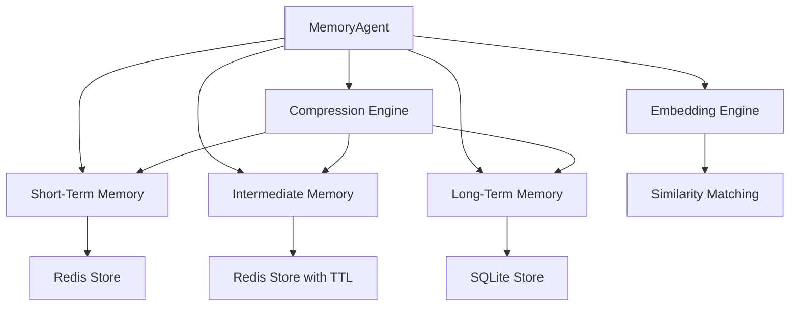

# MemoryAgent Documentation

## Overview

The `MemoryAgent` class is the core component of the agent memory system, responsible for managing an individual agent's memories across different storage tiers. It provides a unified interface for storing, retrieving, and maintaining agent memories with varying levels of detail and persistence.



## Core Responsibilities

- Managing memory entries across three hierarchical tiers
- Automatically transitioning memories between tiers based on age, importance, and capacity constraints
- Compressing memory content for long-term storage
- Generating and managing embeddings for semantic similarity search
- Calculating memory importance for prioritization
- Providing hooks for custom memory event handling

## Initialization

```python
from memory.agent_memory import MemoryAgent
from memory.config import MemoryConfig

# Create a memory configuration
config = MemoryConfig(
    cleanup_interval=100,
    stm_config={
        "memory_limit": 1000,
        "ttl": 86400  # 24 hours
    },
    im_config={
        "memory_limit": 10000,
        "ttl": 604800  # 7 days
    },
    ltm_config={
        "database_path": "agent_memories.db",
        "batch_size": 50
    },
    autoencoder_config={
        "use_neural_embeddings": True,
        "embedding_type": "autoencoder",
        "model_path": "models/memory_autoencoder.pt",
        "input_dim": 768,
        "stm_dim": 256,
        "im_dim": 128,
        "ltm_dim": 64,
        "max_reward_score": 10.0
    }
)

# Initialize the memory agent
agent_id = "agent-123"
memory_agent = MemoryAgent(agent_id, config)
```

## Memory Tiers

The MemoryAgent manages three memory tiers with different characteristics:

| Tier | Storage | TTL | Compression | Resolution | Access Speed |
|------|---------|-----|-------------|------------|--------------|
| Short-Term Memory (STM) | Redis | 24 hours | None | Full | Fastest |
| Intermediate Memory (IM) | Redis | 7 days | Level 1 | Medium | Fast |
| Long-Term Memory (LTM) | SQLite | Permanent | Level 2 | Low | Slower |

## Core Methods

### Storing Memories

```python
# Store an agent state
memory_agent.store_state(
    state_data={
        "position": {"x": 10, "y": 20, "location": "forest"},
        "health": 0.85,
        "energy": 0.7,
        "inventory": ["wood", "stone", "food"]
    },
    step_number=1234,
    priority=0.8
)

# Store an interaction with another agent
memory_agent.store_interaction(
    interaction_data={
        "agent_id": "agent-456",
        "interaction_type": "conversation",
        "content": "Do you have any wood to trade?",
        "outcome": "successful"
    },
    step_number=1235,
    priority=0.7
)

# Store an action
memory_agent.store_action(
    action_data={
        "action_type": "move",
        "direction": "north",
        "result": "success",
        "reward": 0.5
    },
    step_number=1236,
    priority=0.6
)
```

### Retrieving Memories

```python
# Retrieve similar states
query_state = {
    "position": {"x": 12, "y": 22, "location": "forest"},
    "health": 0.8
}
similar_states = memory_agent.retrieve_similar_states(
    query_state=query_state,
    k=5,
    memory_type="state",
    threshold=0.6,
    context_weights={"position": 0.8, "health": 0.2}
)

# Retrieve memories by time range
historical_memories = memory_agent.retrieve_by_time_range(
    start_step=1000,
    end_step=2000,
    memory_type="interaction"
)

# Retrieve memories by attributes
matching_memories = memory_agent.retrieve_by_attributes(
    attributes={"action_type": "move", "direction": "north"},
    memory_type="action"
)

# Search by content text
content_matches = memory_agent.search_by_content(
    content_query="wood trade",
    k=5
)
```

### Hybrid Retrieval

The hybrid_retrieve method combines similarity-based and attribute-based search for more robust memory retrieval:

```python
# Combine vector similarity and attribute matching
hybrid_results = memory_agent.hybrid_retrieve(
    query_state={
        "position": {"location": "forest"},
        "inventory": ["wood", "stone"]
    },
    k=5,
    memory_type="state",
    vector_weight=0.4,  # Weight for similarity search
    attribute_weight=0.6  # Weight for attribute matching
)
```

### Memory Management

```python
# Force memory tier transitions and cleanup
memory_agent.force_maintenance()

# Clear all memories for this agent
memory_agent.clear_memory()

# Get memory statistics
stats = memory_agent.get_memory_statistics()
```

## Memory Importance Calculation

The `MemoryAgent` calculates memory importance using a formula that considers:

1. **Reward magnitude (40%)**: Higher absolute rewards increase importance
2. **Recency (20%)**: More recent memories get higher importance
3. **Retrieval frequency (30%)**: Frequently accessed memories become more important
4. **Surprise factor (10%)**: Unexpected or novel memories increase in importance

```python
def _calculate_importance(self, memory):
    # Reward magnitude component (40%)
    reward = memory["content"].get("reward", 0)
    reward_importance = min(1.0, abs(reward) / 10.0) * 0.4
    
    # Recency factor (20%)
    current_time = time.time()
    timestamp = memory["timestamp"]
    time_diff = max(0, current_time - timestamp)
    recency_factor = math.exp(-time_diff / (24 * 3600))
    recency_importance = recency_factor * 0.2
    
    # Retrieval frequency component (30%)
    retrieval_count = memory["metadata"].get("retrieval_count", 0)
    retrieval_importance = min(retrieval_count / 5.0, 1.0) * 0.3
    
    # Surprise factor (10%) 
    surprise_factor = memory["metadata"].get("surprise_factor", 0.0)
    surprise_importance = surprise_factor * 0.1
    
    # Combine factors
    importance = (
        reward_importance + 
        recency_importance + 
        retrieval_importance + 
        surprise_importance
    )
    
    return max(0.0, min(1.0, importance))
```

## Memory Tier Transitions

The `MemoryAgent` automatically transitions memories between tiers based on:

1. **Capacity limits**: When a tier exceeds its capacity limit
2. **Memory importance**: Less important memories are transitioned first
3. **Age**: Older memories are more likely to be transitioned
4. **Compression level**: Increasing compression as memories move to lower tiers

The transition process is triggered:
- After a configurable number of memory inserts (configured via `cleanup_interval`)
- When explicitly called via `force_maintenance()`

## Event Hooks

The `MemoryAgent` provides an event hook system for customizing memory behavior:

```python
# Define a custom hook function
def custom_memory_hook(event_data, memory_agent):
    # Process the event data
    print(f"Event triggered: {event_data}")
    
    # Optionally store a new memory based on the event
    return {
        "store_memory": True,
        "memory_data": {"event_type": "custom", "details": event_data},
        "step_number": event_data["step_number"],
        "priority": 0.9
    }

# Register the hook
memory_agent.register_hook(
    event_type="resource_depleted",
    hook_function=custom_memory_hook,
    priority=8  # Higher priority hooks execute first (1-10)
)

# Trigger the event
memory_agent.trigger_event(
    event_type="resource_depleted",
    event_data={"resource": "wood", "step_number": 1240}
)
```

## Memory Statistics

The `get_memory_statistics()` method provides comprehensive information about memory usage:

```python
stats = memory_agent.get_memory_statistics()
```

The statistics include:
- Counts of memories per tier
- Memory size in bytes per tier
- Average importance scores
- Compression ratios
- Distribution of memory types
- Access patterns and most/least accessed memories

## Implementation Details

### Memory Compression

As memories transition between tiers, they undergo progressive compression:

1. **STM**: No compression, full details
2. **IM**: Level 1 compression - Summarizes detailed observations, removes non-essential data
3. **LTM**: Level 2 compression - Abstracts to core concepts, high-level summaries

### Neural Embeddings

When configured with neural embeddings, the `MemoryAgent` generates:

1. **Full vectors** for STM (higher dimensionality)
2. **Compressed vectors** for IM (medium dimensionality)
3. **Abstract vectors** for LTM (lower dimensionality)

These embeddings enable semantic similarity search that works even with compressed memories.

## Best Practices

1. **Configure memory limits appropriately**: Set STM and IM limits based on your application's memory requirements and expected agent lifespan.

2. **Use appropriate priorities**: Assign higher priorities (0.7-1.0) to critical memories and lower priorities (0.1-0.5) to routine observations.

3. **Use hybrid retrieval**: For most robust memory retrieval, use the `hybrid_retrieve()` method which combines similarity and attribute matching.

4. **Regularly inspect memory statistics**: Use `get_memory_statistics()` to monitor memory usage and adjust configuration as needed.

5. **Implement custom hooks**: For complex agents, use the event hook system to implement domain-specific memory formation rules. 