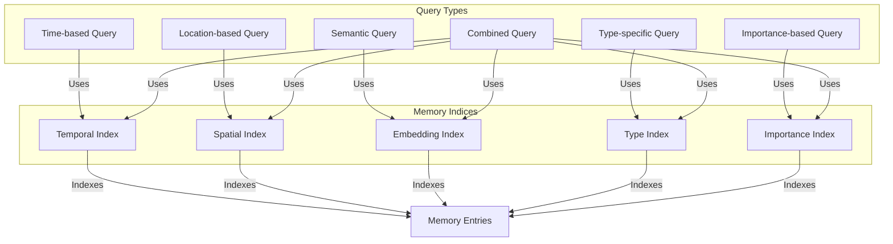
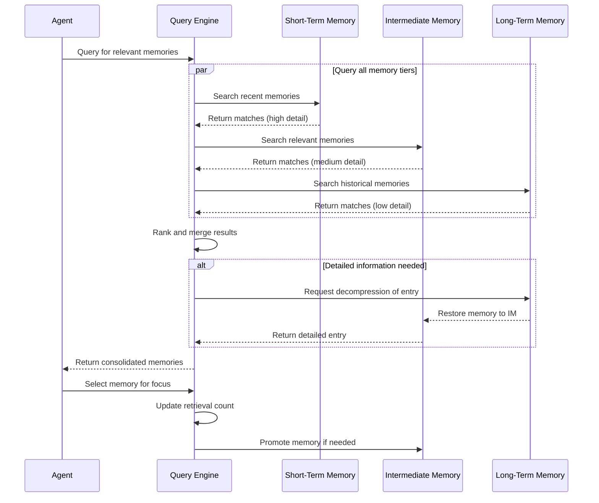

# Agent Memory API Documentation

## Overview

The Agent Memory API provides a clean, standardized interface for interacting with the agent memory system. It abstracts away the implementation details of the underlying storage mechanisms, allowing developers to focus on using the memory system rather than understanding its internals.

The API enables storing and retrieving agent states, actions, and interactions across the hierarchical memory architecture (Short-Term Memory, Intermediate Memory, and Long-Term Memory). It provides methods for both exact and similarity-based retrieval, as well as management operations for the memory system.

## Memory Query System



The memory system maintains five specialized indices for efficient retrieval operations. Temporal indices organize memories by time, spatial indices by location, embedding indices for semantic similarity, type indices for categorization, and importance indices for priority-based access. These correspond to different query patterns like "What happened yesterday?", "What did I see in the forest?", or "What do I know about resources?". The system can combine multiple indices for complex queries, enabling powerful and flexible memory retrieval.

## Key Features

- **Hierarchical Memory Access**: Unified access to all memory tiers (STM, IM, LTM)
- **Vector Similarity Search**: Find semantically similar memories using embedding vectors
- **Attribute-Based Retrieval**: Find memories based on specific attribute values
- **Temporal Queries**: Retrieve memories based on simulation steps or time ranges
- **Memory Management**: Configure and maintain the memory system
- **State Change Tracking**: Track attribute changes over time
- **Memory Statistics**: Get insights about memory usage and distribution

## Installation

The Agent Memory API is available as part of the agent state memory system. Import it directly:

```python
from agent_memory.core import AgentMemorySystem
```

## Basic Usage

### Initialization

```python
from agent_memory.core import AgentMemorySystem
from agent_memory.config import MemoryConfig

# Initialize with default configuration
memory_system = AgentMemorySystem.get_instance()

# Or, initialize with custom configuration
config = MemoryConfig(
    cleanup_interval=100,
    stm_config={"memory_limit": 10000}
)
memory_system = AgentMemorySystem.get_instance(config)
```

### Storing Agent Information

```python
# Store an agent's state
memory_system.store_agent_state(
    agent_id="agent-123",
    state_data={
        "position": [10, 20],
        "health": 0.85,
        "inventory": {"wood": 5, "stone": 2}
    },
    step_number=1234,
    priority=0.75  # Important memory (0.0-1.0)
)

# Store an interaction
memory_system.store_agent_interaction(
    agent_id="agent-123",
    interaction_data={
        "interaction_type": "conversation",
        "other_agent_id": "agent-456",
        "content": "Hello, do you have any wood to trade?",
        "sentiment": 0.6
    },
    step_number=1235
)

# Store an action
memory_system.store_agent_action(
    agent_id="agent-123",
    action_data={
        "action_type": "trade",
        "target_agent": "agent-456",
        "items_given": {"wood": 2},
        "items_received": {"stone": 1},
        "outcome": "success"
    },
    step_number=1236
)
```

### Retrieving Memories

```python
# Get memory agent instance for more specialized operations
memory_agent = memory_system.get_memory_agent("agent-123")

# Get recent states
recent_states = memory_agent.retrieve_recent_states(
    count=5,
    memory_type="state"  # Optional filter
)

# Find similar states
current_state = {"position": [12, 22], "health": 0.8}
similar_states = memory_system.retrieve_similar_states(
    agent_id="agent-123",
    query_state=current_state,
    k=5
)

# Get memories within a time range
memories = memory_system.retrieve_by_time_range(
    agent_id="agent-123",
    start_step=1000,
    end_step=2000,
    memory_type="action"  # Optional filter
)

# Find memories with specific attributes
trading_memories = memory_system.retrieve_by_attributes(
    agent_id="agent-123",
    attributes={"action_type": "trade", "outcome": "success"},
    memory_type="action"
)
```

### Memory Management

```python
# Force memory maintenance (tier transitions)
memory_system.force_memory_maintenance(agent_id="agent-123")

# Get memory statistics
stats = memory_system.get_memory_statistics(agent_id="agent-123")
print(f"Total memories: {stats['total_memories']}")
print(f"Memory distribution: {stats['memory_type_distribution']}")
```

## Advanced Usage

### Raw Vector Search

```python
# Get embedding from a state using your embedding logic
embedding = [0.1, 0.2, 0.3, ...]  # Your embedding vector

# Search using the raw embedding
memory_agent = memory_system.get_memory_agent("agent-123")
similar_memories = memory_agent.search_by_embedding(
    query_embedding=embedding,
    k=10,
    memory_tiers=["stm", "im"]  # Optional: specific tiers to search
)
```

### Content-Based Search

```python
# Get memory agent instance
memory_agent = memory_system.get_memory_agent("agent-123")

# Search by content pattern 
memories = memory_agent.search_by_content(
    content_query="trade wood",
    k=5
)
```

## Memory Retrieval Process



Memory retrieval employs a parallel search strategy across all tiers. When an agent requests memories, the Query Engine simultaneously searches Short-Term Memory for recent details, Intermediate Memory for relevant medium-term information, and Long-Term Memory for historical context. Results are ranked and merged based on relevance. If detailed information is needed from compressed long-term memories, they're decompressed and restored to Intermediate Memory. When an agent focuses on a specific memory, its retrieval count increases, potentially promoting frequently accessed memories to more accessible tiers.

## API Reference

### Core Storage Methods

| Method | Description |
|--------|-------------|
| `store_agent_state(agent_id, state_data, step_number, priority=1.0)` | Store an agent's state in memory |
| `store_agent_interaction(agent_id, interaction_data, step_number, priority=1.0)` | Store information about an interaction |
| `store_agent_action(agent_id, action_data, step_number, priority=1.0)` | Store information about an action |

### Retrieval Methods

| Method | Description |
|--------|-------------|
| `retrieve_similar_states(agent_id, query_state, k=5, memory_type=None)` | Find states similar to the query state |
| `retrieve_by_time_range(agent_id, start_step, end_step, memory_type=None)` | Get memories in a step range |
| `retrieve_by_attributes(agent_id, attributes, memory_type=None)` | Find memories matching attributes |

### Advanced Methods

| Method | Description |
|--------|-------------|
| `get_memory_agent(agent_id)` | Get a MemoryAgent instance for more specialized operations |
| `force_memory_maintenance(agent_id=None)` | Force tier transitions and cleanup |
| `get_memory_statistics(agent_id)` | Get statistics about memory usage |

## Memory Structure

Each memory entry stored by the API has the following standardized structure:

```json
{
  "memory_id": "agent-123-1234-1679233344",
  "agent_id": "agent-123",
  "step_number": 1234,
  "timestamp": 1679233344,
  
  "contents": {
    // The actual state/action/interaction data
    "position": [10, 20],
    "health": 0.85,
    // ...
  },
  
  "metadata": {
    "creation_time": 1679233344,
    "last_access_time": 1679233400,
    "compression_level": 0,
    "importance_score": 0.75,
    "retrieval_count": 3,
    "memory_type": "state" // "interaction", "action", etc.
  },
  
  "embeddings": {
    "full_vector": [...],  // STM embedding
    "compressed_vector": [...],  // IM embedding
    "abstract_vector": [...]  // LTM embedding
  }
}
```

## Hierarchical Memory Architecture

The API transparently interacts with the three-tier memory architecture:

1. **Short-Term Memory (STM)**: Recent, detailed memories stored in Redis
2. **Intermediate Memory (IM)**: Medium-term memories with some compression in Redis
3. **Long-Term Memory (LTM)**: Historical, highly compressed memories in SQLite

Each tier has different characteristics:

| Tier | Storage | Resolution | Typical Retention | Access Speed |
|------|---------|------------|-------------------|--------------|
| STM  | Redis   | Full       | ~1000 steps       | Very Fast    |
| IM   | Redis   | Medium     | ~10,000 steps     | Fast         |
| LTM  | SQLite  | Low        | Entire history    | Medium       |

The API automatically queries the appropriate tiers based on the requested information and combines results when needed.

## Error Handling

The API includes robust error handling to ensure operation continuity even when components fail:

- Redis connection errors are caught and logged
- Invalid parameter types or values are validated
- Error information includes context for debugging

Error recovery behaviors include:

- Falling back to available tiers when one tier is unavailable
- Returning partial results when complete results can't be obtained
- Providing meaningful error information in logs

## Performance Considerations

When using the Agent Memory API, consider these performance factors:

- **Storage Volume**: Each stored state increases memory usage, especially in Redis
- **Embedding Generation**: Vector similarity searches require embedding computation
- **Cross-Tier Queries**: Queries spanning multiple tiers incur additional overhead
- **Redis Capacity**: Monitor Redis memory usage, especially with many agents
- **Tier Maintenance**: Regular maintenance (automatic or via `force_memory_maintenance`) helps manage memory growth

## Configuration Options

The API can be configured using the `MemoryConfig` object:

```python
from agent_memory.config import MemoryConfig, RedisSTMConfig

config = MemoryConfig(
    # System-wide settings
    cleanup_interval=100,  # Check for maintenance every N insertions
    memory_priority_decay=0.95,  # Priority decay factor for older memories
    
    # Tier-specific settings
    stm_config=RedisSTMConfig(
        host="localhost",
        port=6379,
        memory_limit=10000,  # Max entries in STM
        ttl=3600  # 1 hour TTL
    )
)

memory_system = AgentMemorySystem.get_instance(config)
```

## Integration with Agent Systems

The API is designed to integrate seamlessly with agent systems:

- Can be used directly in agent implementations
- Works well with hook-based memory integration (see [Memory Hooks](memory_hooks.md))
- Can be used as a standalone system for memory analytics

## Further Reading

- [Core Concepts](../../../core_concepts.md): Fundamental architecture and data structures
- [Memory Hooks](memory_hooks.md): Non-intrusive agent integration
- [Redis Integration](../../../redis_integration.md): Redis backend details
- [Memory Agent](../../../memory_agent.md): Memory agent implementation 