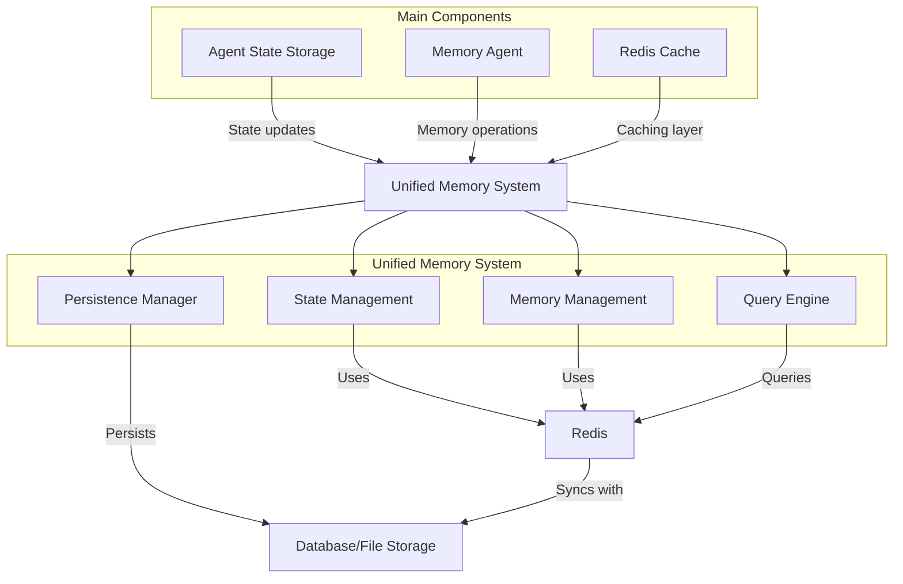
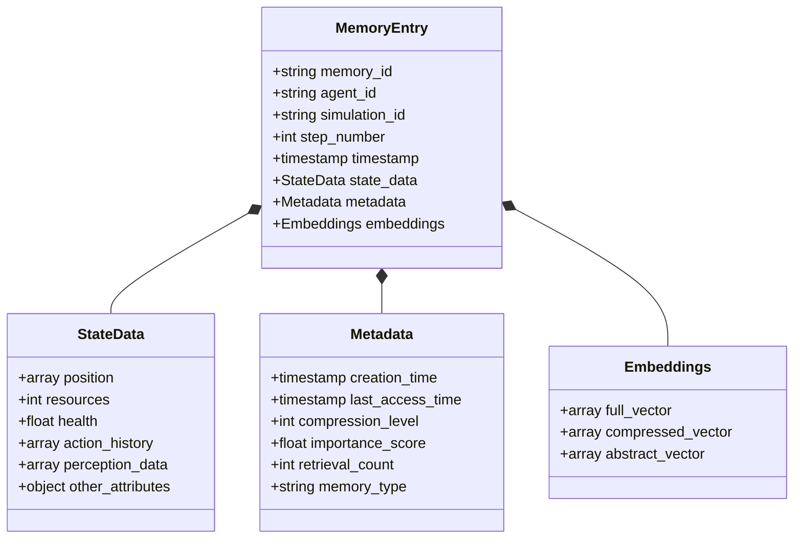

# Agent Memory System Documentation

## Overview

The Agent Memory System is a hierarchical memory management system designed for intelligent agents. It provides a sophisticated way to store, retrieve, and manage agent experiences and states across different memory tiers with varying levels of detail and persistence.

## System Architecture



The system integrates three key components (Agent State Storage, Memory Agent, and Redis Cache) with a Unified Memory System. This central system contains four specialized subsystems: State Management handles agent state data, Memory Management controls transitions between tiers, the Query Engine enables efficient retrieval, and the Persistence Manager ensures data durability. All subsystems use Redis for performance while persisting important data to database storage.

## Core Components

### 1. Memory Agent (`MemoryAgent` class)
The central component that manages all memory operations and coordinates between different storage tiers.

```python
memory_agent = MemoryAgent(
    agent_id="agent-123",
    config=MemoryConfig(...)
)
```

### 2. Memory Tiers
- **Short-Term Memory (STM)**: Redis-based, full resolution storage
- **Intermediate Memory (IM)**: Redis-based with TTL and compression
- **Long-Term Memory (LTM)**: SQLite-based with high compression

### 3. Supporting Components
- Compression Engine
- Autoencoder Embedding Engine
- Event Hook System
- Memory Statistics Tracking

## Key Features

### 1. Memory Storage
```python
# Store a new state
memory_agent.store_state(
    state_data={"position": [x, y], "resources": 42},
    step_number=1234,
    priority=0.8
)

# Store an interaction
memory_agent.store_interaction(
    interaction_data={"type": "collision", "with": "agent-456"},
    step_number=1234,
    priority=0.9
)
```

### 2. Memory Retrieval
```python
# Retrieve similar states
similar_states = memory_agent.retrieve_similar_states(
    query_state=current_state,
    k=5
)

# Retrieve by time range
historical_states = memory_agent.retrieve_by_time_range(
    start_step=1000,
    end_step=2000
)

# Retrieve by attributes
matching_states = memory_agent.retrieve_by_attributes(
    attributes={"resource_level": "high"}
)
```

### 3. Event Hooks
```python
# Register a custom hook
memory_agent.register_hook(
    event_type="critical_resource_change",
    hook_function=custom_hook_function,
    priority=7
)

# Trigger an event
memory_agent.trigger_event(
    event_type="critical_resource_change",
    event_data={"resource_delta": -50}
)
```

## Memory Entry Structure



Each memory entry follows a unified structure containing three main components. The entry includes identifiers, a timestamp, and state data (position, resources, health, etc.) that capture what the agent experienced. The metadata section tracks creation time, importance score, retrieval frequency, and memory type to inform system decisions. The embeddings section contains vector representations at different resolutions for semantic retrieval. This unified design allows both state data and interaction data to share the same infrastructure.

Each memory entry follows this structure:
```json
{
  "memory_id": "unique-identifier",
  "agent_id": "agent-123",
  "step_number": 1234,
  "timestamp": 1679233344,
  
  "contents": {
    "position": [x, y],
    "resources": 42,
    "health": 0.85
  },
  
  "metadata": {
    "creation_time": 1679233344,
    "last_access_time": 1679233400,
    "compression_level": 0,
    "importance_score": 0.75,
    "retrieval_count": 3,
    "memory_type": "state"
  },
  
  "embeddings": {
    "full_vector": [...],
    "compressed_vector": [...],
    "abstract_vector": [...]
  }
}
```

## Performance Monitoring

The system provides comprehensive statistics through:
```python
stats = memory_agent.get_memory_statistics()
```

Statistics include:
- Memory counts per tier
- Average importance scores
- Compression ratios
- Access patterns
- Memory type distribution

## Error Handling

The system implements robust error handling:
- Graceful degradation when Redis is unavailable
- Automatic retry mechanisms
- Comprehensive logging
- Data validation at each tier

## Configuration

The system is highly configurable through the `MemoryConfig` class:
```python
config = MemoryConfig(
    stm_config=STMConfig(
        memory_limit=1000,
        ttl=3600
    ),
    im_config=IMConfig(
        memory_limit=10000,
        compression_level=1
    ),
    ltm_config=LTMConfig(
        db_path="ltm.db",
        compression_level=2
    ),
    autoencoder_config=AutoencoderConfig(
        model_path="model.pt",
        use_neural_embeddings=True
    )
)
```

## See Also
- [Memory Tiers](memory_tiers.md)
- [Memory Hooks](memory_hooks.md)
- [Redis STM Store](redis_stm_store.md)
- [SQLite LTM Store](sqlite_ltm_store.md)
- [Agent Memory API](agent_memory_api.md)
- [Resilient Redis Client](resilient_redis_client.md)

## Using the Agent Memory System

```python
from agent_memory.core import AgentMemorySystem
from agent_memory.config import MemoryConfig

# Get the singleton instance with default configuration
memory_system = AgentMemorySystem.get_instance()

# Or initialize with custom configuration
config = MemoryConfig(
    cleanup_interval=1000,
    stm_config={"memory_limit": 5000},
    im_config={"ttl": 172800}  # 48 hours
)
memory_system = AgentMemorySystem.get_instance(config)

# Store an agent state
memory_system.store_agent_state(
    agent_id="agent_001",
    state_data={"position": [10, 20], "health": 100, "inventory": {"gold": 50}},
    step_number=1500
)

# Retrieve similar states
similar_states = memory_system.retrieve_similar_states(
    agent_id="agent_001",
    query_state={"position": [12, 18]},
    k=5
)

# Get statistics
stats = memory_system.get_memory_statistics(agent_id="agent_001") 