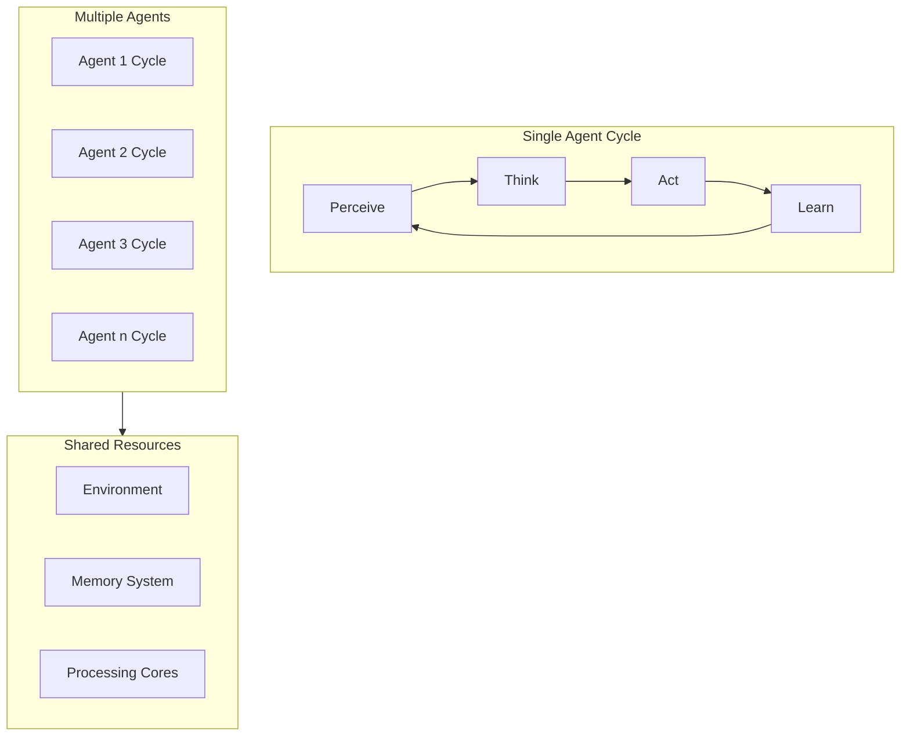

# Agent Simulation Walkthrough

## From Sequential to Parallel

### Current Sequential Approach
```python
# Current sequential processing
for step in range(total_steps):
    for agent in agents:
        agent.think()
        agent.act()
        agent.learn()
    environment.update()
```

### New Parallel Approach
```python
# Each agent runs independently
class ParallelAgent:
    def run_simulation(self):
        while not simulation_complete:
            # All these happen in parallel
            self.perceive_environment()  # Memory Manager handles access
            self.think()                 # Processing Engine handles
            self.act()                   # Action System executes
            self.learn()                 # Processing Engine updates
```

## How Agents Work in the Framework

### 1. Agent Memory Management
```
Individual Agent Memory:
├── Working Memory (Cache)
│   ├── Current perceptions
│   ├── Active goals
│   └── Immediate plans
├── Short-Term Memory
│   ├── Recent interactions
│   ├── Current context
│   └── Temporary knowledge
├── Intermediate Memory
│   ├── Episode records
│   ├── Learning progress
│   └── Performance metrics
└── Long-Term Memory
    ├── Learned behaviors
    ├── Historical data
    └── Core knowledge
```

### 2. Agent Processing Cycle



### 3. Step-by-Step Walkthrough

1. **Initialization**
```python
agent_configs = [
    {
        'id': 'agent_1',
        'priority': 'high',
        'memory_allocation': '4GB',
        'core_assignment': 1
    },
    # More agents...
]

# Framework automatically distributes agents across cores
framework.initialize_agents(agent_configs)
```

2. **Perception Phase**
```
Memory Manager handles:
├── Environment State Access
│   ├── Each agent gets local view
│   ├── Cached for performance
│   └── Updated as needed
└── Perception Processing
    ├── Parallel processing
    ├── No blocking other agents
    └── Consistent snapshots
```

3. **Thinking Phase**
```
Processing Engine manages:
├── Reasoning
│   ├── Goal evaluation
│   ├── Plan formation
│   └── Decision making
├── Resource Usage
│   ├── Dedicated core time
│   ├── Memory allocation
│   └── Priority handling
└── State Management
    ├── Current context
    ├── Decision history
    └── Plan tracking
```

4. **Action Phase**
```
Action System coordinates:
├── Action Execution
│   ├── Validate actions
│   ├── Check conflicts
│   └── Apply changes
├── Synchronization
│   ├── Order critical actions
│   ├── Resolve conflicts
│   └── Maintain consistency
└── Feedback
    ├── Action results
    ├── Environment changes
    └── Performance metrics
```

5. **Learning Phase**
```
Processing Engine handles:
├── Experience Processing
│   ├── Update knowledge
│   ├── Adjust strategies
│   └── Store memories
├── Performance Analysis
│   ├── Track metrics
│   ├── Identify patterns
│   └── Optimize behavior
└── Memory Management
    ├── Consolidate learning
    ├── Prune old data
    └── Update priorities
```

## Key Benefits for Agents

1. **Independent Operation**
   - Each agent runs at its own pace
   - No waiting for other agents
   - Natural handling of different time scales

2. **Resource Efficiency**
   - Agents share computing resources
   - Memory efficiently distributed
   - No single agent blocks others

3. **Reliable Operation**
   - Agents can fail independently
   - Automatic recovery from crashes
   - Preserved learning progress

## Example: Multi-Agent Scenario

```python
# Define multiple agents with different roles
agents = {
    'explorer_agents': [
        {
            'id': f'explorer_{i}',
            'priority': 'normal',
            'behavior': 'exploration',
            'memory_limit': '2GB'
        } for i in range(3)
    ],
    'analyzer_agents': [
        {
            'id': f'analyzer_{i}',
            'priority': 'high',
            'behavior': 'analysis',
            'memory_limit': '4GB'
        } for i in range(2)
    ]
}

# Framework handles:
# - Distributing agents across cores
# - Managing shared resources
# - Coordinating interactions
# - Maintaining performance
```

## Monitoring Agents

```python
# Check agent status
agent_status = framework.get_agent_status()

# Example output:
{
    'explorer_1': {
        'state': 'thinking',
        'memory_used': '1.8GB',
        'actions_taken': 15000,
        'learning_progress': '67%'
    },
    'analyzer_1': {
        'state': 'acting',
        'memory_used': '3.2GB',
        'analysis_complete': '45%',
        'insights_generated': 230
    }
}
```

## Best Practices for Agent Design

1. **Memory Usage**
   - Design agents with clear memory boundaries
   - Use appropriate memory tiers
   - Clean up unnecessary data

2. **Processing Efficiency**
   - Optimize thinking algorithms
   - Use efficient decision strategies
   - Balance computation vs action

3. **Interaction Design**
   - Plan for parallel operation
   - Handle conflicts gracefully
   - Use asynchronous communication 