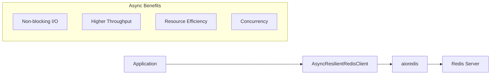

# **AsyncResilientRedisClient Documentation**

## **1. Overview**

The `AsyncResilientRedisClient` is an asynchronous wrapper around Redis operations that implements robust error handling, automatic retries, and circuit breaker patterns to ensure reliable Redis operations in the AgentMemory system. It's designed to work with the `aioredis` library for high-performance asynchronous Redis operations.

## **2. Benefits of Asynchronous Redis Operations**



Asynchronous Redis operations provide several key advantages:

1. **Non-blocking I/O**: Redis operations don't block the execution thread, allowing the application to perform other tasks while waiting for Redis to respond.
2. **Higher Throughput**: Multiple Redis operations can be executed concurrently, increasing overall throughput.
3. **Resource Efficiency**: Fewer threads are needed to handle a large number of concurrent operations, reducing system resource usage.
4. **Better Concurrency Model**: Works well with modern asynchronous frameworks and event loops (asyncio).
5. **Improved Scalability**: Can handle more connections with less system resources compared to synchronous clients.

## **3. Key Features**

- **Asynchronous Operations**: All Redis operations are asynchronous using Python's `async`/`await` syntax
- **Circuit Breaker Pattern**: Prevents cascading failures by stopping operations when Redis is unreliable
- **Automatic Retries**: Configurable retry policies for transient errors
- **Recovery Queue**: Enqueues failed operations for later retry based on priority
- **Priority-Based Operation Handling**: Different handling for critical vs. normal operations
- **Comprehensive Redis Method Coverage**: Full set of Redis operations with error handling
- **Non-Blocking Exponential Backoff**: Uses `asyncio.sleep()` for non-blocking delays between retries

## **4. Usage**

### **4.1 Basic Usage**

```python
import asyncio
from agent_memory.storage.async_redis_client import AsyncResilientRedisClient

async def main():
    # Create client
    client = AsyncResilientRedisClient(
        client_name="agent_memory",
        host="localhost",
        port=6379,
        db=0
    )
    
    # Initialize client (required before use)
    await client.init()
    
    try:
        # Basic operations
        await client.set("key", "value")
        value = await client.get("key")
        print(f"Value: {value}")
        
        # Hash operations
        await client.hset("user:1", "name", "John")
        await client.hset_dict("user:1", {
            "age": "30",
            "email": "john@example.com"
        })
        user = await client.hgetall("user:1")
        print(f"User: {user}")
    finally:
        # Always close the client when done
        await client.close()

# Run the async function
asyncio.run(main())
```

### **4.2 Advanced Usage with Store Retry**

```python
from agent_memory.utils.error_handling import Priority

async def store_agent_state(agent_id, state_data):
    key = f"agent:{agent_id}:state"
    try:
        return await client.hset_dict(key, state_data)
    except Exception as e:
        logger.error(f"Failed to store state: {e}")
        return False

async def main():
    client = AsyncResilientRedisClient(client_name="agent_memory")
    await client.init()
    
    try:
        # Store with priority and retry
        result = await client.store_with_retry(
            agent_id="agent123",
            state_data={"position": "10,20", "health": "100"},
            store_func=store_agent_state,
            priority=Priority.CRITICAL,
            retry_attempts=5
        )
        
        if result:
            print("Successfully stored agent state")
        else:
            print("Failed to store agent state after retries")
    finally:
        await client.close()
```

## **5. Initialization**

The client follows a two-step initialization process:

1. **Constructor**: Creates the client instance and sets up configuration
2. **init() method**: Establishes the actual connection to Redis (must be called before using the client)

```python
# Create client instance
client = AsyncResilientRedisClient(
    client_name="memory_client",
    host="redis.example.com",
    port=6379,
    db=0,
    password="secret",
    circuit_threshold=5,
    circuit_reset_timeout=60
)

# Initialize connection
await client.init()

# When done
await client.close()
```

## **6. Key Methods**

### **6.1 Core Redis Operations**

All Redis operations are implemented as asynchronous methods:

| Method                               | Purpose                         | Redis Command  |
| ------------------------------------ | ------------------------------- | -------------- |
| `ping()`                             | Check connection                | PING           |
| `get(key)`                           | Get value                       | GET            |
| `set(key, value, ...)`               | Set value                       | SET            |
| `delete(*keys)`                      | Delete keys                     | DEL            |
| `exists(*keys)`                      | Check key existence             | EXISTS         |
| `expire(key, time)`                  | Set key expiry                  | EXPIRE         |
| `hset(name, key, value)`             | Set hash field                  | HSET           |
| `hget(name, key)`                    | Get hash field                  | HGET           |
| `hgetall(name)`                      | Get all hash fields             | HGETALL        |
| `hset_dict(name, mapping)`           | Set multiple hash fields        | HSET (mapping) |
| `hdel(name, *keys)`                  | Delete hash fields              | HDEL           |
| `zadd(name, mapping, ...)`           | Add to sorted set               | ZADD           |
| `zrange(name, start, end, ...)`      | Get range from sorted set       | ZRANGE         |
| `zrangebyscore(name, min, max, ...)` | Get score range from sorted set | ZRANGEBYSCORE  |
| `zrem(name, *values)`                | Remove from sorted set          | ZREM           |
| `zcard(name)`                        | Count sorted set members        | ZCARD          |
| `scan_iter(match, count)`            | Scan keys matching pattern      | SCAN           |

### **6.2 Client Lifecycle Methods**

| Method                      | Purpose                                           |
| --------------------------- | ------------------------------------------------- |
| `init()`                    | Initialize Redis connection (required before use) |
| `close()`                   | Close Redis connection and clean up resources     |
| `get_latency()`             | Measure Redis server latency in milliseconds      |

### **6.3 Error Handling Methods**

| Method                                                                                                | Purpose                                  |
| ----------------------------------------------------------------------------------------------------- | ---------------------------------------- |
| `_execute_with_circuit_breaker(operation_name, operation)`                                            | Wrap operation with circuit breaker      |
| `_create_redis_client()`                                                                              | Create Redis client with error handling  |
| `store_with_retry(agent_id, state_data, store_func, priority, retry_attempts, base_delay, max_delay)` | Store with configurable retry parameters |

## **7. Error Handling Strategy**

### **7.1 Asynchronous Circuit Breaker**

The client uses an asynchronous circuit breaker to prevent repeated failed attempts to Redis:

1. **Closed State**: Normal operation, all requests pass through
2. **Open State**: After `circuit_threshold` failures, requests are blocked
3. **Half-Open State**: After `circuit_reset_timeout` seconds, a test request is allowed

### **7.2 Non-Blocking Exponential Backoff**

The `async_exponential_backoff` function calculates delays between retry attempts without blocking:

```python
async def async_exponential_backoff(
    attempt: int, base_delay: float = 0.5, max_delay: float = 30.0
) -> float:
    """Calculate and sleep for exponential backoff delay."""
    delay = min(base_delay * (2**attempt), max_delay)
    await asyncio.sleep(delay)
    return delay
```

Unlike the synchronous version, this uses `asyncio.sleep()` which doesn't block the event loop, allowing other operations to continue during the backoff period.

### **7.3 Priority-Based Handling**

Operations are handled differently based on priority:

| Priority        | Handling on Failure                                   |
| --------------- | ----------------------------------------------------- |
| **CRITICAL**    | Immediate async retry with configurable exponential backoff |
| **HIGH/NORMAL** | Enqueue for background retry                          |
| **LOW**         | Log and continue                                      |

## **8. Configuration**

### **8.1 Connection Parameters**

| Parameter                | Description            | Default     |
| ------------------------ | ---------------------- | ----------- |
| `host`                   | Redis host             | "localhost" |
| `port`                   | Redis port             | 6379        |
| `db`                     | Redis database number  | 0           |
| `password`               | Redis password         | None        |
| `socket_timeout`         | Timeout for operations | 2.0 seconds |
| `socket_connect_timeout` | Connection timeout     | 2.0 seconds |

### **8.2 Circuit Breaker Settings**

| Parameter               | Description                   | Default |
| ----------------------- | ----------------------------- | ------- |
| `circuit_threshold`     | Failures before circuit opens | 3       |
| `circuit_reset_timeout` | Seconds before circuit reset  | 300     |

### **8.3 Retry Settings**

| Parameter                 | Description                            | Default      |
| ------------------------- | -------------------------------------- | ------------ |
| `critical_retry_attempts` | Retry attempts for critical operations | 3            |
| `retry_base_delay`        | Base delay for exponential backoff     | 0.5 seconds  |
| `retry_max_delay`         | Maximum delay cap                      | 30.0 seconds |

## **9. Performance Considerations**

### **9.1 Event Loop Impact**

While `AsyncResilientRedisClient` is non-blocking for I/O operations, be aware that:

1. Heavy CPU operations in the same event loop can still impact Redis responsiveness
2. Using very high concurrency can lead to resource contention

### **9.2 Connection Pool Management**

The aioredis library manages connection pools automatically, but consider:

1. Monitoring connection counts in high-load scenarios
2. Closing connections properly when no longer needed

### **9.3 Recovery Queue Processing**

If using the recovery queue with high volume:

1. Implement an async worker to process the queue outside the main event loop
2. Consider batching operations for better throughput

## **10. Comparison with Synchronous Client**

| Feature                   | AsyncResilientRedisClient                  | ResilientRedisClient                      |
| ------------------------- | ------------------------------------------ | ----------------------------------------- |
| Performance               | Higher throughput for I/O bound operations | Better for CPU bound operations           |
| Resource Usage            | Lower for many concurrent operations       | Higher thread usage                       |
| Execution Model           | Non-blocking, event-driven                 | Blocking operations                       |
| Framework Compatibility   | Modern async frameworks (FastAPI, etc.)    | Traditional frameworks (Flask, Django)    |
| Implementation Complexity | Requires careful async/await handling      | Simpler linear execution flow             |
| Retry Logic               | Non-blocking retries                       | Blocking retries                          |
| Library Foundation        | aioredis                                   | redis-py                                  |

## **11. Testing**

The AsyncResilientRedisClient includes a comprehensive test suite using pytest-asyncio to verify:

1. **Basic Operations**: All Redis commands function correctly
2. **Error Handling**: Circuit breaker and retry mechanisms work as expected
3. **Retry Logic**: Different priority levels handle errors appropriately
4. **Connection Management**: Proper initialization and cleanup

Run the test suite with:

```bash
pytest tests/storage/test_async_redis_client.py -v
``` 