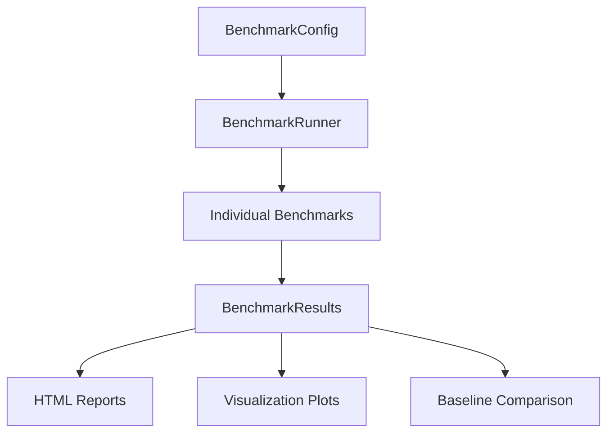

# AgentMemory Benchmarking System

## Overview

The AgentMemory benchmarking system provides a comprehensive framework for measuring, analyzing, and visualizing the performance of the AgentMemory system across various dimensions. It enables systematic evaluation of key performance metrics such as throughput, latency, memory efficiency, and scalability.

This benchmarking system allows developers to:
- Run standardized benchmarks to evaluate system performance
- Compare results across different configurations and implementations
- Generate detailed reports and visualizations
- Establish performance baselines and detect regressions



## Benchmark Categories

The benchmarking system includes several categories of benchmarks, each focusing on a different aspect of the AgentMemory system:

1. **Storage Performance**: Evaluates raw storage capabilities (write throughput, read latency, memory efficiency)
2. **Compression Effectiveness**: Measures neural compression system capabilities (embedding quality, compression ratio)
3. **Memory Transition**: Tests effectiveness of memory tier transitions (transition accuracy, importance scoring)
4. **Retrieval Performance**: Evaluates memory retrieval capabilities (search latency, cross-tier retrieval)
5. **Scalability**: Measures system performance under increasing load (agent count scaling, memory size scaling)
6. **Integration Tests**: Evaluates integration with existing agent systems (API overhead, real-world integration)

> **Note:** Currently, only the Storage Performance benchmark category is fully implemented. Other categories are planned for future development.

## Architecture

The benchmarking system consists of several components:

- **BenchmarkConfig**: Configuration classes for customizing benchmark parameters
- **BenchmarkRunner**: Core engine for discovering and executing benchmarks
- **BenchmarkResults**: Storage and analysis of benchmark results
- **Benchmark Implementations**: Individual benchmark modules for each category
- **CLI Interface**: Command-line tools for running benchmarks and analyzing results

## Dependencies

The benchmarking system requires the following dependencies:

```
pandas
matplotlib
```

These are used for data analysis and visualization of benchmark results.

## Folder Structure

```
memory/benchmarking/
├── __init__.py                   # Package initialization
├── cli.py                       # Command-line interface
├── config.py                    # Configuration classes
├── runner.py                    # Benchmark runner
├── results.py                   # Results handling
├── README.md                    # Quick start documentation
└── benchmarks/                  # Individual benchmark implementations
    ├── __init__.py              # Benchmark package initialization
    └── storage.py               # Storage benchmarks
```

## Running Benchmarks

### Command Line Interface

The benchmarking system provides a command-line interface for running benchmarks:

#### Windows (PowerShell)

```powershell
# Run all benchmarks
python -m memory.benchmarking.cli run

# Run a specific category
python -m memory.benchmarking.cli run --category storage

# Run a specific benchmark
python -m memory.benchmarking.cli run --category storage --benchmark write_throughput

# Run benchmarks in parallel
python -m memory.benchmarking.cli run --parallel --workers 8

# Run with custom configuration
python -m memory.benchmarking.cli run --config custom_config.json
```

#### Unix/Linux/MacOS

```bash
# Run all benchmarks
python scripts/benchmark.py run

# Run a specific category
python scripts/benchmark.py run --category storage

# Run a specific benchmark
python scripts/benchmark.py run --category storage --benchmark write_throughput

# Run benchmarks in parallel
python scripts/benchmark.py run --parallel --workers 8

# Run with custom configuration
python scripts/benchmark.py run --config custom_config.json
```

### Working with Results

```bash
# List available results
python -m memory.benchmarking.cli results list

# Generate a report from results
python -m memory.benchmarking.cli results report --category storage

# Compare results with a baseline
python -m memory.benchmarking.cli compare --current-dir results/run1 --baseline-dir results/baseline
```

## Creating Custom Benchmarks

The benchmarking system is designed to be easily extensible. You can create custom benchmarks by adding new benchmark functions to the appropriate module.

### Benchmark Function Structure

Benchmark functions should follow this structure:

```python
def benchmark_my_custom_benchmark(param1: int = 100, param2: float = 0.5, **kwargs) -> Dict[str, Any]:
    """Description of what this benchmark measures.
    
    Args:
        param1: Description of parameter 1
        param2: Description of parameter 2
        
    Returns:
        Dictionary with benchmark results
    """
    results = {}
    
    # Benchmark implementation
    # ...
    
    return results
```

Key points:
1. Function name must start with `benchmark_`
2. Accept configuration parameters with sensible defaults
3. Include `**kwargs` for flexibility with configuration
4. Return a dictionary with structured results
5. Include proper docstring with description and parameter documentation

### Example Benchmark Implementation

Here's an example of a storage benchmark implementation:

```python
def benchmark_write_throughput(batch_sizes: Optional[List[int]] = None, 
                              data_complexity_levels: Optional[List[int]] = None, 
                              **kwargs) -> Dict[str, Any]:
    """Benchmark write throughput across memory tiers.
    
    Args:
        batch_sizes: List of batch sizes to test
        data_complexity_levels: List of data complexity levels to test
        
    Returns:
        Dictionary with benchmark results
    """
    batch_sizes = batch_sizes or [10, 100, 1000, 10000]
    data_complexity_levels = data_complexity_levels or [1, 5, 10]
    
    results = {}
    
    for complexity in data_complexity_levels:
        complexity_results = {}
        
        for batch_size in batch_sizes:
            print(f"Testing write throughput with batch_size={batch_size}, complexity={complexity}")
            
            # Create a fresh memory system for each test
            config = MemoryConfig()
            temp_db_path = os.path.join(tempfile.gettempdir(), f"benchmark_ltm_{complexity}_{batch_size}.db")
            config.ltm_config.db_path = temp_db_path
            memory_system = AgentMemorySystem(config)
            
            # Generate test data
            test_states = [generate_test_state(complexity) for _ in range(batch_size)]
            
            # Test STM write throughput
            start_time = time.time()
            for i, state in enumerate(test_states):
                memory_system.store_agent_state(
                    agent_id="benchmark_agent",
                    state_data=state,
                    step_number=i
                )
            end_time = time.time()
            
            execution_time = end_time - start_time
            stm_throughput = batch_size / execution_time if execution_time > 0 else 0
            
            batch_results = {
                "throughput_ops_per_second": stm_throughput,
                "total_time_seconds": execution_time,
                "items_processed": batch_size
            }
            
            complexity_results[f"batch_{batch_size}"] = batch_results
            
            # Clean up temp file
            if os.path.exists(temp_db_path):
                try:
                    os.remove(temp_db_path)
                except:
                    pass
        
        results[f"complexity_{complexity}"] = complexity_results
    
    return results
```

## Results Format

Benchmark results are stored in a structured JSON format:

```json
{
  "benchmark": "write_throughput",
  "category": "storage",
  "timestamp": "20250323_145623",
  "results": {
    "complexity_1": {
      "batch_100": {
        "throughput_ops_per_second": 1250.5,
        "total_time_seconds": 0.08,
        "items_processed": 100
      }
    }
  },
  "metadata": {
    "execution_time": 15.2,
    "params": {
      "batch_sizes": [10, 100, 1000, 10000],
      "data_complexity_levels": [1, 5, 10]
    }
  }
}
```

## Configuration System

The benchmarking system uses a configuration system to customize benchmark parameters:

```python
from memory.benchmarking.config import BenchmarkConfig

# Create default config
config = BenchmarkConfig()

# Customize configuration
config.storage.batch_sizes = [10, 50, 100]
config.retrieval.similarity_thresholds = [0.6, 0.7, 0.8]
config.output_dir = "custom_benchmark_results"

# Save configuration for reuse
config.save("custom_config.json")
```

## Result Analysis

The `BenchmarkResults` class provides methods for analyzing benchmark results:

```python
from memory.benchmarking.results import BenchmarkResults

# Initialize results manager
results = BenchmarkResults("benchmark_results")

# List results
storage_results = results.list_results(category="storage")

# Compare results
comparison_df = results.compare_results(storage_results)

# Generate a report
report_path = results.generate_report(category="storage")

# Create visualization
fig = results.plot_comparison(
    storage_results, 
    metric="throughput_ops_per_second",
    x_axis="batch_size"
)
results.save_plot(fig, "storage_throughput.png")
```

## Integration with CI/CD

The benchmarking system can be integrated with CI/CD pipelines to automatically detect performance regressions:

```bash
# Run benchmarks and compare with baseline
python -m memory.benchmarking.cli run --output-dir results/current
python -m memory.benchmarking.cli compare --current-dir results/current --baseline-dir results/baseline --threshold 0.1

# Exit code 2 indicates performance regression
if ($LASTEXITCODE -eq 2) {
  Write-Host "Performance regression detected!"
  exit 1
}
```

## Best Practices

1. **Isolation**: Each benchmark should create a fresh instance of AgentMemorySystem
2. **Cleanup**: Properly clean up temporary files and resources
3. **Parameterization**: Make benchmarks configurable through parameters
4. **Documentation**: Include detailed documentation about what each benchmark measures
5. **Consistency**: Use consistent naming and result structures
6. **Error Handling**: Implement proper error handling to prevent benchmark failures
7. **Resource Management**: Be mindful of memory and CPU usage during benchmarks

By following these guidelines, you can create reliable and informative benchmarks that help monitor and improve the performance of the AgentMemory system. 