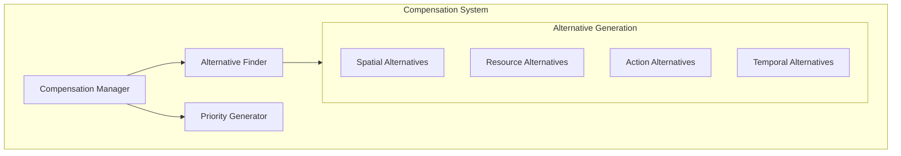

# Agent Compensation System

## Overview

The compensation system ensures agents can gracefully handle rejected actions and find alternatives, maintaining smooth operation even when their primary actions can't be executed.

## Core Components



## Compensation Manager

```python
class CompensationManager:
    def __init__(self):
        self.alternative_finder = AlternativeFinder()
        self.priority_manager = PriorityManager()
        self.compensation_history = defaultdict(list)  # Track per agent
        
    async def handle_rejected_action(self, action, reason):
        """Handle a rejected action with appropriate compensation"""
        compensation = {
            'agent_id': action.agent_id,
            'original_action': action,
            'rejection_reason': reason,
            'timestamp': time.time(),
            'alternatives': await self.generate_alternatives(action),
            'priority_adjustment': self.calculate_priority_boost(action)
        }
        
        # Record compensation
        self.compensation_history[action.agent_id].append(compensation)
        
        return compensation

    def calculate_priority_boost(self, action):
        """Calculate priority boost based on rejection history"""
        agent_history = self.compensation_history[action.agent_id]
        recent_rejections = len([
            c for c in agent_history
            if time.time() - c['timestamp'] < 300  # Last 5 minutes
        ])
        
        return min(0.1 * recent_rejections, 0.5)  # Max 50% boost
```

## Alternative Generation

### 1. Spatial Alternatives

```python
class SpatialAlternativeFinder:
    def find_alternatives(self, action, radius=1.0):
        """Find alternative locations for spatial actions"""
        original_pos = action.target_position
        alternatives = []
        
        # Generate spiral pattern of alternatives
        for r in np.arange(0.1, radius, 0.1):
            for theta in np.arange(0, 2*np.pi, np.pi/4):
                alt_pos = (
                    original_pos[0] + r * np.cos(theta),
                    original_pos[1] + r * np.sin(theta)
                )
                if self.is_position_valid(alt_pos):
                    alternatives.append({
                        'position': alt_pos,
                        'distance': r,
                        'score': self.score_position(alt_pos, action)
                    })
        
        return sorted(alternatives, key=lambda x: x['score'], reverse=True)
```

### 2. Resource Alternatives

```python
class ResourceAlternativeFinder:
    def find_alternatives(self, action):
        """Find alternative resources for resource actions"""
        original_resource = action.resource
        alternatives = []
        
        # Find similar resources
        similar_resources = self.find_similar_resources(original_resource)
        
        for resource in similar_resources:
            if self.is_resource_available(resource):
                alternatives.append({
                    'resource': resource,
                    'similarity': self.calculate_similarity(
                        original_resource, resource
                    ),
                    'cost': self.calculate_resource_cost(resource)
                })
        
        return sorted(alternatives, key=lambda x: x['similarity'], reverse=True)
```

### 3. Temporal Alternatives

```python
class TemporalAlternativeFinder:
    def find_alternatives(self, action):
        """Find alternative timing for actions"""
        original_time = action.execution_time
        alternatives = []
        
        # Generate time slots
        for delay in [0.1, 0.5, 1.0, 2.0, 5.0]:  # seconds
            future_time = original_time + delay
            if self.is_time_slot_available(future_time):
                alternatives.append({
                    'time': future_time,
                    'delay': delay,
                    'congestion': self.predict_congestion(future_time)
                })
        
        return sorted(alternatives, key=lambda x: x['congestion'])
```

## Example Usage

### 1. Basic Compensation

```python
# Example of handling a rejected movement action
async def handle_movement_rejection(action):
    compensation_manager = CompensationManager()
    
    # Generate compensation
    compensation = await compensation_manager.handle_rejected_action(
        action,
        reason="position_occupied"
    )
    
    # Example compensation output:
    # {
    #     'agent_id': 'agent_1',
    #     'original_action': {
    #         'type': 'move',
    #         'target': (1.0, 1.0)
    #     },
    #     'alternatives': [
    #         {'position': (1.1, 1.1), 'score': 0.95},
    #         {'position': (0.9, 1.0), 'score': 0.92},
    #         {'position': (1.0, 0.9), 'score': 0.88}
    #     ],
    #     'priority_boost': 0.1
    # }
```

### 2. Complex Scenario

```python
# Example of handling multiple compensations
async def handle_complex_scenario():
    # Multiple agents trying to access a resource
    actions = [
        {
            'agent_id': 'agent_1',
            'type': 'use_resource',
            'resource': 'tool_1',
            'duration': 5
        },
        {
            'agent_id': 'agent_2',
            'type': 'use_resource',
            'resource': 'tool_1',
            'duration': 3
        }
    ]
    
    resolver = ConflictResolver()
    compensator = CompensationManager()
    
    # Resolve conflict
    winner = await resolver.resolve_resource_conflict(actions)
    
    # Generate compensations for losing agent
    compensation = await compensator.handle_rejected_action(
        actions[1],
        reason="resource_in_use"
    )
    
    # Compensation might suggest:
    # 1. Use alternative tool
    # 2. Wait for tool_1 with priority boost
    # 3. Split task into smaller chunks
```

## Advanced Features

### 1. Learning from Compensations

```python
class AdaptiveCompensation:
    def __init__(self):
        self.compensation_history = []
        self.success_rates = defaultdict(float)
        
    def learn_from_outcome(self, compensation, success):
        """Learn from compensation outcomes"""
        self.compensation_history.append({
            'compensation': compensation,
            'success': success
        })
        
        # Update success rates
        comp_type = compensation['type']
        self.success_rates[comp_type] = (
            0.9 * self.success_rates[comp_type] +
            0.1 * float(success)
        )
```

### 2. Predictive Compensation

```python
class PredictiveCompensator:
    def predict_best_alternative(self, action, context):
        """Predict best compensation based on history"""
        similar_situations = self.find_similar_situations(
            action, context, self.compensation_history
        )
        
        if similar_situations:
            # Learn from similar past situations
            return self.analyze_successful_compensations(
                similar_situations
            )
        else:
            # Fall back to standard compensation
            return self.generate_standard_compensation(action)
```

## Best Practices

1. **Fair Compensation**
   - Track rejection history per agent
   - Balance compensation across agents
   - Gradually increase priority for repeatedly rejected agents

2. **Efficient Alternative Generation**
   - Cache common alternatives
   - Use spatial indexing for position alternatives
   - Maintain resource similarity maps

3. **Performance Considerations**
   - Generate alternatives asynchronously
   - Prioritize quick, approximate solutions
   - Cache recent compensation results 