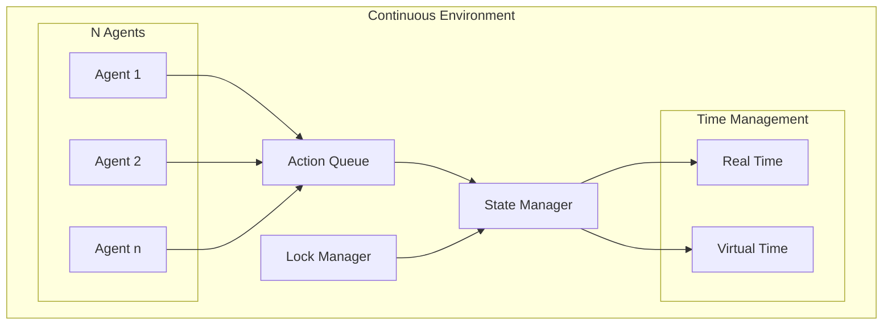

# Continuous N-Agent Architecture

## Overview

This guide explains how to run N agents continuously without discrete steps, where each agent operates independently in real-time.

## Core Architecture Changes

### 1. Time Management
```python
class ContinuousAgent:
    def __init__(self, agent_id, tick_rate=None):
        self.agent_id = agent_id
        self.tick_rate = tick_rate  # Optional rate limiting
        self.last_tick = time.time()
        
    async def run_forever(self):
        """Continuous agent operation"""
        while True:
            current_time = time.time()
            
            # Rate limiting if specified
            if self.tick_rate:
                sleep_time = 1/self.tick_rate - (current_time - self.last_tick)
                if sleep_time > 0:
                    await asyncio.sleep(sleep_time)
            
            # Parallel operations
            await self.perceive()
            await self.think()
            await self.act()
            await self.learn()
            
            self.last_tick = time.time()
```

### 2. Environment Synchronization



### 3. Resource Scaling

```python
class ResourceManager:
    def __init__(self, max_agents):
        self.max_agents = max_agents
        self.core_pool = ThreadPool(cpu_count() - 1)  # Reserve 1 core
        self.memory_per_agent = total_memory / max_agents
        
        # Dynamic scaling
        self.active_agents = {}
        self.resource_monitor = ResourceMonitor()
```

## Implementation Guide

### 1. Agent Pool Management

```python
class ContinuousAgentPool:
    def __init__(self, max_agents):
        self.max_agents = max_agents
        self.active_agents = {}
        self.agent_queues = {
            'high_priority': asyncio.Queue(),
            'normal': asyncio.Queue(),
            'background': asyncio.Queue()
        }
        
    async def add_agent(self, agent_config):
        """Add new agent to the pool"""
        if len(self.active_agents) >= self.max_agents:
            # Queue agent for later activation
            await self.agent_queues[agent_config['priority']].put(agent_config)
            return False
            
        # Create and start agent
        agent = ContinuousAgent(agent_config)
        self.active_agents[agent.id] = agent
        asyncio.create_task(agent.run_forever())
        return True
```

### 2. Environment State Management

```python
class ContinuousEnvironment:
    def __init__(self):
        self.state = StateManager()
        self.action_queue = asyncio.Queue()
        self.state_locks = {}  # Region-based locking
        
    async def update(self):
        """Continuous environment updates"""
        while True:
            # Process queued actions
            while not self.action_queue.empty():
                action = await self.action_queue.get()
                await self.apply_action(action)
            
            # Update global state
            await self.state.update()
            
            # Brief sleep to prevent CPU hogging
            await asyncio.sleep(0.001)
```

### 3. Memory Management for N Agents

```python
class NAgentMemoryManager:
    def __init__(self, max_agents):
        self.memory_pools = {}
        self.shared_cache = LRUCache(size=total_memory * 0.2)  # 20% for shared cache
        
    def allocate_agent_memory(self, agent_id):
        """Dynamic memory allocation"""
        pool = MemoryPool(
            working_memory=self.calculate_working_memory(),
            short_term=self.calculate_short_term(),
            intermediate=self.calculate_intermediate(),
            long_term=self.calculate_long_term()
        )
        self.memory_pools[agent_id] = pool
        return pool
```

## Scaling Considerations

### 1. Dynamic Resource Allocation
```python
class DynamicResourceAllocator:
    def adjust_resources(self, agent_metrics):
        """Adjust resources based on agent performance"""
        for agent_id, metrics in agent_metrics.items():
            if metrics['cpu_usage'] > threshold:
                self.increase_cpu_priority(agent_id)
            if metrics['memory_pressure'] > threshold:
                self.expand_memory_pool(agent_id)
```

### 2. Load Balancing
```python
class LoadBalancer:
    def balance_agents(self, current_load):
        """Balance agent load across cores"""
        overloaded_cores = self.detect_overload()
        available_cores = self.find_available_cores()
        
        for core in overloaded_cores:
            self.migrate_agents(
                from_core=core,
                to_core=self.select_target_core(available_cores)
            )
```

## Best Practices for N-Agent Systems

1. **Resource Management**
   ```python
   # Configure resource limits per agent
   agent_limits = {
       'cpu_share': 1/n_agents,  # Fair CPU sharing
       'memory_limit': total_memory/n_agents,
       'priority_boost': False  # Dynamic priority adjustment
   }
   ```

2. **Conflict Resolution**
   ```python
   class ConflictResolver:
       async def resolve_conflicts(self, actions):
           """Resolve conflicting actions from multiple agents"""
           # Group conflicting actions
           conflicts = self.identify_conflicts(actions)
           
           # Resolve based on priorities and timestamps
           resolved = await self.apply_resolution_strategy(conflicts)
           
           return resolved
   ```

3. **Performance Monitoring**
   ```python
   class PerformanceMonitor:
       def monitor_system(self):
           metrics = {
               'agent_count': len(active_agents),
               'memory_usage': self.get_memory_usage(),
               'cpu_utilization': self.get_cpu_usage(),
               'action_throughput': self.measure_actions_per_second()
           }
           return metrics
   ```

## Example: Running 1000+ Agents

```python
async def run_large_scale_simulation():
    # Initialize system
    pool = ContinuousAgentPool(max_agents=1000)
    env = ContinuousEnvironment()
    
    # Create agents with different roles
    agent_types = ['explorer', 'analyzer', 'controller']
    for i in range(1000):
        agent_config = {
            'id': f'agent_{i}',
            'type': random.choice(agent_types),
            'priority': 'normal',
            'tick_rate': 10  # 10 Hz operation
        }
        await pool.add_agent(agent_config)
    
    # Start continuous operation
    await asyncio.gather(
        env.update(),
        pool.manage_agents(),
        monitor.run()
    )
```

## Monitoring Large-Scale Operations

```python
# Real-time monitoring dashboard
async def monitor_large_scale():
    while True:
        stats = {
            'active_agents': len(pool.active_agents),
            'queued_agents': sum(q.qsize() for q in pool.agent_queues.values()),
            'action_rate': action_counter.rate(),
            'memory_usage': resource_monitor.memory_usage(),
            'cpu_usage': resource_monitor.cpu_usage()
        }
        await dashboard.update(stats)
        await asyncio.sleep(1)
``` 