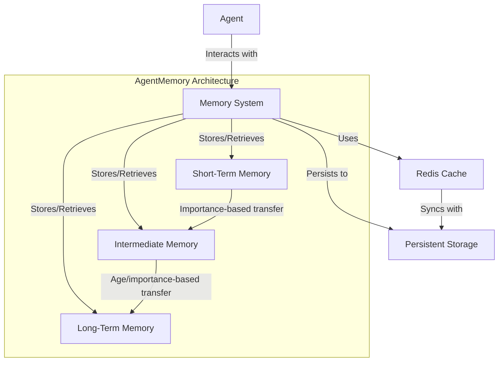
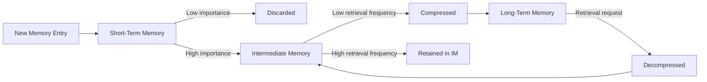

# AgentMemory System Design

## Architecture Overview

Agents interact with a central Memory System that manages three distinct memory tiers. Short-Term Memory holds recent experiences, Intermediate Memory stores important information for medium-term access, and Long-Term Memory archives historical data. The system uses Redis for fast memory access and syncs important data to permanent storage for analysis.

## Memory Flow

Memories move through the system similar to human memory processes. New experiences enter Short-Term Memory, where unimportant items are discarded while significant ones advance to Intermediate Memory. Frequently accessed memories remain in Intermediate Memory for quick retrieval. Less-used memories are compressed and moved to Long-Term Memory for efficient storage. When needed again, older memories are restored to Intermediate Memory for easier access.

# Major Requirements

1. **Hierarchical Memory Architecture**
   - Three-tier system: Short-Term Memory (STM), Intermediate Memory (IM), and Long-Term Memory (LTM)
   - Efficient memory transition between tiers with progressive compression
   - Ability to store different memory types (state, action, interaction)

2. **Performance Optimization**
   - Redis-based caching for high-throughput operations
   - Batch persistence mechanisms to reduce database load
   - Optimized indices for efficient retrieval

3. **Flexible Retrieval System**
   - Vector similarity search for contextually relevant memories
   - Attribute-based and temporal retrieval options 
   - Multi-resolution compression with minimal information loss

4. **Integration Capabilities**
   - Standardized API for agent system integration
   - Event hooks for automatic memory formation during critical experiences
   - Compatibility with existing simulation database architecture

# Primary Features

1. **Memory Embedding System**
   - Neural network-based autoencoder for vector embeddings
   - Multi-resolution compression for different memory tiers
   - Semantic preservation during compression

2. **Contextual Memory Retrieval**
   - Similarity-based retrieval using vector embeddings
   - Attribute-based and temporal filtering options
   - Relevance ranking for retrieved memories

3. **Memory Transition Management**
   - Automated maintenance of memory tiers
   - Importance-based filtering during transitions
   - Background workers for efficient batch operations

4. **State Change Tracking**
   - Historical tracking of attribute changes
   - Significant change detection
   - Statistical analysis of agent changes over time

5. **Error Handling and Recovery**
   - Robust error recovery mechanisms
   - Graceful degradation strategies
   - Fallback systems when primary storage fails

# Acceptance Criteria

1. **Performance**
   - Memory operations must not block simulation progress
   - Retrieval latency under 10ms for STM, 50ms for IM, 200ms for LTM
   - Support for high-volume simulations with 100,000+ steps

2. **Storage Efficiency**
   - Progressive compression with adjustable ratios (typically 3:1 for IM, 10:1 for LTM)
   - Automatic maintenance of memory tiers based on importance and recency
   - Efficient Redis schema design with optimized indices

3. **Retrieval Quality**
   - Semantically relevant results for similarity searches
   - Accurate reconstruction of memories from compressed states
   - Proper weighting of recency vs. importance in results

4. **Integration**
   - Complete, documented API for agent integration
   - Compatibility with existing simulation database
   - Event-driven hooks for key agent experiences

5. **Reliability**
   - Robust error handling with graceful degradation
   - Data consistency across memory tiers
   - Recovery mechanisms for unexpected failures
