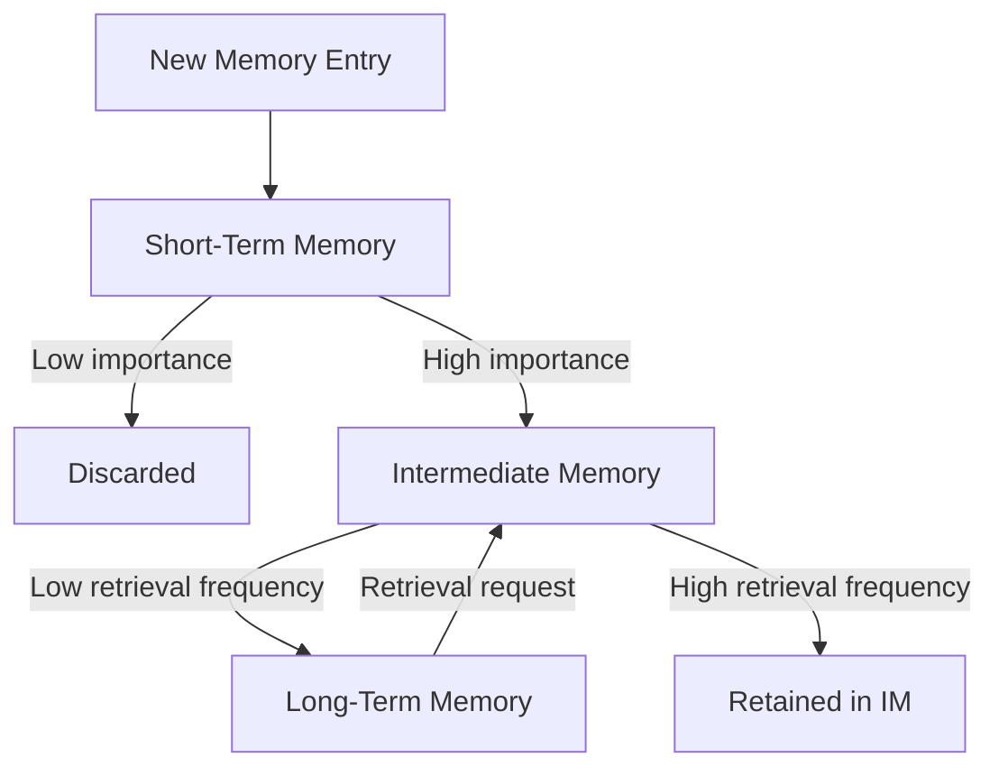
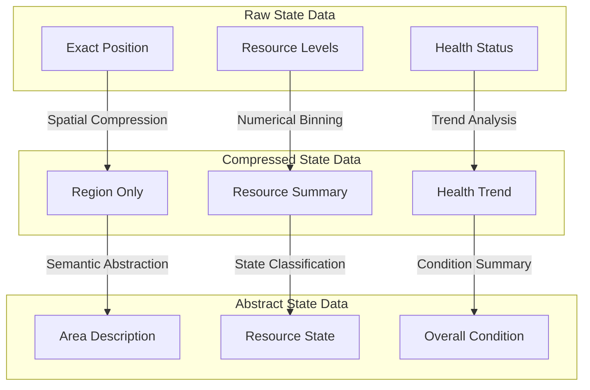

# AgentMemory: A Comprehensive Architecture for Intelligent Agent Memory Management

## Core Design Philosophy

AgentMemory is built on the understanding that intelligent agents need memory systems that mimic human cognitive processes while working efficiently within computational constraints. This document explores the key architectural principles that make this system unique.

## Biologically-Inspired Memory Architecture



Memory flows through the system similar to human memory processes:

1. **Short-Term Memory (STM)**
   - Implemented with Redis for microsecond access times
   - Stores complete, uncompressed data (~100 recent steps)
   - Automatically cleans up based on age and capacity
   - Preserves critical experiences based on importance scoring

2. **Intermediate Memory (IM)**
   - Redis-based with TTL for balanced performance (~1000 steps)
   - Partially compressed (128-dimensional embeddings)
   - Balances detail preservation with storage efficiency
   - Selectively maintains details based on importance

3. **Long-Term Memory (LTM)**
   - SQLite-backed for persistent, efficient storage
   - Highly compressed (32-dimensional embeddings)
   - Maintains abstract representations of entire agent history
   - Optimized for efficient long-term storage and retrieval

## Progressive Compression System



The system employs neural autoencoder-based compression that:
- Preserves semantic meaning while reducing dimensionality
- Tailors compression levels to each memory tier
- Allows efficient similarity-based retrieval even from compressed states
- Progressively transforms concrete data into abstract representations

## Unified Memory Structure

Every memory entry follows a consistent structure:

```json
{
  "memory_id": "unique-id",
  "agent_id": "agent-123",
  "step_number": 1234,
  "timestamp": 1679233344,
  
  "contents": {
    "position": [x, y],
    "resources": 42
  },
  
  "metadata": {
    "compression_level": 0,
    "importance_score": 0.75,
    "retrieval_count": 3
  },
  
  "embeddings": {
    "full_vector": [...],
    "compressed_vector": [...]
  }
}
```

This unified approach allows:
- Seamless processing of different memory types
- Consistent APIs across memory tiers
- Efficient filtering and querying
- Integrated importance scoring

## Memory Importance Prioritization

The system uses sophisticated scoring to determine memory importance:

```python
def calculate_importance(memory):
    """
    Components:
    - Reward magnitude (40%)
    - Retrieval frequency (30%)
    - Recency (20%)
    - Surprise factor (10%)
    """
    return weighted_score
```

This importance-based approach ensures:
- Critical memories are preserved longer
- Routine experiences naturally fade away
- Memory transitions reflect meaningful patterns
- Limited resources focus on valuable information

## Integration & Flexibility

AgentMemory provides simple yet powerful integration methods:

```python
# Direct API
memory_system.store_agent_state(
    agent_id="agent1", 
    state_data={"position": [0, 0]},
    step_number=1
)

# Using hooks
@install_memory_hooks
class MyAgent(BaseAgent):
    def act(self, observation):
        # Memory hooks automatically store states
        return super().act(observation)
```

This flexible architecture allows:
- Seamless integration with existing agent systems
- Complete control or automated memory management
- Extensive configuration options
- Comprehensive performance monitoring

## Performance & Benchmarking

The system includes sophisticated benchmarking tools to measure:
- Storage performance across memory tiers
- Compression effectiveness and retrieval quality
- Memory transition efficiency
- Scalability under increasing loads

These tools ensure the system meets its performance targets:
- STM retrieval under 10ms
- IM retrieval under 50ms
- LTM retrieval under 200ms
- Support for simulations with 100,000+ steps

By combining biological inspiration with practical engineering, AgentMemory provides a comprehensive solution for intelligent agent memory management that balances performance, efficiency, and cognitive realism.
