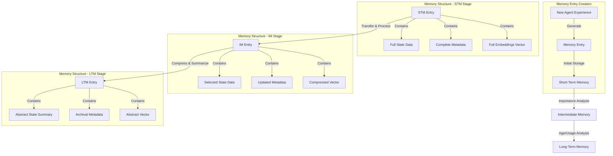
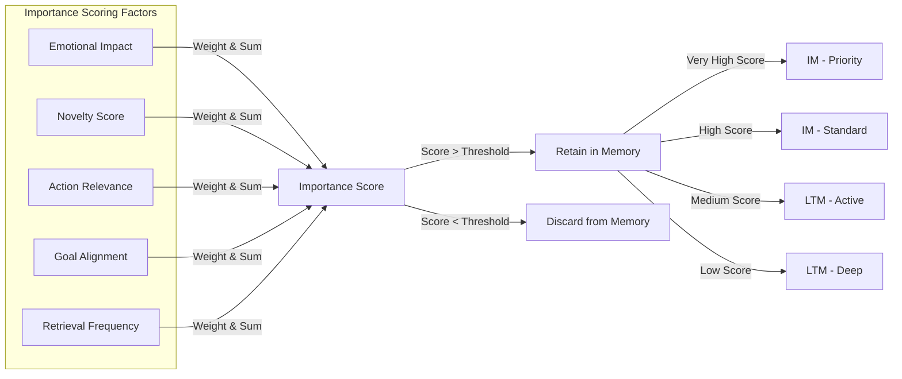
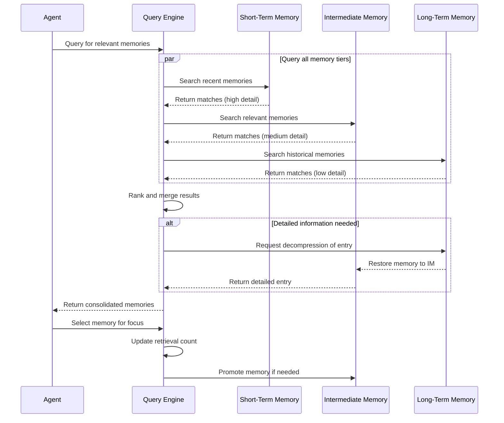
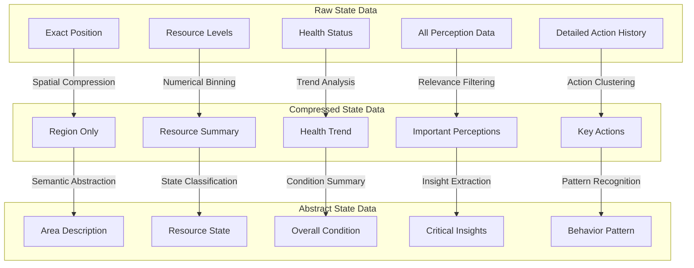
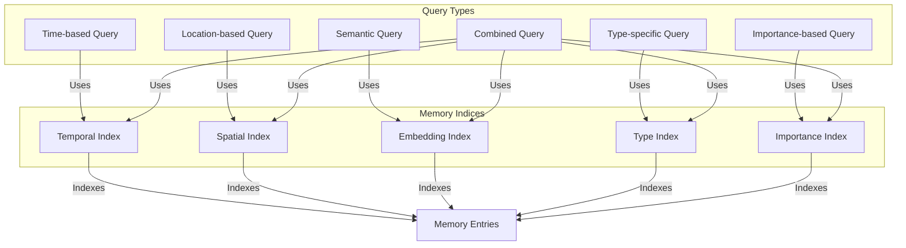

# Memory Entry Lifecycle Diagrams

## Memory Entry Transformation

This diagram illustrates how memory entries transform as they move through the memory tiers. When an agent has a new experience, a memory entry is created and stored in Short-Term Memory (STM) with full state data, complete metadata, and full embedding vectors. As important memories transfer to Intermediate Memory (IM), they undergo processing where only selected state data is retained and vectors are compressed. When memories move to Long-Term Memory (LTM), they're further compressed to abstract summaries with archival metadata and abstract vectors. This progressive transformation mimics human memory, where details fade over time but core concepts remain.

## Memory Importance Scoring System

This diagram shows the importance scoring system that determines which memories to retain and where to store them. Five key factors contribute to a memory's importance: emotional impact, novelty, action relevance, goal alignment, and retrieval frequency. These factors are weighted and summed to produce an importance score. Memories scoring below a threshold are discarded, while those above are retained. The final score determines the memory's destination: very high-scoring memories go to priority IM, high scores to standard IM, medium scores to active LTM, and low (but above threshold) scores to deep LTM. This nuanced scoring system ensures the most relevant memories are most easily accessible.

## Memory Access and Retrieval Flow

This sequence diagram illustrates the memory access and retrieval process. When an agent queries for memories, the Query Engine searches all memory tiers in parallel: STM for recent memories with high detail, IM for relevant memories with medium detail, and LTM for historical memories with low detail. Results are ranked and merged based on relevance. If detailed information is needed for an LTM entry, it's decompressed and restored to IM before being returned. When the agent selects a specific memory for focus, its retrieval count is updated, potentially promoting frequently accessed memories to more accessible tiers. This parallel querying with intelligent promotion ensures efficient memory retrieval.

## State Data Compression Techniques

This diagram details the progressive compression techniques applied to different aspects of state data as memories move through tiers. Raw state data in STM contains precise information like exact positions and detailed resource levels. In IM, this data is compressed: positions become regions, resources are summarized, and only important perceptions and key actions are retained. In LTM, the data becomes highly abstract: regions become area descriptions, resource details become general states, and specific actions become behavior patterns. Each type of data undergoes specialized compression algorithms appropriate to its nature, preserving essential information while reducing storage requirements.

## Memory Index and Query System

This diagram shows the indexing and query system that enables efficient memory retrieval. Five types of indices are maintained: Temporal (time-based), Spatial (location-based), Embedding (semantic), Type (state vs. interaction), and Importance (priority-based). These correspond to different types of queries an agent might make, such as "What happened yesterday?" (temporal), "What did I see in the forest?" (spatial), or "What do I know about resources?" (semantic). Combined queries can leverage multiple indices simultaneously for complex memory retrieval. This multi-dimensional indexing system allows for flexible, efficient querying across all memory tiers regardless of compression level. 