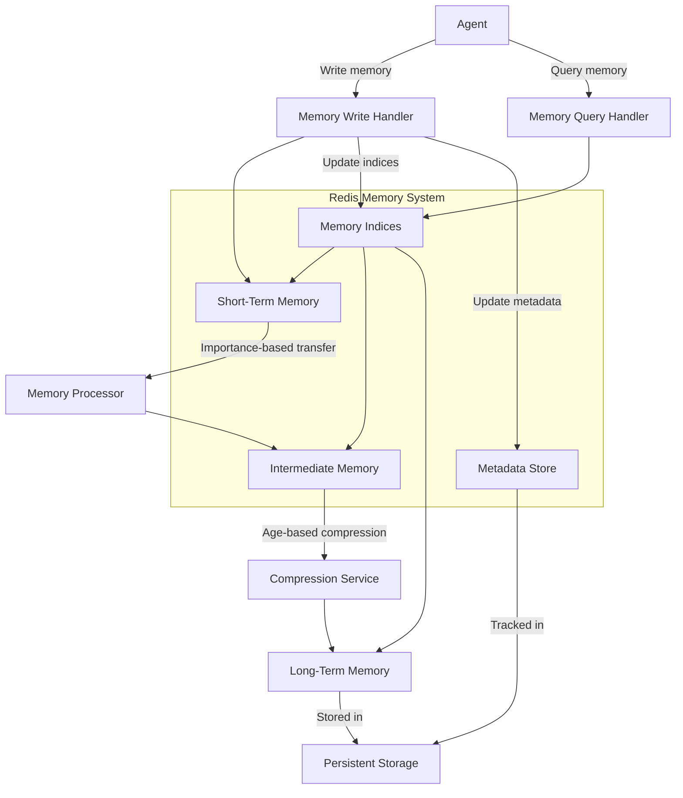
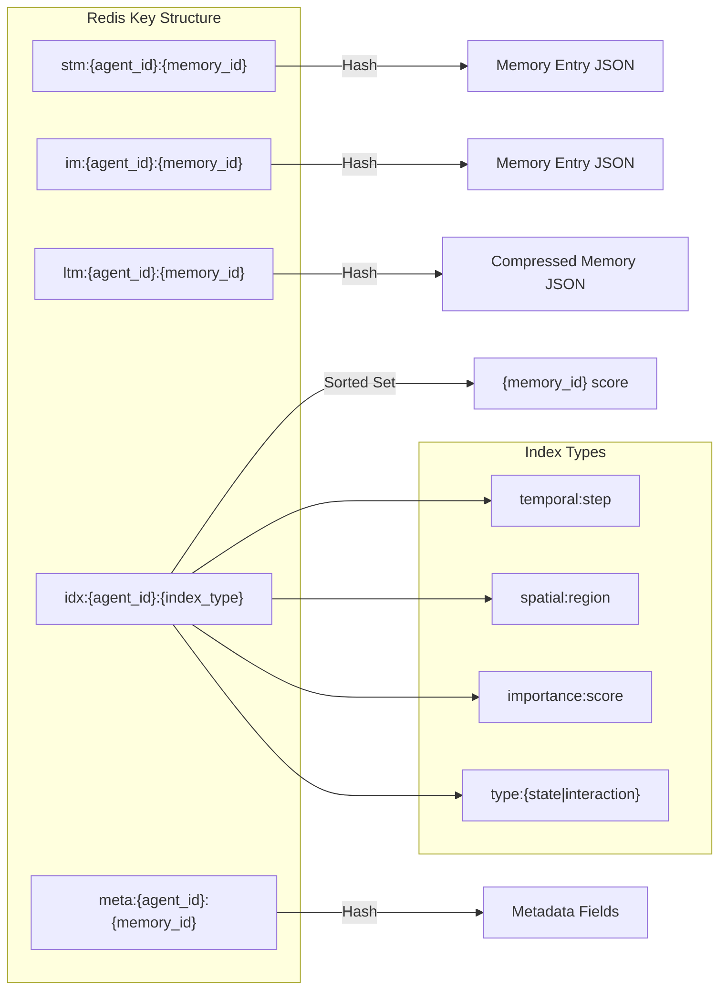
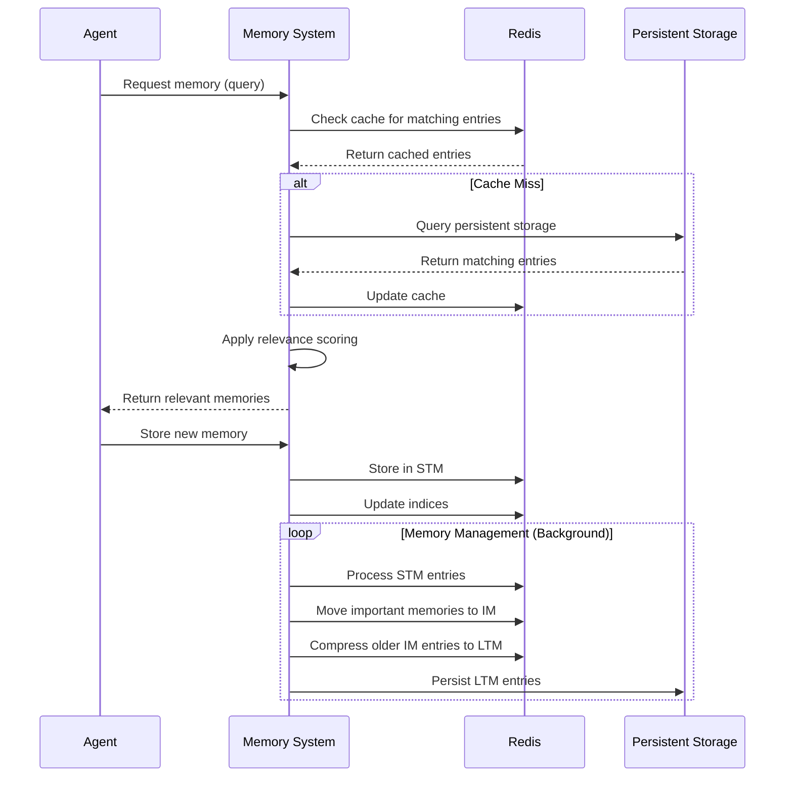
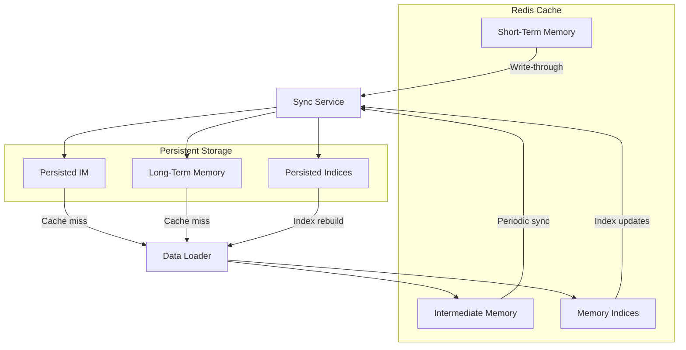

# Redis Implementation Diagrams

## Redis Memory Tier Architecture

This diagram details the Redis-based memory tier architecture. It shows how agents interact with the system through Write and Query handlers. New memories are stored in Short-Term Memory (STM) with their indices and metadata updated accordingly. The Memory Processor evaluates STM entries and transfers important ones to Intermediate Memory (IM). A Compression Service compresses older IM entries and moves them to Long-Term Memory (LTM). Both LTM and metadata are persisted to storage. Query operations leverage indices to efficiently retrieve memories from any tier.

## Redis Data Structure

This diagram illustrates the Redis key structure used to implement the memory system. Memory entries are stored as Redis hashes with keys prefixed by their tier (stm/im/ltm) followed by agent_id and memory_id. Indices are implemented as sorted sets that enable efficient querying by various dimensions (temporal, spatial, importance, and type). Metadata is stored in separate hashes for quick access. This structure leverages Redis's data types to provide fast access patterns while maintaining the relationships between different aspects of the memory system.

## Memory Access Patterns

This sequence diagram shows the memory access patterns and interactions between system components. When an agent requests memories, the system first checks Redis for cached entries. If there's a cache miss, it falls back to persistent storage and updates the cache. Relevance scoring is applied before returning memories to the agent. For storing new memories, entries are placed in STM with index updates. A background process continuously manages memory transfers between tiers based on importance and age, ensuring optimal memory organization and persistence.

## Data Consistency Management

This diagram outlines how data consistency is maintained between Redis and persistent storage. The Sync Service manages data flow to storage using different strategies: write-through for STM and periodic syncing for IM and indices. This ensures data durability while optimizing performance. The Data Loader handles cache misses by loading data from persistent storage back into Redis, and can rebuild indices if needed. This two-way synchronization mechanism ensures the system can recover from failures and maintain data integrity across the caching and persistence layers.
