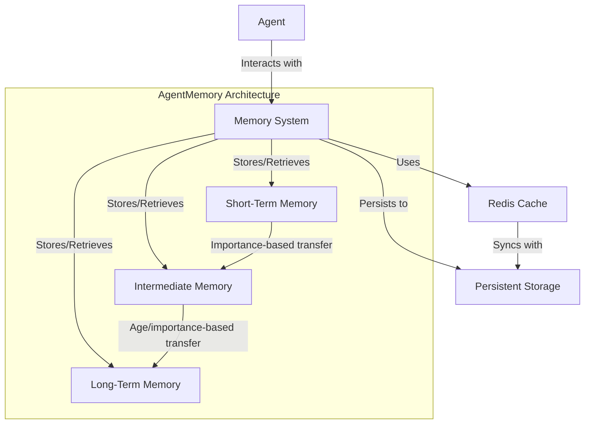
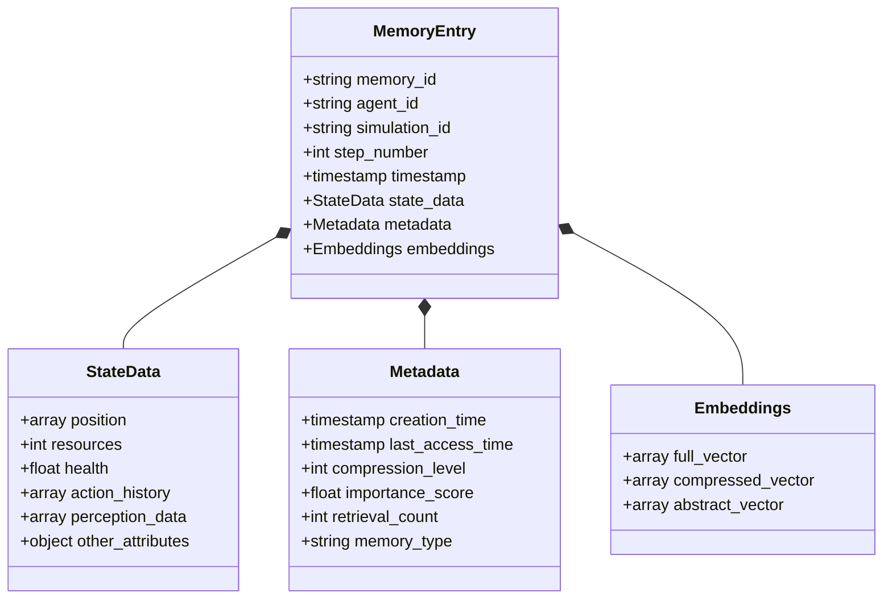
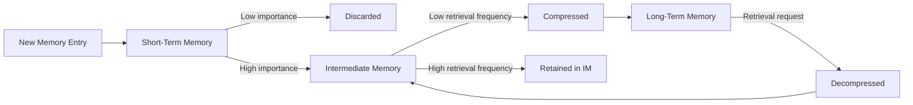
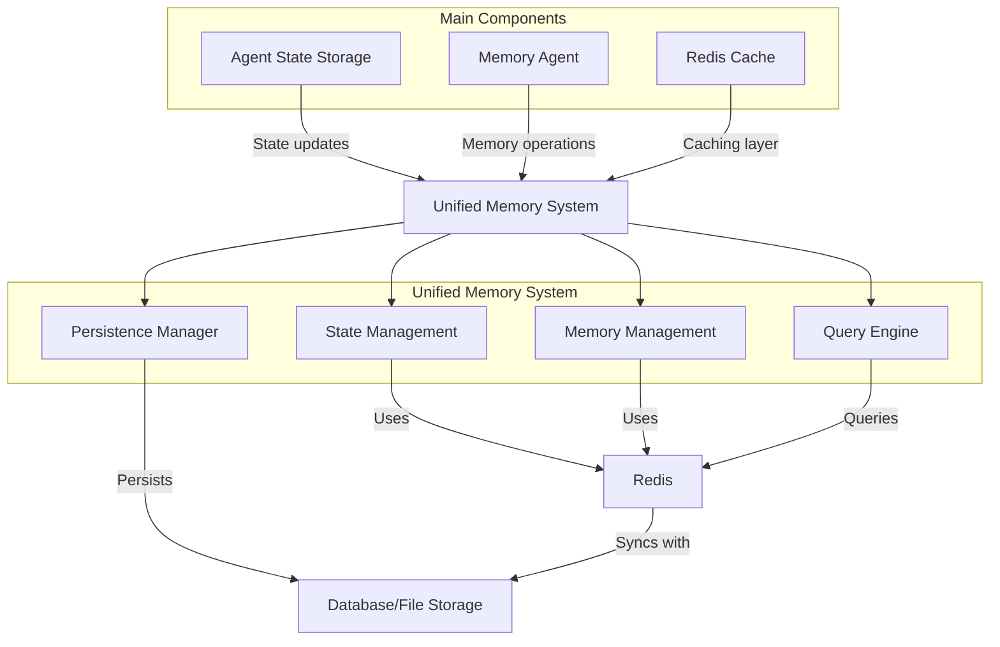
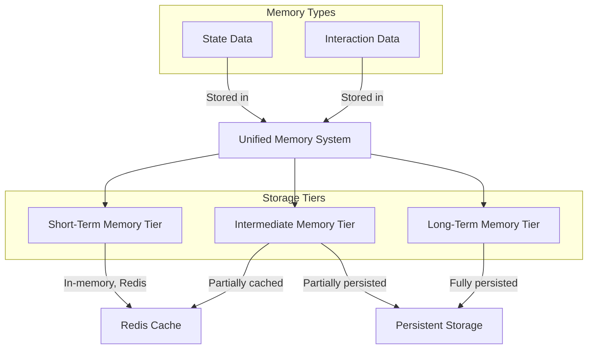

# AgentMemory Architecture Diagrams

## High-Level System Architecture

This diagram illustrates the high-level architecture of the AgentMemory system. It shows how agents interact with the memory system, which manages three tiers of memory: Short-Term Memory (STM), Intermediate Memory (IM), and Long-Term Memory (LTM). The memory system uses Redis for high-performance caching and persists data to a database. Information flows between memory tiers based on importance and age, with Redis syncing to persistent storage to ensure data durability.

## Memory Entry Structure

This class diagram depicts the structure of a memory entry in the system. Each memory entry contains identifiers, a timestamp, state data (position, resources, health, etc.), metadata (creation time, importance score, etc.), and embeddings used for semantic retrieval. The unified design allows for both state data and interaction data to be stored in the same structure, with the memory_type field distinguishing between them. This schema supports the efficient storage and retrieval of different types of agent memories.

## Memory Flow and Transitions

This flowchart shows how memory entries move through the system's memory tiers. New memories enter Short-Term Memory (STM), where low-importance memories are discarded while important ones move to Intermediate Memory (IM). From IM, memories that are accessed frequently remain there for quick retrieval, while less-frequently accessed memories are compressed and moved to Long-Term Memory (LTM). When an LTM entry needs to be accessed, it's decompressed and moved back to IM for faster access. This mimics human memory processes where important and frequently accessed memories remain readily available.

## Component Integration

This diagram illustrates how the main components integrate within the unified system. The three key components (Agent State Storage, Memory Agent, and Redis Cache) work with the Unified Memory System, which consists of four subsystems: State Management, Memory Management, Query Engine, and Persistence Manager. Each subsystem interfaces with Redis for caching and with the database for persistence. This design unifies what would otherwise be separate systems into a cohesive architecture with clear responsibilities and interfaces.

## Data Types and Storage Tiers

This diagram shows how different types of data (State Data and Interaction Data) are stored within the unified system. Both data types share the same memory architecture with three tiers: Short-Term Memory (STM), Intermediate Memory (IM), and Long-Term Memory (LTM). STM is kept entirely in Redis for fast access, IM is partially cached and partially persisted, and LTM is fully persisted to storage. This unified approach enables consistent memory management regardless of data type while allowing for optimized storage strategies based on memory tier. 