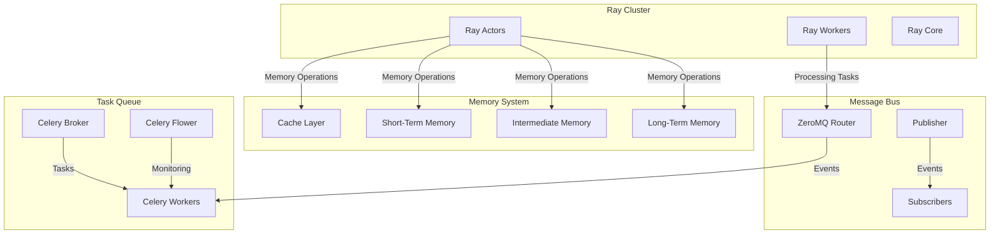

# Distributed Implementation of Four-Tier Memory Architecture

## Overview

This article details the implementation of a distributed agent memory system using modern distributed computing frameworks. The architecture leverages:

- **Ray**: For distributed computing and actor model
- **Concurrent.futures**: For thread pool management
- **ZeroMQ**: For high-performance message passing
- **Celery**: For distributed task queues

## System Architecture



## Implementation Components

### 1. Ray-Based Memory Management

```python
import ray
from concurrent.futures import ThreadPoolExecutor
from typing import Optional, Dict, Any

@ray.remote
class DistributedMemoryManager:
    def __init__(self, config: Dict[str, Any]):
        # Thread pools for different memory tiers
        self.executors = {
            'cache': ThreadPoolExecutor(max_workers=2),
            'stm': ThreadPoolExecutor(max_workers=5),
            'im': ThreadPoolExecutor(max_workers=5),
            'ltm': ThreadPoolExecutor(max_workers=3)
        }
        
        # Initialize memory tiers
        self.cache = ray.get_actor("cache_service")
        self.stm = ray.get_actor("stm_service")
        self.im = ray.get_actor("im_service")
        self.ltm = ray.get_actor("ltm_service")
        
    def get(self, key: str) -> Optional[Any]:
        # Try cache first using thread pool
        future = self.executors['cache'].submit(
            lambda: ray.get(self.cache.get.remote(key))
        )
        try:
            result = future.result(timeout=0.1)  # 100ms timeout
            if result:
                return result
        except TimeoutError:
            pass
            
        # Try other tiers with increasing timeouts
        for tier, timeout in [('stm', 0.5), ('im', 1.0), ('ltm', 2.0)]:
            future = self.executors[tier].submit(
                lambda t=tier: ray.get(getattr(self, t).get.remote(key))
            )
            try:
                result = future.result(timeout=timeout)
                if result:
                    # Update cache asynchronously
                    self.cache.set.remote(key, result)
                    return result
            except TimeoutError:
                continue
                
        return None
        
    def store(self, key: str, value: Any, importance: float = 0.5):
        # Store in STM and cache concurrently
        futures = []
        futures.append(self.executors['stm'].submit(
            lambda: ray.get(self.stm.set.remote(key, value, importance))
        ))
        futures.append(self.executors['cache'].submit(
            lambda: ray.get(self.cache.set.remote(key, value))
        ))
        # Wait for completion
        concurrent.futures.wait(futures)
```

### 2. ZeroMQ Message Bus

```python
import zmq
from dataclasses import dataclass
from typing import Any

@dataclass
class Message:
    type: str
    payload: Any
    source: str
    timestamp: float

class MessageBus:
    def __init__(self, host: str = "localhost", port: int = 5555):
        self.context = zmq.Context()
        
        # Router socket for request/reply pattern
        self.router = self.context.socket(zmq.ROUTER)
        self.router.bind(f"tcp://{host}:{port}")
        
        # Pub/Sub sockets for event broadcasting
        self.publisher = self.context.socket(zmq.PUB)
        self.publisher.bind(f"tcp://{host}:{port+1}")
        
    def start(self):
        while True:
            # Get message from router
            identity, message = self.router.recv_multipart()
            msg = Message.deserialize(message)
            
            # Process message
            if msg.type == "memory_operation":
                # Forward to memory manager
                self.handle_memory_operation(msg)
            elif msg.type == "processing_task":
                # Create Celery task
                self.create_celery_task(msg)
            
            # Broadcast event
            self.publisher.send_multipart([
                msg.type.encode(),
                Message.serialize(msg)
            ])
```

### 3. Celery Task Queue

```python
from celery import Celery
from kombu import Queue

# Configure Celery
app = Celery('agent_memory',
             broker='redis://localhost:6379/0',
             backend='redis://localhost:6379/1')

# Configure task queues with priorities
app.conf.task_queues = (
    Queue('memory_ops', routing_key='memory.#'),
    Queue('processing', routing_key='processing.#'),
    Queue('maintenance', routing_key='maintenance.#'),
)

@app.task(queue='memory_ops')
def memory_operation(operation: str, key: str, value: Any = None):
    """Execute memory operations asynchronously."""
    memory_manager = ray.get_actor("memory_manager")
    if operation == "get":
        return ray.get(memory_manager.get.remote(key))
    elif operation == "store":
        return ray.get(memory_manager.store.remote(key, value))

@app.task(queue='processing')
def process_data(data: Any):
    """Process data using Ray workers."""
    return ray.get(ray.remote(process_function).remote(data))

@app.task(queue='maintenance')
def memory_maintenance():
    """Periodic memory maintenance task."""
    memory_manager = ray.get_actor("memory_manager")
    ray.get(memory_manager.run_maintenance.remote())
```

### 4. Thread Pool Management

```python
from concurrent.futures import ThreadPoolExecutor, Future
from dataclasses import dataclass
from typing import Dict, Callable

@dataclass
class ThreadPoolConfig:
    min_workers: int
    max_workers: int
    queue_size: int

class AdaptiveThreadPool:
    def __init__(self, config: ThreadPoolConfig):
        self.config = config
        self.executor = ThreadPoolExecutor(
            max_workers=config.min_workers,
            thread_name_prefix='memory_worker'
        )
        self.active_threads = 0
        self.queue_size = 0
        
    def submit(self, fn: Callable, *args, **kwargs) -> Future:
        self.queue_size += 1
        
        # Scale up if needed
        if (self.queue_size > self.active_threads and 
            self.active_threads < self.config.max_workers):
            self._scale_up()
            
        future = self.executor.submit(fn, *args, **kwargs)
        future.add_done_callback(self._task_done)
        return future
        
    def _scale_up(self):
        """Increase thread count."""
        if self.active_threads < self.config.max_workers:
            self.executor._max_workers += 1
            self.active_threads += 1
            
    def _scale_down(self):
        """Decrease thread count if queue is small."""
        if (self.queue_size < self.active_threads / 2 and 
            self.active_threads > self.config.min_workers):
            self.executor._max_workers -= 1
            self.active_threads -= 1
            
    def _task_done(self, future):
        """Callback when task is completed."""
        self.queue_size -= 1
        self._scale_down()
```

## Integration Example

Here's how to integrate all components into a cohesive system:

```python
import ray
from celery import Celery
from concurrent.futures import ThreadPoolExecutor
import zmq

class DistributedAgent:
    def __init__(self, config: Dict[str, Any]):
        # Initialize Ray
        ray.init(address=config['ray_address'])
        
        # Initialize memory manager
        self.memory_manager = ray.remote(DistributedMemoryManager).remote(
            config['memory_config']
        )
        
        # Initialize message bus
        self.message_bus = MessageBus(
            host=config['zmq_host'],
            port=config['zmq_port']
        )
        
        # Initialize Celery
        self.celery = Celery('agent_memory',
                            broker=config['celery_broker'],
                            backend=config['celery_backend'])
        
        # Initialize thread pools
        self.thread_pools = {
            'memory': AdaptiveThreadPool(ThreadPoolConfig(
                min_workers=4,
                max_workers=16,
                queue_size=1000
            )),
            'processing': AdaptiveThreadPool(ThreadPoolConfig(
                min_workers=2,
                max_workers=8,
                queue_size=500
            ))
        }
        
    async def process_observation(self, observation: Any):
        # Store observation in memory
        future = self.thread_pools['memory'].submit(
            lambda: ray.get(self.memory_manager.store.remote(
                f"obs:{time.time()}", observation
            ))
        )
        
        # Create processing task
        task = self.celery.send_task(
            'process_data',
            args=[observation],
            queue='processing'
        )
        
        # Publish event
        self.message_bus.publisher.send_multipart([
            b"observation",
            Message.serialize(Message(
                type="observation",
                payload=observation,
                source="agent",
                timestamp=time.time()
            ))
        ])
        
        # Wait for memory operation to complete
        await future
        
    def run(self):
        # Start message bus
        self.message_bus_thread = Thread(
            target=self.message_bus.start
        )
        self.message_bus_thread.start()
        
        # Start Celery workers
        subprocess.Popen([
            'celery', '-A', 'agent_memory', 'worker',
            '--loglevel=info',
            '--queues=memory_ops,processing,maintenance'
        ])
        
        # Start Celery beat for periodic tasks
        subprocess.Popen([
            'celery', '-A', 'agent_memory', 'beat',
            '--loglevel=info'
        ])
```

## Performance Considerations

### 1. Memory Tier Optimization

```python
@ray.remote
class CacheTier:
    def __init__(self, config):
        self.cache = {}
        self.stats = ray.remote(MetricsCollector).remote()
        
    def get(self, key):
        value = self.cache.get(key)
        if value:
            ray.get(self.stats.increment.remote("cache_hits"))
        else:
            ray.get(self.stats.increment.remote("cache_misses"))
        return value
```

### 2. Message Bus Optimization

```python
class OptimizedMessageBus(MessageBus):
    def __init__(self, *args, **kwargs):
        super().__init__(*args, **kwargs)
        self.high_water_mark = 10000
        self.router.setsockopt(zmq.SNDHWM, self.high_water_mark)
        self.router.setsockopt(zmq.RCVHWM, self.high_water_mark)
```

### 3. Task Queue Optimization

```python
app.conf.update(
    worker_prefetch_multiplier=1,
    task_acks_late=True,
    task_reject_on_worker_lost=True,
    task_queue_max_priority=10,
    broker_transport_options={
        'visibility_timeout': 3600,
        'queue_order_strategy': 'priority'
    }
)
```

## Monitoring and Metrics

### 1. Ray Dashboard

```python
ray.init(
    address="auto",
    dashboard_host="0.0.0.0",
    dashboard_port=8265,
    include_dashboard=True
)
```

### 2. Celery Flower

```python
subprocess.Popen([
    'celery', '-A', 'agent_memory', 'flower',
    '--port=5555',
    '--broker=redis://localhost:6379/0'
])
```

### 3. Custom Metrics

```python
@ray.remote
class MetricsCollector:
    def __init__(self):
        self.metrics = defaultdict(int)
        self.timings = defaultdict(list)
        
    def increment(self, metric: str):
        self.metrics[metric] += 1
        
    def record_timing(self, operation: str, duration: float):
        self.timings[operation].append(duration)
        
    def get_stats(self):
        return {
            'metrics': dict(self.metrics),
            'timings': {
                k: {
                    'avg': np.mean(v),
                    'p95': np.percentile(v, 95),
                    'p99': np.percentile(v, 99)
                }
                for k, v in self.timings.items()
            }
        }
```

## Best Practices

1. **Ray Actor Placement**
   - Place memory tiers on different nodes
   - Use custom resources for specialized hardware
   - Implement proper actor recovery

2. **ZeroMQ Patterns**
   - Use ROUTER-DEALER for load balancing
   - Implement heartbeating for reliability
   - Use multipart messages for metadata

3. **Celery Task Management**
   - Implement proper retry policies
   - Use task routing for optimization
   - Monitor queue lengths and latencies

4. **Thread Pool Tuning**
   - Adjust pool sizes based on workload
   - Monitor thread utilization
   - Implement proper error handling

## Conclusion

This distributed implementation of the four-tier memory architecture provides:
- Horizontal scalability through Ray
- Reliable message passing with ZeroMQ
- Efficient task processing with Celery
- Adaptive thread pool management

The system can be deployed across multiple nodes while maintaining the intended functionality and complexity of the original architecture.

## Deployment Guide

### 1. Infrastructure Setup

#### Single Node Deployment
```bash
# Install dependencies
pip install ray zmq celery redis numpy torch

# Start Redis for Celery and STM/IM
redis-server --port 6379  # For Celery
redis-server --port 6380  # For STM
redis-server --port 6381  # For IM

# Start Ray head node
ray start --head --port=6382

# Initialize SQLite for LTM
sqlite3 ltm.db < schema.sql
```

#### Multi-Node Deployment
```bash
# On head node
ray start --head --port=6382 --redis-port=6383

# On worker nodes
ray start --address='<head_node_ip>:6382'

# Configure Redis Cluster for STM/IM
redis-cli --cluster create \
    node1:6379 node2:6379 node3:6379 \
    node4:6380 node5:6380 node6:6380 \
    --cluster-replicas 1
```

### 2. Configuration Management

#### System Configuration
```python
@dataclass
class SystemConfig:
    # Ray configuration
    ray_config: Dict[str, Any] = field(default_factory=lambda: {
        'address': 'auto',
        'runtime_env': {
            'pip': [
                'redis>=4.0.0',
                'zmq>=22.0.0',
                'celery>=5.0.0',
                'numpy>=1.20.0'
            ]
        },
        'resources': {
            'memory_node': 2,  # Number of nodes dedicated to memory
            'processing_node': 4  # Number of nodes for processing
        }
    })
    
    # Redis configuration
    redis_config: Dict[str, Any] = field(default_factory=lambda: {
        'stm': {
            'host': 'localhost',
            'port': 6380,
            'db': 0,
            'max_memory': '4gb',
            'maxmemory_policy': 'allkeys-lru'
        },
        'im': {
            'host': 'localhost',
            'port': 6381,
            'db': 0,
            'max_memory': '8gb',
            'maxmemory_policy': 'volatile-lru'
        }
    })
    
    # SQLite configuration
    sqlite_config: Dict[str, Any] = field(default_factory=lambda: {
        'database': 'ltm.db',
        'journal_mode': 'WAL',
        'cache_size': -2000000,  # 2GB cache
        'synchronous': 'NORMAL',
        'temp_store': 'MEMORY'
    })
    
    # ZeroMQ configuration
    zmq_config: Dict[str, Any] = field(default_factory=lambda: {
        'router_port': 5555,
        'pub_port': 5556,
        'high_water_mark': 10000,
        'heartbeat_interval': 1000,
        'reconnect_interval': 100
    })
    
    # Celery configuration
    celery_config: Dict[str, Any] = field(default_factory=lambda: {
        'broker_url': 'redis://localhost:6379/0',
        'result_backend': 'redis://localhost:6379/1',
        'task_serializer': 'pickle',
        'accept_content': ['pickle', 'json'],
        'task_routes': {
            'memory_ops.*': {'queue': 'memory_ops'},
            'processing.*': {'queue': 'processing'},
            'maintenance.*': {'queue': 'maintenance'}
        },
        'task_default_priority': 5,
        'worker_prefetch_multiplier': 1,
        'worker_max_tasks_per_child': 1000
    })
```

### 3. Advanced Memory Management

#### Memory Tier Sharding
```python
@ray.remote
class ShardedMemoryTier:
    def __init__(self, tier_config: Dict[str, Any], num_shards: int = 4):
        self.num_shards = num_shards
        self.shards = [
            ray.remote(MemoryShard).remote(tier_config)
            for _ in range(num_shards)
        ]
        
    def get(self, key: str) -> Optional[Any]:
        shard_id = self._get_shard_id(key)
        return ray.get(self.shards[shard_id].get.remote(key))
        
    def store(self, key: str, value: Any, metadata: Dict[str, Any]):
        shard_id = self._get_shard_id(key)
        return ray.get(self.shards[shard_id].store.remote(key, value, metadata))
        
    def _get_shard_id(self, key: str) -> int:
        """Consistent hashing for shard selection."""
        return hash(key) % self.num_shards
```

#### Memory Compression
```python
class MemoryCompressor:
    def __init__(self, compression_config: Dict[str, Any]):
        self.compression_levels = {
            'stm': 0,    # No compression
            'im': 2,     # Medium compression
            'ltm': 4     # High compression
        }
        self.compressors = {
            'numerical': NumericalCompressor(),
            'categorical': CategoricalCompressor(),
            'text': TextCompressor(),
            'embedding': EmbeddingCompressor()
        }
        
    def compress(self, data: Any, tier: str) -> Tuple[bytes, Dict[str, Any]]:
        level = self.compression_levels[tier]
        data_type = self._detect_data_type(data)
        compressor = self.compressors[data_type]
        
        compressed_data = compressor.compress(data, level)
        metadata = {
            'original_size': len(str(data)),
            'compressed_size': len(compressed_data),
            'compression_type': data_type,
            'compression_level': level
        }
        
        return compressed_data, metadata
```

### 4. Advanced Message Patterns

#### Priority-Based Message Routing
```python
class PriorityMessageRouter:
    def __init__(self, config: Dict[str, Any]):
        self.context = zmq.Context()
        self.high_priority = self.context.socket(zmq.ROUTER)
        self.medium_priority = self.context.socket(zmq.ROUTER)
        self.low_priority = self.context.socket(zmq.ROUTER)
        
        # Configure sockets
        for socket, port in [
            (self.high_priority, config['high_priority_port']),
            (self.medium_priority, config['medium_priority_port']),
            (self.low_priority, config['low_priority_port'])
        ]:
            socket.bind(f"tcp://*:{port}")
            
    def route_message(self, message: Message):
        if self._is_high_priority(message):
            socket = self.high_priority
        elif self._is_medium_priority(message):
            socket = self.medium_priority
        else:
            socket = self.low_priority
            
        socket.send_multipart([
            message.destination.encode(),
            Message.serialize(message)
        ])
```

### 5. Advanced Task Processing

#### Task Pipeline Management
```python
class TaskPipeline:
    def __init__(self, config: Dict[str, Any]):
        self.stages = []
        self.error_handlers = {}
        self.metrics = MetricsCollector()
        
    def add_stage(self, name: str, processor: Callable, 
                  error_handler: Optional[Callable] = None):
        self.stages.append({
            'name': name,
            'processor': processor,
            'error_handler': error_handler
        })
        
    async def process(self, data: Any):
        context = {'original_data': data}
        
        for stage in self.stages:
            try:
                start_time = time.time()
                result = await stage['processor'](data, context)
                duration = time.time() - start_time
                
                self.metrics.record_timing(stage['name'], duration)
                data = result
                
            except Exception as e:
                if stage['error_handler']:
                    data = stage['error_handler'](e, data, context)
                else:
                    raise
                    
        return data
```

### 6. Monitoring and Debugging

#### Advanced Metrics Collection
```python
@ray.remote
class AdvancedMetricsCollector:
    def __init__(self):
        self.metrics = {
            'counters': defaultdict(int),
            'gauges': defaultdict(float),
            'histograms': defaultdict(list),
            'timers': defaultdict(list)
        }
        
    def record_metric(self, metric_type: str, name: str, value: Any):
        if metric_type == 'counter':
            self.metrics['counters'][name] += value
        elif metric_type == 'gauge':
            self.metrics['gauges'][name] = value
        elif metric_type == 'histogram':
            self.metrics['histograms'][name].append(value)
        elif metric_type == 'timer':
            self.metrics['timers'][name].append(value)
            
    def get_metrics_report(self) -> Dict[str, Any]:
        return {
            'counters': dict(self.metrics['counters']),
            'gauges': dict(self.metrics['gauges']),
            'histograms': {
                k: {
                    'min': min(v),
                    'max': max(v),
                    'avg': sum(v) / len(v),
                    'p95': np.percentile(v, 95),
                    'p99': np.percentile(v, 99)
                }
                for k, v in self.metrics['histograms'].items()
            },
            'timers': {
                k: {
                    'avg': sum(v) / len(v),
                    'p95': np.percentile(v, 95),
                    'p99': np.percentile(v, 99)
                }
                for k, v in self.metrics['timers'].items()
            }
        }
```

### 7. Error Handling and Recovery

#### Distributed Circuit Breaker
```python
class DistributedCircuitBreaker:
    def __init__(self, config: Dict[str, Any]):
        self.failure_threshold = config['failure_threshold']
        self.reset_timeout = config['reset_timeout']
        self.half_open_timeout = config['half_open_timeout']
        
        self.failure_count = 0
        self.last_failure_time = 0
        self.state = 'closed'
        
    async def execute(self, command: Callable, *args, **kwargs):
        if self.state == 'open':
            if time.time() - self.last_failure_time > self.reset_timeout:
                self.state = 'half-open'
            else:
                raise CircuitBreakerOpen()
                
        try:
            result = await command(*args, **kwargs)
            
            if self.state == 'half-open':
                self.state = 'closed'
                self.failure_count = 0
                
            return result
            
        except Exception as e:
            self.failure_count += 1
            self.last_failure_time = time.time()
            
            if self.failure_count >= self.failure_threshold:
                self.state = 'open'
                
            raise
```

### 8. System Recovery and Maintenance

#### Automated Recovery Procedures
```python
class SystemRecovery:
    def __init__(self, system_config: SystemConfig):
        self.config = system_config
        self.recovery_steps = []
        
    async def perform_recovery(self):
        """Execute recovery steps in order."""
        for step in self.recovery_steps:
            try:
                await step.execute()
            except Exception as e:
                logger.error(f"Recovery step {step.name} failed: {e}")
                if step.critical:
                    raise
                    
    async def verify_system_state(self) -> bool:
        """Verify system integrity after recovery."""
        checks = [
            self._verify_ray_cluster(),
            self._verify_redis_connections(),
            self._verify_message_bus(),
            self._verify_task_queues()
        ]
        
        results = await asyncio.gather(*checks)
        return all(results)
```

## Advanced Usage Examples

### 1. Custom Memory Tier Implementation
```python
@ray.remote
class CustomMemoryTier:
    def __init__(self, config: Dict[str, Any]):
        self.storage = {}
        self.index = {}
        self.compression = MemoryCompressor(config['compression'])
        
    def store(self, key: str, value: Any, metadata: Dict[str, Any]):
        # Compress data
        compressed_data, comp_metadata = self.compression.compress(
            value, metadata.get('tier', 'stm')
        )
        
        # Update metadata
        metadata.update(comp_metadata)
        
        # Store data and metadata
        self.storage[key] = compressed_data
        self.index[key] = metadata
        
        # Build indices for efficient retrieval
        self._update_indices(key, metadata)
        
    def _update_indices(self, key: str, metadata: Dict[str, Any]):
        # Implementation of custom indexing strategy
        pass
```

### 2. Custom Task Processing Pipeline
```python
class CustomTaskPipeline:
    def __init__(self):
        self.pipeline = TaskPipeline({
            'max_retries': 3,
            'timeout': 30
        })
        
        # Add processing stages
        self.pipeline.add_stage(
            'preprocess',
            self._preprocess_data,
            self._handle_preprocess_error
        )
        self.pipeline.add_stage(
            'process',
            self._process_data,
            self._handle_process_error
        )
        self.pipeline.add_stage(
            'postprocess',
            self._postprocess_data,
            self._handle_postprocess_error
        )
        
    async def _preprocess_data(self, data: Any, context: Dict):
        # Implementation of preprocessing logic
        pass
        
    async def _process_data(self, data: Any, context: Dict):
        # Implementation of main processing logic
        pass
        
    async def _postprocess_data(self, data: Any, context: Dict):
        # Implementation of postprocessing logic
        pass
```

## Troubleshooting Guide

### 1. Common Issues and Solutions

#### Memory Management Issues
```python
class MemoryDebugger:
    @staticmethod
    async def diagnose_memory_issues(memory_manager: DistributedMemoryManager):
        issues = []
        
        # Check memory usage
        memory_usage = await memory_manager.get_memory_usage()
        if memory_usage['total'] > 0.9:  # 90% usage
            issues.append({
                'type': 'high_memory_usage',
                'details': memory_usage
            })
            
        # Check memory leaks
        leak_report = await memory_manager.check_memory_leaks()
        if leak_report['leaks']:
            issues.append({
                'type': 'memory_leak',
                'details': leak_report
            })
            
        return issues
```

#### Network Issues
```python
class NetworkDebugger:
    @staticmethod
    async def diagnose_network_issues(config: SystemConfig):
        issues = []
        
        # Check Redis connectivity
        for redis_instance in ['stm', 'im']:
            try:
                redis_client = redis.Redis(**config.redis_config[redis_instance])
                redis_client.ping()
            except redis.ConnectionError as e:
                issues.append({
                    'type': 'redis_connection_error',
                    'instance': redis_instance,
                    'error': str(e)
                })
                
        # Check Ray cluster health
        try:
            ray.cluster_resources()
        except Exception as e:
            issues.append({
                'type': 'ray_cluster_error',
                'error': str(e)
            })
            
        return issues
```

### 2. Performance Optimization

#### Memory Access Patterns
```python
class MemoryOptimizer:
    @staticmethod
    def analyze_access_patterns(metrics: Dict[str, Any]) -> Dict[str, Any]:
        return {
            'hot_keys': [
                k for k, v in metrics['access_counts'].items()
                if v > metrics['access_threshold']
            ],
            'cold_keys': [
                k for k, v in metrics['access_counts'].items()
                if v < metrics['cold_threshold']
            ],
            'recommendations': {
                'cache_size': metrics['recommended_cache_size'],
                'shard_count': metrics['recommended_shards'],
                'compression_level': metrics['recommended_compression']
            }
        }
```

#### Task Queue Optimization
```python
class QueueOptimizer:
    @staticmethod
    def optimize_queues(metrics: Dict[str, Any]) -> Dict[str, Any]:
        return {
            'worker_count': {
                'memory_ops': metrics['memory_ops_optimal_workers'],
                'processing': metrics['processing_optimal_workers'],
                'maintenance': metrics['maintenance_optimal_workers']
            },
            'batch_sizes': {
                'memory_ops': metrics['memory_ops_optimal_batch'],
                'processing': metrics['processing_optimal_batch']
            },
            'priorities': {
                'high': metrics['high_priority_tasks'],
                'medium': metrics['medium_priority_tasks'],
                'low': metrics['low_priority_tasks']
            }
        }
```

## Performance Benchmarks

### 1. Memory Operation Benchmarks
```python
async def run_memory_benchmarks(memory_manager: DistributedMemoryManager):
    results = {
        'write_throughput': {},
        'read_throughput': {},
        'latency': {}
    }
    
    # Test different data sizes
    for size in [1024, 10240, 102400]:  # 1KB, 10KB, 100KB
        data = generate_test_data(size)
        
        # Measure write throughput
        start_time = time.time()
        for i in range(1000):
            await memory_manager.store(f"test_key_{i}", data)
        write_time = time.time() - start_time
        results['write_throughput'][size] = 1000 / write_time
        
        # Measure read throughput
        start_time = time.time()
        for i in range(1000):
            await memory_manager.get(f"test_key_{i}")
        read_time = time.time() - start_time
        results['read_throughput'][size] = 1000 / read_time
        
    return results
```

### 2. Task Processing Benchmarks
```python
async def run_task_benchmarks(pipeline: TaskPipeline):
    results = {
        'throughput': {},
        'latency': {},
        'error_rate': {}
    }
    
    # Test different workload sizes
    for workload in [10, 100, 1000]:
        tasks = generate_test_tasks(workload)
        
        # Measure throughput
        start_time = time.time()
        completed = 0
        errors = 0
        
        for task in tasks:
            try:
                await pipeline.process(task)
                completed += 1
            except Exception:
                errors += 1
                
        execution_time = time.time() - start_time
        
        results['throughput'][workload] = completed / execution_time
        results['error_rate'][workload] = errors / workload
        
    return results
```

## Deployment Checklist

1. **Pre-deployment**
   - [ ] Verify all dependencies are installed
   - [ ] Check system requirements
   - [ ] Configure monitoring tools
   - [ ] Set up logging

2. **Deployment**
   - [ ] Start Redis instances
   - [ ] Initialize Ray cluster
   - [ ] Start ZeroMQ message bus
   - [ ] Launch Celery workers
   - [ ] Start monitoring services

3. **Post-deployment**
   - [ ] Verify system connectivity
   - [ ] Run basic health checks
   - [ ] Execute benchmark tests
   - [ ] Monitor initial performance

4. **Maintenance**
   - [ ] Schedule regular backups
   - [ ] Plan upgrade procedures
   - [ ] Configure automatic scaling
   - [ ] Set up alerting

## Security Considerations

1. **Network Security**
   - Configure firewalls
   - Set up SSL/TLS
   - Implement authentication

2. **Data Security**
   - Encrypt sensitive data
   - Implement access controls
   - Regular security audits

3. **Monitoring Security**
   - Log security events
   - Monitor access patterns
   - Detect anomalies

## Future Considerations

1. **Scalability**
   - Horizontal scaling strategies
   - Load balancing improvements
   - Sharding enhancements

2. **Performance**
   - Advanced caching strategies
   - Compression optimizations
   - Query optimization

3. **Reliability**
   - Improved error handling
   - Better recovery procedures
   - Enhanced monitoring

4. **Features**
   - Additional memory tiers
   - Advanced querying capabilities
   - Machine learning integration 