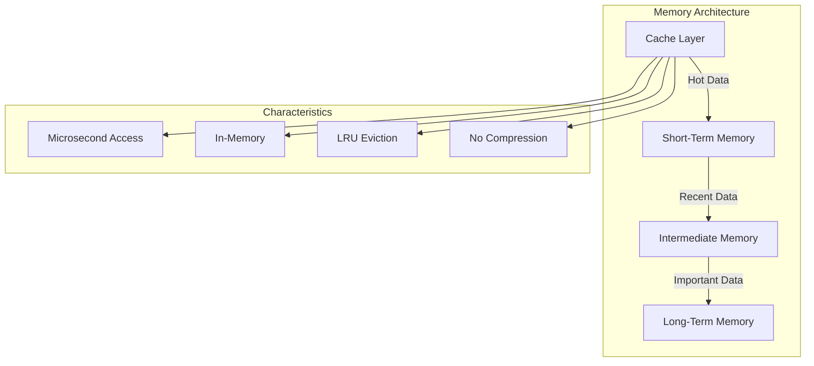

# Four-Tier Memory Architecture

## Overview

The AgentMemory system implements a four-tier hierarchical memory architecture that provides optimal performance and resource utilization. This architecture builds upon the original three-tier design by introducing a dedicated cache layer for ultra-fast access to frequently used data.



## Memory Tiers

### 1. Cache Layer (New)

#### Purpose
- Ultra-fast access to frequently used data
- Reduce load on underlying memory tiers
- Optimize performance for hot data patterns

#### Implementation
- In-memory LRU (Least Recently Used) cache
- Configurable size limits and TTL
- Automatic eviction policies
- No persistence

#### Characteristics
- Access Time: Microseconds
- Storage: Pure in-memory
- Compression: None
- Persistence: None
- Eviction: LRU with configurable policies

#### Use Cases
- Frequently accessed agent states
- Recent query results
- Hot embeddings
- Common patterns and behaviors
- High-frequency operations

#### Configuration
```python
CacheConfig(
    max_size=10000,          # Maximum number of items
    ttl=300,                 # Time-to-live in seconds
    eviction_policy="lru",   # Eviction strategy
    compression_enabled=False # No compression for speed
)
```

### 2. Short-Term Memory (STM)

#### Purpose
- Recent, high-resolution data storage
- Active session management
- Current context maintenance

#### Implementation
- Redis-based storage
- In-memory with persistence
- TTL-based expiration

#### Characteristics
- Access Time: Milliseconds
- Storage: Redis
- Compression: Minimal
- Persistence: Yes
- Retention: ~1000 most recent steps

#### Use Cases
- Recent agent states
- Active session data
- Current context
- Immediate recall needs

### 3. Intermediate Memory (IM)

#### Purpose
- Medium-term data storage
- Balanced compression and access
- Transitional data management

#### Implementation
- Redis with TTL
- Medium compression
- Selective persistence

#### Characteristics
- Access Time: Milliseconds
- Storage: Redis
- Compression: Medium (2-4x)
- Persistence: Partial
- Retention: ~10,000 steps

#### Use Cases
- Important historical states
- Compressed experiences
- Transitional data
- Medium-term patterns

### 4. Long-Term Memory (LTM)

#### Purpose
- Long-term data storage
- Permanent knowledge retention
- Historical data management

#### Implementation
- SQLite database
- High compression
- Full persistence

#### Characteristics
- Access Time: Milliseconds to seconds
- Storage: SQLite
- Compression: High (8-16x)
- Persistence: Full
- Retention: Entire history

#### Use Cases
- Historical data
- Compressed experiences
- Permanent storage
- Long-term patterns

## Data Flow

### Write Path
1. Data enters through Cache Layer
2. If cache miss, writes to STM
3. Important data transitions to IM
4. Critical data eventually moves to LTM

### Read Path
1. Check Cache Layer first
2. If cache miss, check STM
3. If not in STM, check IM
4. If not in IM, check LTM
5. Update cache with retrieved data

## Performance Characteristics

### Access Times
- Cache Layer: < 1ms
- STM: 1-5ms
- IM: 5-10ms
- LTM: 10-100ms

### Storage Efficiency
- Cache Layer: 1x (no compression)
- STM: 1x (minimal compression)
- IM: 2-4x compression
- LTM: 8-16x compression

### Memory Usage
- Cache Layer: Configurable (default 1GB)
- STM: ~1000 entries
- IM: ~10,000 entries
- LTM: Unlimited (disk-based)

## Implementation Details

### Cache Layer Implementation
```python
class CacheLayer:
    def __init__(self, config: CacheConfig):
        self.max_size = config.max_size
        self.ttl = config.ttl
        self.cache = LRUCache(maxsize=config.max_size)
        self.stats = CacheStats()
    
    def get(self, key: str) -> Optional[Any]:
        """Get item from cache with stats tracking."""
        if key in self.cache:
            self.stats.hits += 1
            return self.cache[key]
        self.stats.misses += 1
        return None
    
    def set(self, key: str, value: Any):
        """Set item in cache with automatic eviction."""
        self.cache[key] = value
        self.stats.sets += 1
```

### Integration with Existing Tiers
```python
class AgentMemorySystem:
    def __init__(self, config: MemoryConfig):
        self.cache = CacheLayer(config.cache_config)
        self.stm = RedisSTM(config.stm_config)
        self.im = RedisIM(config.im_config)
        self.ltm = SQLiteLTM(config.ltm_config)
    
    def get(self, key: str) -> Optional[Any]:
        # Try cache first
        if result := self.cache.get(key):
            return result
            
        # Try STM
        if result := self.stm.get(key):
            self.cache.set(key, result)
            return result
            
        # Continue with IM and LTM...
```

## Benefits

1. **Performance**
   - Ultra-fast access to hot data
   - Reduced latency for frequent operations
   - Better handling of high-frequency access patterns

2. **Efficiency**
   - Reduced load on Redis and SQLite
   - Optimized resource utilization
   - Better memory usage patterns

3. **Scalability**
   - Improved handling of concurrent access
   - Better distribution of load
   - More efficient resource utilization

4. **Cost**
   - Reduced Redis operations
   - Lower database load
   - More efficient resource usage

5. **Flexibility**
   - Configurable caching strategies
   - Tunable performance parameters
   - Adaptive to usage patterns

## Configuration Options

### Cache Layer Configuration
```python
@dataclass
class CacheConfig:
    max_size: int = 10000
    ttl: int = 300
    eviction_policy: str = "lru"
    compression_enabled: bool = False
    stats_enabled: bool = True
    warmup_enabled: bool = True
```

### Memory System Configuration
```python
@dataclass
class MemoryConfig:
    cache_config: CacheConfig = field(default_factory=CacheConfig)
    stm_config: RedisSTMConfig = field(default_factory=RedisSTMConfig)
    im_config: RedisIMConfig = field(default_factory=RedisIMConfig)
    ltm_config: SQLiteLTMConfig = field(default_factory=SQLiteLTMConfig)
```

## Monitoring and Metrics

### Cache Statistics
- Hit rate
- Miss rate
- Eviction count
- Memory usage
- Access patterns

### Performance Metrics
- Access times per tier
- Compression ratios
- Storage efficiency
- Resource utilization

## Best Practices

1. **Cache Configuration**
   - Size cache based on available memory
   - Set appropriate TTL values
   - Monitor hit rates
   - Adjust based on usage patterns

2. **Data Management**
   - Use appropriate compression levels
   - Implement efficient eviction policies
   - Monitor memory usage
   - Balance performance and resource usage

3. **Performance Optimization**
   - Profile access patterns
   - Optimize cache size
   - Monitor tier transitions
   - Balance compression ratios

4. **Resource Management**
   - Monitor memory usage
   - Track cache efficiency
   - Optimize storage usage
   - Balance resource allocation 