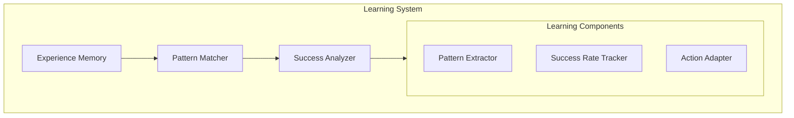

# Learning and Adaptation System

## Overview

The learning system helps agents become smarter about handling conflicts and compensations over time. Instead of using fixed rules, it learns from experience what works best in different situations.

## Core Learning Components



## Experience Collection

```python
class ExperienceCollector:
    def __init__(self):
        self.experiences = []
        self.pattern_cache = {}
        self.success_metrics = defaultdict(lambda: {
            'attempts': 0,
            'successes': 0,
            'recent_outcomes': deque(maxlen=100)
        })
        
    async def record_experience(self, event):
        """Record an experience with its context and outcome"""
        experience = {
            'timestamp': time.time(),
            'agent_id': event.agent_id,
            'action_type': event.action_type,
            'context': self.extract_context(event),
            'outcome': event.outcome,
            'compensation_used': event.compensation,
            'success': event.success
        }
        
        self.experiences.append(experience)
        self.update_metrics(experience)
        await self.extract_patterns(experience)
        
    def extract_context(self, event):
        """Extract relevant context features"""
        return {
            'local_density': self.calculate_agent_density(event.location),
            'resource_availability': self.check_resource_state(),
            'time_pressure': self.calculate_time_pressure(event),
            'agent_state': self.get_agent_state(event.agent_id)
        }
```

## Pattern Recognition

```python
class PatternRecognizer:
    def __init__(self):
        self.patterns = defaultdict(lambda: {
            'count': 0,
            'success_rate': 0.0,
            'contexts': []
        })
        
    def identify_patterns(self, experiences, window_size=1000):
        """Identify patterns in recent experiences"""
        recent = experiences[-window_size:]
        patterns = {}
        
        # Look for action patterns
        for i in range(len(recent)-1):
            sequence = recent[i:i+3]  # Look at sequences of 3 events
            pattern_key = self.create_pattern_key(sequence)
            
            if pattern_key not in patterns:
                patterns[pattern_key] = {
                    'sequence': sequence,
                    'success_rate': self.calculate_success_rate(sequence),
                    'frequency': 1
                }
            else:
                patterns[pattern_key]['frequency'] += 1
                
        return self.filter_significant_patterns(patterns)
    
    def create_pattern_key(self, sequence):
        """Create a unique key for an action sequence"""
        return "_".join([
            f"{e['action_type']}:{e['outcome']}"
            for e in sequence
        ])
```

## Success Analysis

```python
class SuccessAnalyzer:
    def __init__(self):
        self.success_history = defaultdict(list)
        self.adaptation_rules = {}
        
    def analyze_success_patterns(self, experiences):
        """Analyze what makes compensations successful"""
        for exp in experiences:
            context_key = self.context_to_key(exp['context'])
            action_type = exp['action_type']
            
            self.success_history[context_key].append({
                'compensation': exp['compensation_used'],
                'success': exp['success'],
                'timestamp': exp['timestamp']
            })
            
        return self.extract_success_patterns()
    
    def extract_success_patterns(self):
        """Extract patterns that lead to successful compensations"""
        patterns = {}
        
        for context, history in self.success_history.items():
            if len(history) >= 10:  # Minimum sample size
                success_rate = self.calculate_success_rate(history)
                if success_rate > 0.7:  # High success threshold
                    patterns[context] = {
                        'success_rate': success_rate,
                        'sample_size': len(history),
                        'compensation_pattern': self.extract_compensation_pattern(history)
                    }
                    
        return patterns
```

## Adaptation Mechanisms

### 1. Strategy Adaptation

```python
class StrategyAdapter:
    def __init__(self):
        self.strategies = defaultdict(lambda: {
            'base_strategy': None,
            'adaptations': [],
            'success_rate': 0.0
        })
        
    def adapt_strategy(self, context, current_success_rate):
        """Adapt strategy based on success rate"""
        strategy = self.strategies[self.context_to_key(context)]
        
        if current_success_rate < 0.5:  # Poor performance
            # Try more aggressive compensation
            strategy['adaptations'].append({
                'type': 'priority_boost',
                'value': 0.2
            })
        elif current_success_rate < 0.7:  # Moderate performance
            # Try alternative resource types
            strategy['adaptations'].append({
                'type': 'expand_alternatives',
                'value': 'include_different_types'
            })
```

### 2. Dynamic Learning

```python
class DynamicLearner:
    def __init__(self):
        self.learning_rate = 0.1
        self.exploration_rate = 0.2
        
    async def learn_from_experience(self, experience):
        """Update learning based on new experience"""
        # Update success rates
        self.update_success_rates(experience)
        
        # Adjust exploration rate
        self.adjust_exploration_rate()
        
        # Generate new adaptation rules
        if random.random() < self.exploration_rate:
            await self.try_new_strategy(experience)
        else:
            await self.apply_best_strategy(experience)
```

## Example: Learning in Action

```python
# Example of learning from a series of compensations
async def demonstrate_learning():
    learner = DynamicLearner()
    collector = ExperienceCollector()
    
    # Initial conflict situation
    initial_conflict = {
        'type': 'resource_conflict',
        'resource': 'tool_1',
        'agents': ['agent_1', 'agent_2']
    }
    
    # First attempt - basic compensation
    compensation_1 = await handle_conflict(initial_conflict)
    await collector.record_experience({
        'action_type': 'resource_access',
        'compensation': compensation_1,
        'success': False
    })
    
    # System learns and adapts
    await learner.learn_from_experience(collector.experiences[-1])
    
    # Second attempt - with learned adaptation
    compensation_2 = await handle_conflict(initial_conflict)
    # Now might include:
    # - Pre-emptive resource booking
    # - Alternative resource suggestions
    # - Better timing based on learned patterns
```

## Advanced Learning Features

### 1. Pattern-Based Prediction

```python
class PatternPredictor:
    def predict_conflict_likelihood(self, action, context):
        """Predict likelihood of conflict based on patterns"""
        similar_patterns = self.find_similar_patterns(action, context)
        
        if similar_patterns:
            return self.calculate_conflict_probability(similar_patterns)
        return 0.5  # Default uncertainty
```

### 2. Adaptive Compensation Generation

```python
class AdaptiveCompensator:
    def generate_compensation(self, action, context):
        """Generate compensation based on learned patterns"""
        success_patterns = self.analyzer.get_success_patterns(
            action.type, context
        )
        
        if success_patterns:
            return self.apply_successful_pattern(
                action, success_patterns[0]
            )
        return self.generate_default_compensation(action)
```

## Best Practices

1. **Data Collection**
   - Collect diverse experiences
   - Track long-term outcomes
   - Store relevant context

2. **Pattern Recognition**
   - Look for recurring situations
   - Identify successful strategies
   - Track failure patterns

3. **Adaptation Strategy**
   - Start conservative
   - Gradually increase exploration
   - Monitor adaptation impact 