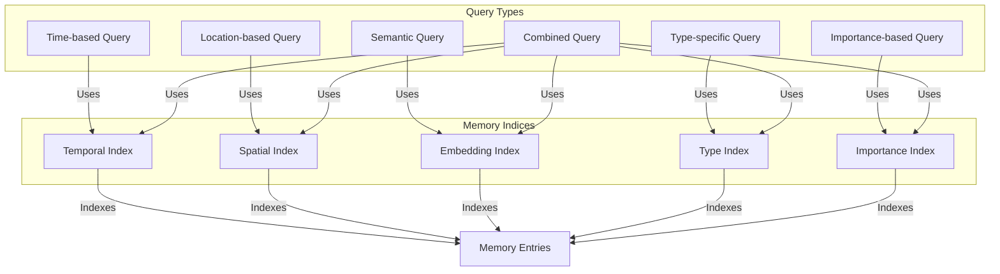
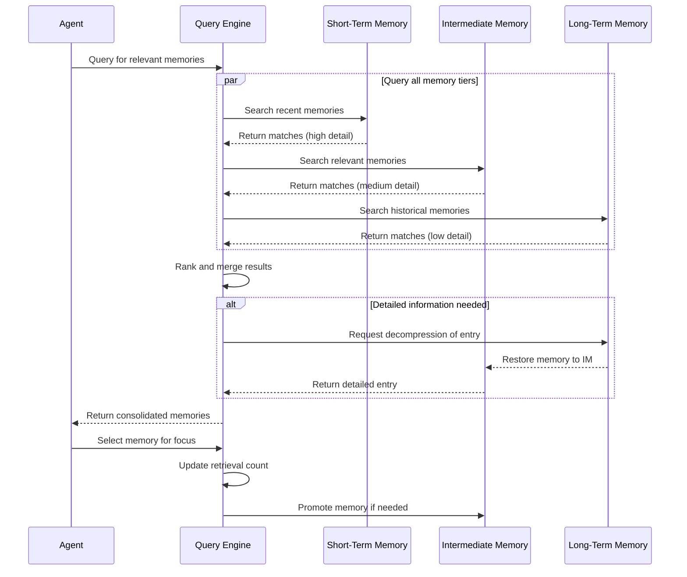
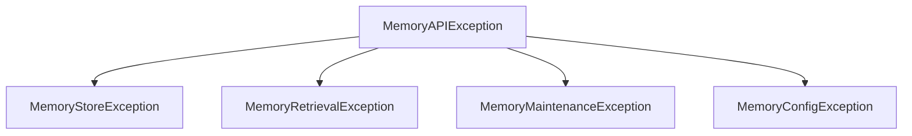

# Agent Memory API Documentation

## Overview

The Agent Memory API provides a clean, standardized interface for interacting with the agent memory system. It abstracts away the implementation details of the underlying storage mechanisms, allowing developers to focus on using the memory system rather than understanding its internals.

The API enables storing and retrieving agent states, actions, and interactions across the hierarchical memory architecture (Short-Term Memory, Intermediate Memory, and Long-Term Memory). It provides methods for both exact and similarity-based retrieval, as well as management operations for the memory system.

## Memory Query System



The memory system maintains five specialized indices for efficient retrieval operations. Temporal indices organize memories by time, spatial indices by location, embedding indices for semantic similarity, type indices for categorization, and importance indices for priority-based access. These correspond to different query patterns like "What happened yesterday?", "What did I see in the forest?", or "What do I know about resources?". The system can combine multiple indices for complex queries, enabling powerful and flexible memory retrieval.

## Key Features

- **Hierarchical Memory Access**: Unified access to all memory tiers (STM, IM, LTM)
- **Vector Similarity Search**: Find semantically similar memories using embedding vectors
- **Attribute-Based Retrieval**: Find memories based on specific attribute values
- **Temporal Queries**: Retrieve memories based on simulation steps or time ranges
- **Memory Management**: Configure and maintain the memory system
- **State Change Tracking**: Track attribute changes over time
- **Memory Statistics**: Get insights about memory usage and distribution
- **Performance Optimizations**: Efficient merge sorting and caching mechanisms for improved query performance

## Installation

The Agent Memory API is available as part of the agent state memory system. Import it directly:

```python
from memory.api import AgentMemoryAPI
```

## Basic Usage

### Initialization

```python
from memory.api import AgentMemoryAPI
from memory.config import MemoryConfig

# Initialize with default configuration
memory_api = AgentMemoryAPI()

# Or, initialize with custom configuration
config = MemoryConfig(
    cleanup_interval=100,
    stm_config={"memory_limit": 10000}
)
memory_api = AgentMemoryAPI(config)
```

### Storing Agent Information

```python
# Store an agent's state
memory_api.store_agent_state(
    agent_id="agent-123",
    state_data={
        "position": [10, 20],
        "health": 0.85,
        "inventory": {"wood": 5, "stone": 2}
    },
    step_number=1234,
    priority=0.75  # Important memory (0.0-1.0)
)

# Store an interaction
memory_api.store_agent_interaction(
    agent_id="agent-123",
    interaction_data={
        "interaction_type": "conversation",
        "other_agent_id": "agent-456",
        "content": "Hello, do you have any wood to trade?",
        "sentiment": 0.6
    },
    step_number=1235
)

# Store an action
memory_api.store_agent_action(
    agent_id="agent-123",
    action_data={
        "action_type": "trade",
        "target_agent": "agent-456",
        "items_given": {"wood": 2},
        "items_received": {"stone": 1},
        "outcome": "success"
    },
    step_number=1236
)
```

### Using Structured Models

The API provides structured data models for consistent representation of agent states and actions:

```python
from memory.api import AgentState, ActionResult, ActionData

# Create a structured agent state
agent_state = AgentState(
    agent_id="agent-123",
    step_number=1234,
    health=0.85,
    position_x=10,
    position_y=20,
    extra_data={"inventory": {"wood": 5, "stone": 2}}
)

# Store the state using the model
state_dict = agent_state.as_dict()
memory_api.store_agent_state(
    agent_id=agent_state.agent_id,
    state_data=state_dict,
    step_number=agent_state.step_number
)

# Create an action result
result = ActionResult(
    action_type="trade",
    params={"target": "agent-456", "item": "wood"},
    reward=0.5
)
```

### Retrieving Memories

```python
# Get memory agent instance for more specialized operations
memory_agent = memory_api.get_memory_agent("agent-123")

# Get recent states
recent_states = memory_agent.retrieve_recent_states(
    count=5,
    memory_type="state"  # Optional filter
)

# Find similar states
current_state = {"position": [12, 22], "health": 0.8}
similar_states = memory_api.retrieve_similar_states(
    agent_id="agent-123",
    query_state=current_state,
    k=5
)

# Get memories within a time range
memories = memory_api.retrieve_by_time_range(
    agent_id="agent-123",
    start_step=1000,
    end_step=2000,
    memory_type="action"  # Optional filter
)

# Find memories with specific attributes
trading_memories = memory_api.retrieve_by_attributes(
    agent_id="agent-123",
    attributes={"action_type": "trade", "outcome": "success"},
    memory_type="action"
)
```

### Memory Management

```python
# Force memory maintenance (tier transitions)
memory_api.force_memory_maintenance(agent_id="agent-123")

# Get memory statistics
stats = memory_api.get_memory_statistics(agent_id="agent-123")
print(f"Total memories: {stats['total_memories']}")
print(f"Memory distribution: {stats['memory_type_distribution']}")

# Clear the cache to free up memory and ensure fresh results
memory_api.clear_cache()

# Configure cache TTL for balancing memory usage and performance
memory_api.set_cache_ttl(300)  # 5 minutes
```

## Memory Hooks System

The Agent Memory API includes a hooks system that allows automatic capture of agent memories during agent execution without modifying existing agent logic.

### Using Memory Hooks

```python
from memory.api import install_memory_hooks, BaseAgent, with_memory

# Option 1: Class decorator approach
@install_memory_hooks
class MyAgent(BaseAgent):
    def __init__(self, config=None, agent_id=None):
        super().__init__(config, agent_id)
        # Agent-specific initialization
        
    def act(self, observation):
        # Memory hooks automatically capture state before and after this method
        # Process the observation and determine action
        result = self.process(observation)
        return result
        
    def get_state(self):
        # Return the current agent state
        state = super().get_state()
        state.extra_data["custom_field"] = self.some_internal_state
        return state

# Option 2: Instance decorator approach for existing agents
agent = ExistingAgentClass()
memory_enhanced_agent = with_memory(agent, agent_id="agent-456")

# Now use the agent normally - memories are created automatically
result = memory_enhanced_agent.act({"user_input": "What's the weather today?"})
```

The hooks system automatically:
- Captures agent state before and after actions
- Calculates state differences to identify important changes
- Stores states, actions, and their results in memory
- Associates memories with the correct agent and step number
- Handles error conditions gracefully to prevent disrupting agent execution

## Advanced Usage

### Raw Vector Search

```python
# Get embedding from a state using your embedding logic
embedding = [0.1, 0.2, 0.3, ...]  # Your embedding vector

# Search using the raw embedding
memory_agent = memory_api.get_memory_agent("agent-123")
similar_memories = memory_agent.search_by_embedding(
    query_embedding=embedding,
    k=10,
    memory_tiers=["stm", "im"]  # Optional: specific tiers to search
)
```

### Content-Based Search

```python
# Get memory agent instance
memory_agent = memory_api.get_memory_agent("agent-123")

# Search by content pattern 
memories = memory_agent.search_by_content(
    content_query="trade wood",
    k=5
)
```

### Caching Expensive Operations

The API includes a caching system to improve performance for expensive operations:

```python
from memory.api import cacheable

# Create a cached function with a 60-second TTL
@cacheable(ttl=60)
def expensive_memory_operation(agent_id, query):
    # Complex, expensive operation...
    return results

# First call computes the result
result1 = expensive_memory_operation("agent-123", "find wood")

# Second call with same parameters uses cached result
result2 = expensive_memory_operation("agent-123", "find wood")  # Uses cache

# Different parameters will compute new result
result3 = expensive_memory_operation("agent-123", "find stone")  # New computation
```

## Memory Retrieval Process



Memory retrieval employs a parallel search strategy across all tiers. When an agent requests memories, the Query Engine simultaneously searches Short-Term Memory for recent details, Intermediate Memory for relevant medium-term information, and Long-Term Memory for historical context. Results are ranked and merged based on relevance. If detailed information is needed from compressed long-term memories, they're decompressed and restored to Intermediate Memory. When an agent focuses on a specific memory, its retrieval count increases, potentially promoting frequently accessed memories to more accessible tiers.

## Performance Optimizations

The API includes several optimizations to improve query performance and reduce resource usage:

### Efficient Merge Sorting

When querying across memory tiers, the system uses an efficient merging algorithm to combine sorted results from different stores without resorting the entire dataset. This optimization is particularly beneficial for:

- Temporal queries (`retrieve_by_time_range`)
- Similarity searches (`retrieve_similar_states`)
- Queries that return large result sets

The merge sorting algorithm:
1. Recognizes when individual store results are already sorted
2. Uses a heap-based approach for O(n log k) performance where k is the number of lists
3. Avoids unnecessary full sorts of the combined results

```python
# The merge_sorted parameter is enabled by default for appropriate methods
memories = memory_agent.retrieve_by_time_range(
    agent_id="agent-123",
    start_step=1000,
    end_step=2000
)  # Uses efficient merge sort internally
```

### Result Caching

Expensive operations like semantic similarity searches can be automatically cached to improve performance for repeated queries:

```python
# This query will cache results (using lru_cache)
similar_states = memory_agent.retrieve_similar_states(
    agent_id="agent-123",
    query_state=current_state,
    k=5
)

# Subsequent identical calls will use the cached result
similar_states_again = memory_agent.retrieve_similar_states(
    agent_id="agent-123",
    query_state=current_state,
    k=5
)  # Returns cached result without recomputing
```

The caching system provides:
- Configurable time-to-live (TTL) for cached results
- LRU (Least Recently Used) eviction policy
- Manual cache clearing when needed

```python
# Configure the default cache TTL
memory_agent.set_cache_ttl(300)  # 5 minutes

# Clear the entire cache
memory_agent.clear_cache()
```

### When to Use Caching

Caching is most effective when:
- The same query is executed multiple times
- The underlying data changes infrequently
- Query computation is expensive (e.g., embedding generation, cross-tier searches)

For rapidly changing data or single-use queries, caching may not provide significant benefits.

## Error Handling and Exception Management

The Agent Memory API provides robust error handling through a hierarchy of specialized exceptions. These allow client code to implement specific recovery strategies based on the type and context of failures.

### Exception Hierarchy



- `MemoryAPIException`: Base class for all memory API-related exceptions
- `MemoryStoreException`: Raised for storage operation failures (e.g., failed Redis writes)
- `MemoryRetrievalException`: Raised when memory retrieval operations fail
- `MemoryMaintenanceException`: Raised when memory maintenance operations fail
- `MemoryConfigException`: Raised for configuration-related errors

### Error Recovery Strategies

API methods implement several error recovery approaches:

1. **Validation First**: Input parameters are validated before performing operations
2. **Graceful Degradation**: When a specific memory tier fails, the API attempts to return results from available tiers
3. **Detailed Logging**: Errors are logged with contextual information for debugging
4. **Exception Context**: Exception messages include details about what failed and why

### Example Error Handling

```python
from memory.api import AgentMemoryAPI, MemoryStoreException, MemoryRetrievalException

memory_api = AgentMemoryAPI()

try:
    # Attempt to store a state
    memory_api.store_agent_state(
        agent_id="agent-123",
        state_data={"position": [10, 20], "health": 0.8},
        step_number=42
    )
except MemoryStoreException as e:
    # Handle storage failure (e.g., retry or log)
    print(f"Storage failed: {e}")
    # Implement recovery strategy...

try:
    # Attempt to retrieve similar states
    similar_states = memory_api.retrieve_similar_states(
        agent_id="agent-123",
        query_state={"position": [12, 22]}
    )
except MemoryRetrievalException as e:
    # Handle retrieval failure (e.g., fallback to non-vector search)
    print(f"Retrieval failed: {e}")
    # Implement fallback strategy...
```

### Recoverable vs. Fatal Errors

The API distinguishes between different types of errors to help client code make appropriate decisions:

- **Recoverable Errors**: Input validation failures, partial tier unavailability
- **Potentially Recoverable**: Configuration issues, temporary connection failures
- **Fatal Errors**: Database corruption, persistent connection failures, internal logic errors

Client code should implement appropriate retry and fallback mechanisms based on the exception type and context.

## API Reference

### Core Storage Methods

| Method | Description |
|--------|-------------|
| `store_agent_state(agent_id, state_data, step_number, priority=1.0)` | Store an agent's state in memory |
| `store_agent_interaction(agent_id, interaction_data, step_number, priority=1.0)` | Store information about an interaction |
| `store_agent_action(agent_id, action_data, step_number, priority=1.0)` | Store information about an action |

### Retrieval Methods

| Method | Description |
|--------|-------------|
| `retrieve_similar_states(agent_id, query_state, k=5, memory_type=None)` | Find states similar to the query state |
| `retrieve_by_time_range(agent_id, start_step, end_step, memory_type=None)` | Get memories in a step range |
| `retrieve_by_attributes(agent_id, attributes, memory_type=None)` | Find memories matching attributes |

### Advanced Methods

| Method | Description |
|--------|-------------|
| `get_memory_agent(agent_id)` | Get a MemoryAgent instance for more specialized operations |
| `force_memory_maintenance(agent_id=None)` | Force tier transitions and cleanup |
| `get_memory_statistics(agent_id)` | Get statistics about memory usage |
| `clear_cache()` | Clear the query result cache |
| `set_cache_ttl(ttl)` | Set the default cache time-to-live in seconds |

## Memory Structure

Each memory entry stored by the API has the following standardized structure:

```json
{
  "memory_id": "agent-123-1234-1679233344",
  "agent_id": "agent-123",
  "step_number": 1234,
  "timestamp": 1679233344,
  
  "contents": {
    // The actual state/action/interaction data
    "position": [10, 20],
    "health": 0.85,
    // ...
  },
  
  "metadata": {
    "creation_time": 1679233344,
    "last_access_time": 1679233400,
    "compression_level": 0,
    "importance_score": 0.75,
    "retrieval_count": 3,
    "memory_type": "state" // "interaction", "action", etc.
  },
  
  "embeddings": {
    "full_vector": [...],  // STM embedding
    "compressed_vector": [...],  // IM embedding
    "abstract_vector": [...]  // LTM embedding
  }
}
```

## Hierarchical Memory Architecture

The API transparently interacts with the three-tier memory architecture:

1. **Short-Term Memory (STM)**: Recent, detailed memories stored in Redis
2. **Intermediate Memory (IM)**: Medium-term memories with some compression in Redis
3. **Long-Term Memory (LTM)**: Historical, highly compressed memories in SQLite

Each tier has different characteristics:

| Tier | Storage | Resolution | Typical Retention | Access Speed |
|------|---------|------------|-------------------|--------------|
| STM  | Redis   | Full       | ~1000 steps       | Very Fast    |
| IM   | Redis   | Medium     | ~10,000 steps     | Fast         |
| LTM  | SQLite  | Low        | Entire history    | Medium       |

The API automatically queries the appropriate tiers based on the requested information and combines results when needed.

## Performance Considerations

When using the Agent Memory API, consider these performance factors:

- **Storage Volume**: Each stored state increases memory usage, especially in Redis
- **Embedding Generation**: Vector similarity searches require embedding computation
- **Cross-Tier Queries**: Queries spanning multiple tiers incur additional overhead
- **Redis Capacity**: Monitor Redis memory usage, especially with many agents
- **Tier Maintenance**: Regular maintenance (automatic or via `force_memory_maintenance`) helps manage memory growth
- **Caching Strategy**: Configure appropriate cache TTLs based on data change frequency
- **Query Patterns**: Consider how to structure queries to leverage the merge sorting optimization

### Performance Tuning Tips

For optimal performance:

1. **Use Specific Tiers**: When possible, specify which memory tiers to search instead of searching all tiers
2. **Be Specific with Filters**: Add memory_type filters to narrow search space
3. **Batch Operations**: Group related operations to minimize round trips
4. **Monitor Cache Size**: Be aware of memory usage from caching frequently used results
5. **Tune Cache TTL**: Adjust cache time-to-live based on data update frequency

Example of tier-specific querying:

```python
# Search only STM and IM (faster than searching all tiers)
results = memory_agent.search_by_embedding(
    query_embedding=embedding,
    k=10,
    memory_tiers=["stm", "im"]  # Skip LTM for faster results
)
```

## Configuration Options

The API can be configured using the `MemoryConfig` object:

```python
from memory.config import MemoryConfig, RedisSTMConfig

config = MemoryConfig(
    # System-wide settings
    cleanup_interval=100,  # Check for maintenance every N insertions
    memory_priority_decay=0.95,  # Priority decay factor for older memories
    
    # Tier-specific settings
    stm_config=RedisSTMConfig(
        host="localhost",
        port=6379,
        memory_limit=10000,  # Max entries in STM
        ttl=3600  # 1 hour TTL
    )
)

memory_api = AgentMemoryAPI(config)
```

## Integration with Agent Systems

The API is designed to integrate seamlessly with agent systems:

- Can be used directly in agent implementations
- Works well with hook-based memory integration (see [Memory Hooks](memory_hooks.md))
- Can be used as a standalone system for memory analytics

## Further Reading

- [Core Concepts](../../../core_concepts.md): Fundamental architecture and data structures
- [Memory Hooks](memory_hooks.md): Non-intrusive agent integration
- [Redis Integration](../../../redis_integration.md): Redis backend details
- [Memory Agent](../../../memory_agent.md): Memory agent implementation 