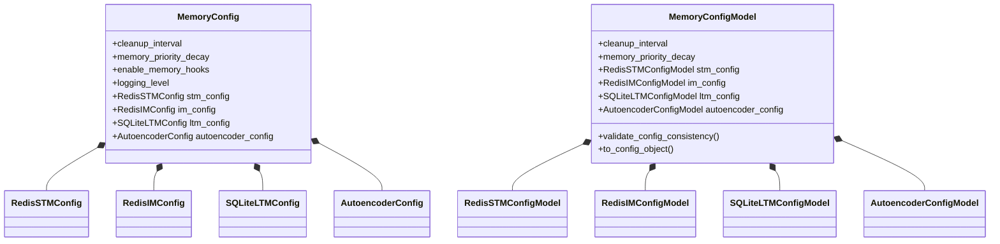

# Memory Configuration Module

## Overview

The Memory Configuration module provides a centralized way to configure all aspects of the AgentMemory system. It defines configuration classes for different memory tiers (STM, IM, LTM) and components like the embedding autoencoder.

Configuration is managed through a hierarchy of classes with sensible defaults, while Pydantic models provide validation to ensure configuration values are valid and consistent.



## Key Components

### Core Configuration Classes

#### MemoryConfig

The main configuration container that integrates settings for all memory tiers and components.

```python
from memory.config import MemoryConfig

# Create with defaults
config = MemoryConfig()

# Configure specific parameters
config.cleanup_interval = 50
config.memory_priority_decay = 0.9
config.enable_memory_hooks = True
config.logging_level = "DEBUG"

# Access tier-specific configs
config.stm_config.ttl = 1800  # 30 minutes
config.im_config.memory_limit = 100000
config.ltm_config.db_path = "./custom_ltm.db"
```

#### RedisSTMConfig

Configuration for Redis-based Short-Term Memory storage.

| Parameter | Type | Default | Description |
|-----------|------|---------|-------------|
| host | str | "localhost" | Redis server hostname |
| port | int | 6379 | Redis server port |
| memory_limit | int | 10000 | Maximum number of memories in STM |
| ttl | int | 3600 | Time-to-live for STM entries in seconds (1 hour) |
| db | int | 0 | Redis DB number |
| namespace | str | "agent-stm" | Redis key namespace |
| password | str | None | Redis password (optional) |
| use_mock | bool | False | Use in-memory mock instead of real Redis |

#### RedisIMConfig

Configuration for Redis-based Intermediate Memory storage.

| Parameter | Type | Default | Description |
|-----------|------|---------|-------------|
| host | str | "localhost" | Redis server hostname |
| port | int | 6379 | Redis server port |
| memory_limit | int | 50000 | Maximum number of memories in IM |
| ttl | int | 86400 | Time-to-live for IM entries in seconds (24 hours) |
| db | int | 1 | Redis DB number |
| namespace | str | "agent-im" | Redis key namespace |
| password | str | None | Redis password (optional) |
| use_mock | bool | False | Use in-memory mock instead of real Redis |

#### SQLiteLTMConfig

Configuration for SQLite-based Long-Term Memory storage.

| Parameter | Type | Default | Description |
|-----------|------|---------|-------------|
| db_path | str | "./ltm.db" | Path to SQLite database file |
| compression_level | int | 1 | Compression level for stored memories |
| batch_size | int | 100 | Batch size for database operations |
| table_prefix | str | "ltm" | Prefix for database tables |
| use_mock | bool | False | Use in-memory mock instead of SQLite |

#### AutoencoderConfig

Configuration for the memory autoencoder used for embedding compression.

| Parameter | Type | Default | Description |
|-----------|------|---------|-------------|
| input_dim | int | 64 | Input dimension |
| stm_dim | int | 768 | Embedding dimension for STM |
| im_dim | int | 384 | Embedding dimension for IM |
| ltm_dim | int | 128 | Embedding dimension for LTM |
| use_neural_embeddings | bool | False | Whether to use neural embeddings |
| model_path | str | "./models/autoencoder.pt" | Path to save/load model |
| embedding_type | str | "autoencoder" | Embedding type ("autoencoder" or "text") |
| text_model_name | str | "all-MiniLM-L6-v2" | Name of text embedding model |

### Pydantic Validation Models

The system provides Pydantic models that enforce validation rules to ensure configuration consistency:

#### RedisSTMConfigModel

Validates Redis STM configuration with rules like:
- Port must be between 1 and 65535
- Memory limit must be at least 100
- TTL must be at least 60 seconds

#### RedisIMConfigModel

Validates Redis IM configuration with rules like:
- Memory limit must be at least 1000
- TTL must be at least 3600 seconds (1 hour)

#### SQLiteLTMConfigModel

Validates SQLite LTM configuration with rules like:
- Database path cannot be empty

#### AutoencoderConfigModel

Validates autoencoder configuration with rules like:
- IM dimension must be smaller than STM dimension
- LTM dimension must be smaller than IM and STM dimensions

#### MemoryConfigModel

Validates the entire memory configuration with:
- Cross-tier validation (e.g., ensuring STM and IM use the same Redis server)
- Cleanup interval must be positive
- Memory priority decay must be between 0.0 and 1.0

## Usage Examples

### Basic Configuration

```python
from memory.config import MemoryConfig
from memory import AgentMemorySystem

# Create configuration with defaults
config = MemoryConfig()

# Initialize memory system
memory = AgentMemorySystem(config)
```

### Custom Configuration

```python
from memory.config import MemoryConfig, RedisSTMConfig, SQLiteLTMConfig

# Create custom configuration
config = MemoryConfig()

# Configure STM
config.stm_config.host = "redis.example.com"
config.stm_config.port = 6380
config.stm_config.memory_limit = 20000
config.stm_config.ttl = 7200  # 2 hours

# Configure LTM
config.ltm_config.db_path = "./agent_memories.db"
config.ltm_config.compression_level = 2

# Configure general settings
config.cleanup_interval = 50
config.logging_level = "DEBUG"

# Initialize memory system with custom config
memory = AgentMemorySystem(config)
```

### Using Pydantic Validation

```python
from memory.config import MemoryConfig
from memory.config.models import MemoryConfigModel, RedisSTMConfigModel

# Create base config
config = MemoryConfig()

# Create validated config model
validated_config = MemoryConfigModel(
    cleanup_interval=50,
    memory_priority_decay=0.9,
    stm_config=RedisSTMConfigModel(
        host="localhost",
        port=6379,
        memory_limit=15000,
        ttl=1800
    )
)

# Apply validated config to the config object
config = validated_config.to_config_object(config)

# Use the validated config
memory = AgentMemorySystem(config)
```

### Using Mock Storage for Testing

```python
from memory.config import MemoryConfig

# Create config that uses in-memory mocks instead of real storage
config = MemoryConfig()
config.stm_config.use_mock = True
config.im_config.use_mock = True
config.ltm_config.use_mock = True

# Initialize memory system with mock storage
memory = AgentMemorySystem(config)
```

## Integration with Other Components

The configuration module integrates with other AgentMemory components:

1. **Memory Stores**: Configuration for Redis-based STM/IM and SQLite-based LTM
2. **Autoencoder**: Configuration for neural compression of memory embeddings
3. **Memory Hooks**: Enable/disable system-wide memory hooks
4. **Logging**: Configure system-wide logging level

## Best Practices

1. **Centralize Configuration**: Use a single MemoryConfig instance to manage all settings
2. **Validate Early**: Use Pydantic models to validate configuration before system initialization
3. **Environment-Specific Configs**: Create separate configurations for development, testing, and production
4. **Custom Defaults**: Create factory functions that return pre-configured MemoryConfig instances for common use cases

## Windows-Specific Configuration

When running on Windows, consider these specific configuration options:

```python
from memory.config import MemoryConfig
import os

# Create Windows-friendly configuration
config = MemoryConfig()

# Use Windows-style paths
config.ltm_config.db_path = os.path.join(
    os.environ.get("APPDATA"),
    "AgentMemory",
    "agent_memories.db"
)

# Initialize memory system
memory = AgentMemorySystem(config)
``` 