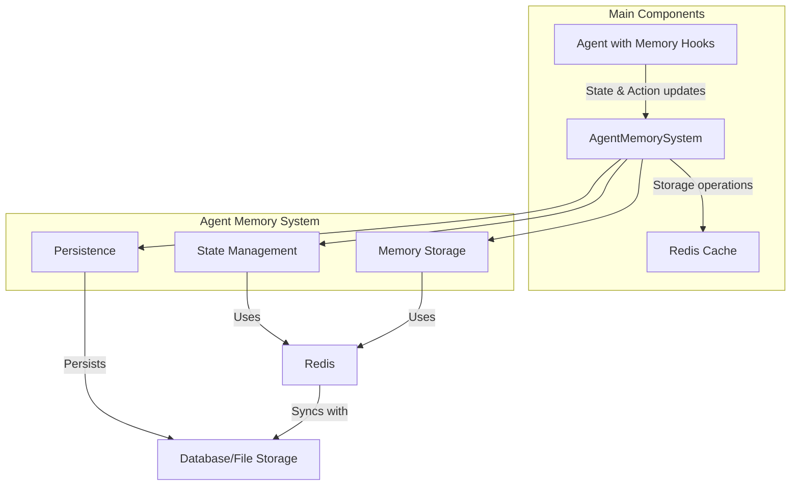

# Agent Memory Hooks

## Overview

The Agent Memory Hooks system provides a non-intrusive way to add memory capabilities to agent classes and instances. These hooks integrate with the agent lifecycle, capturing and storing states and actions in the hierarchical memory system without requiring changes to the agent's implementation.

## Component Integration



Memory hooks function as connectors between agents and the memory architecture. They transparently intercept agent lifecycle events and state changes, forwarding this information to the AgentMemorySystem. The hooks create a seamless integration layer that enables memory capabilities without modifying agent implementation logic.

## Features

- **Seamless Integration**: Hooks into agent lifecycle methods (`__init__`, `act`, `get_state`) without modifying their behavior
- **Graceful Degradation**: Falls back to original behavior if memory system is unavailable
- **Intelligent Prioritization**: Automatically calculates importance scores for memory entries
- **Error Handling**: Robust error recovery with rate-limited logging
- **Configuration Support**: Respects memory system configuration parameters
- **Performance Tracking**: Measures execution time and state differences

## Installation Methods

### Class Decorator

Apply memory hooks to all instances of an agent class:

```python
from agent_memory.api.hooks import install_memory_hooks, BaseAgent

@install_memory_hooks
class MyAgent(BaseAgent):
    def __init__(self, config, *args, **kwargs):
        super().__init__(config, *args, **kwargs)
        # Your custom initialization
```

### Instance Wrapper

Apply memory hooks to a specific agent instance:

```python
from agent_memory.api.hooks import with_memory, BaseAgent

# Create agent
agent = BaseAgent(config)

# Add memory capabilities
agent_with_memory = with_memory(agent)
```

## Configuration

Memory hooks can be configured through the agent's configuration:

```python
from agent_memory.config import MemoryConfig

# Create memory configuration
memory_config = MemoryConfig(
    enable_memory_hooks=True  # Enable/disable hooks globally
)

# Pass to agent
agent_config = {
    # Other agent config...
    "memory_config": memory_config
}

agent = MyAgent(agent_config)
```

### Configuration Formats

The memory system supports multiple configuration formats, handled by the `get_memory_config` helper function:

```python
# Object-style configuration 
class Config:
    def __init__(self):
        self.memory_config = MemoryConfig(enable_memory_hooks=True)

# Dictionary-style configuration
config = {
    "memory_config": {
        "enable_memory_hooks": True
    }
}

# Nested configuration
config = {
    "memory_config": MemoryConfig(enable_memory_hooks=True)
}
```

The `get_memory_config` function handles all these formats consistently, enabling flexible configuration options while maintaining internal type safety.

## Core Functions

### get_memory_config

```python
def get_memory_config(config: Any) -> Optional[MemoryConfig]:
    """Retrieve memory configuration from agent config.

    Handles both dictionary-style and object-style configurations.

    Args:
        config: Agent configuration (dict or object)

    Returns:
        MemoryConfig object or None if not found
    """
```

### install_memory_hooks

```python
def install_memory_hooks(agent_class: Type[T]) -> Type[T]:
    """Install memory hooks on an agent class.

    This is a class decorator that adds memory hooks to BaseAgent subclasses.
    Hooks are only installed if enable_memory_hooks is True in the memory config.

    Args:
        agent_class: The agent class to install hooks on

    Returns:
        The modified agent class
    """
```

### with_memory

```python
def with_memory(agent_instance: T) -> T:
    """Add memory capabilities to an existing agent instance.

    Args:
        agent_instance: The agent instance to add memory to

    Returns:
        The agent with memory capabilities
    """
```

## Usage Examples

### Basic Integration with Existing Agents

```python
from agent_memory.api.hooks import install_memory_hooks
from agent_memory.config import MemoryConfig
from my_project.agents import ExplorerAgent

# Configure memory system
memory_config = MemoryConfig(
    enable_memory_hooks=True
)

# Apply hooks to agent class
@install_memory_hooks
class MemoryAwareExplorer(ExplorerAgent):
    pass

# Create agent with memory config
agent = MemoryAwareExplorer({
    "agent_id": "explorer-1",
    "memory_config": memory_config
})

# Use agent normally - memory operations happen automatically
state = agent.get_state()  # State is automatically stored
action_result = agent.act()  # Action is recorded with states before/after
```

### Retrieving Memories from the Agent

```python
from agent_memory.api.hooks import with_memory
from my_project.agents import SimpleAgent

# Create and enhance agent
agent = with_memory(SimpleAgent({"agent_id": "agent-1"}))

# Simulate some actions
for _ in range(10):
    agent.act()

# Now retrieve similar states to current state
current_state = agent.get_state()
similar_states = agent.memory_system.retrieve_similar_states(
    agent.agent_id, 
    current_state,
    k=5
)

# Analyze action history
action_history = agent.memory_system.retrieve_by_time_range(
    agent.agent_id,
    start_step=0,
    end_step=10,
    memory_type="action"
)
```

### Disabling Memory for Specific Agents

```python
from agent_memory.api.hooks import install_memory_hooks
from agent_memory.config import MemoryConfig
from my_project.agents import SimpleAgent

@install_memory_hooks
class MemoryAwareAgent(SimpleAgent):
    pass

# Create agent with memory hooks disabled
agent_no_memory = MemoryAwareAgent({
    "agent_id": "agent-no-mem",
    "memory_config": MemoryConfig(enable_memory_hooks=False)
})

# Memory operations will be skipped for this agent
```

## Internal Functions

### _log_throttled_error

```python
def _log_throttled_error(self: Any, message: str, throttle_seconds: int = 60) -> None:
    """Log errors with throttling to avoid log spam.

    Args:
        message: Error message to log
        throttle_seconds: Minimum seconds between logging the same error
    """
```

### _initialize_memory_attributes

```python
def _initialize_memory_attributes(obj: Any, memory_config: Optional[MemoryConfig]) -> None:
    """Initialize memory-related attributes on an object.

    Args:
        obj: Object to initialize attributes on
        memory_config: Memory configuration
    """
```

### _handle_memory_error

```python
def _handle_memory_error(obj: Any, error_message: str) -> None:
    """Handle memory-related errors with proper logging and error management.

    Args:
        obj: Object where the error occurred
        error_message: Error message to log
    """
```

### _calculate_state_difference

```python
def _calculate_state_difference(self: T, state_before: Dict[str, Any], state_after: Dict[str, Any]) -> float:
    """Calculate a normalized difference between two states.

    Args:
        state_before: State before action
        state_after: State after action

    Returns:
        Normalized difference score (0.0-1.0)
    """
```

### _calculate_state_importance

```python
def _calculate_state_importance(state: Dict[str, Any]) -> float:
    """Calculate an importance score for a state.

    Args:
        state: Agent state dictionary

    Returns:
        Importance score (0.0-1.0)
    """
```

## State and Action Recording

### State Recording

When the agent's `get_state` method is called, the memory hooks:

1. Call the original `get_state` method to retrieve the agent's state
2. Calculate an importance score for the state based on factors like health and reward
3. Store the state in the memory system with the calculated importance score
4. Return the original state unmodified

### Action Recording

When the agent's `act` method is called, the memory hooks:

1. Record the state before the action
2. Execute the original action, measuring execution time
3. Record the state after the action
4. Calculate importance based on state differences and reward
5. Store the action data along with before/after states in memory
6. Return the original action result

## Error Handling

Memory hooks are designed to fail gracefully:

1. If the memory system initialization fails, agents will continue to function without memory capabilities
2. Errors during state/action storage are caught and logged with full stack traces using `logger.exception()`
3. Error logging is rate-limited to prevent log flooding (at most once per minute for the same error type)
4. All memory operations occur in a try/except block to ensure the original agent behavior continues even when memory operations fail

## Performance Considerations

- **Memory Usage**: The hooks store agent states and actions, which can consume significant memory in Redis.
- **Error Rate Limiting**: Errors are logged at most once per minute to avoid log flooding.
- **Importance Calculation**: States and actions are stored with importance scores, allowing the memory system to prioritize significant memories.
- **Hook Avoidance**: Set `enable_memory_hooks=False` for high-performance critical agents.

## BaseAgent

The module includes a minimal `BaseAgent` class that defines the core interface required for memory hooks:

```python
class BaseAgent:
    """Base agent class with core functionality required for memory hooks."""

    def __init__(self, config=None, agent_id=None, **kwargs):
        """Initialize a base agent."""
        self.config = config or {}
        self.agent_id = agent_id or f"agent_{id(self)}"
        self.step_number = 0

    def act(self, observation=None, **kwargs):
        """Perform an agent action based on observation."""
        self.step_number += 1
        return ActionResult(action_type="noop")

    def get_state(self) -> AgentState:
        """Get the current agent state."""
        return AgentState(agent_id=self.agent_id, step_number=self.step_number)
``` 