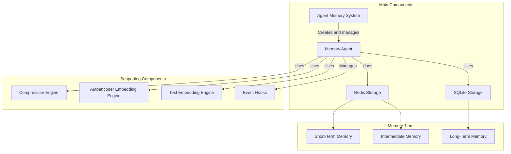
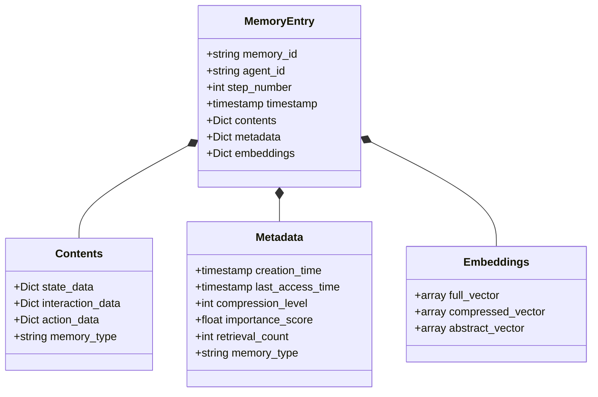

# Agent Memory System Documentation

## Overview

[Tiered Adaptive Semantic Memory (TASM)](#overview) is a memory system designed for intelligent agents. It provides a sophisticated way to store, retrieve, and manage agent experiences and states across different memory tiers with varying levels of detail and persistence.

## System Architecture



The system is composed of an [AgentMemorySystem](../memory/core.py) that serves as the singleton entry point, managing [MemoryAgent](../memory/agent_memory.py) instances for individual agents. Each MemoryAgent manages three memory tiers: 
- [Short-Term Memory](../memory/storage/redis_stm.py) (Redis-based)
- [Intermediate Memory](../memory/storage/redis_im.py) (Redis-based with TTL)
- [Long-Term Memory](../memory/storage/sqlite_ltm.py) (SQLite-based)

Each tier has distinct compression levels and persistence characteristics.

## Core Components

### 1. Agent Memory System ([`AgentMemorySystem`](../memory/core.py) class)
The central manager and entry point for the TASM system, providing agent-specific memory access.

```python
from memory.core import AgentMemorySystem
from memory.config import MemoryConfig

# Get the singleton instance with default configuration
memory_system = AgentMemorySystem.get_instance()

# Or initialize with custom configuration
config = MemoryConfig(
    cleanup_interval=100,
    stm_config=RedisSTMConfig(memory_limit=1000),
    im_config=RedisIMConfig(ttl=604800)  # 7 days
)
memory_system = AgentMemorySystem.get_instance(config)
```

### 2. Memory Agent ([`MemoryAgent`](../memory/agent_memory.py) class)
Manages memory operations for a specific agent across all memory tiers.

```python
# The AgentMemorySystem creates and manages MemoryAgent instances
memory_agent = memory_system.get_memory_agent(agent_id="agent-123")
```

### 3. Memory Tiers
- **Short-Term Memory (STM)**: Redis-based, full resolution storage with 24-hour TTL
- **Intermediate Memory (IM)**: Redis-based with 7-day TTL and level 1 compression
- **Long-Term Memory (LTM)**: SQLite-based with level 2 compression

### 4. Supporting Components
- **Compression Engine**: Handles data compression for different memory tiers
- **Autoencoder Embedding Engine**: Neural network for embedding generation
- **Text Embedding Engine**: For text-based embeddings (optional)
- **Event Hook System**: For custom event handling

## Key Features

### 1. Memory Storage
```python
# Store a new state
memory_system.store_agent_state(
    agent_id="agent-123",
    state_data={"position": [x, y], "resources": 42},
    step_number=1234,
    priority=0.8
)

# Store an interaction
memory_system.store_agent_interaction(
    agent_id="agent-123",
    interaction_data={"type": "collision", "with": "agent-456"},
    step_number=1234,
    priority=0.9
)

# Store an action
memory_system.store_agent_action(
    agent_id="agent-123",
    action_data={"action": "move", "direction": "north"},
    step_number=1234,
    priority=0.7
)
```

### 2. Memory Retrieval
```python
# Retrieve similar states
similar_states = memory_system.retrieve_similar_states(
    agent_id="agent-123",
    query_state=current_state,
    k=5,
    threshold=0.6,
    context_weights={"position": 0.8, "resources": 0.2}
)

# Retrieve by time range
historical_states = memory_system.retrieve_by_time_range(
    agent_id="agent-123",
    start_step=1000,
    end_step=2000,
    memory_type="state"
)

# Retrieve by attributes
matching_states = memory_system.retrieve_by_attributes(
    agent_id="agent-123",
    attributes={"resource_level": "high"},
    memory_type="state"
)

# Advanced: hybrid retrieval
hybrid_results = memory_system.hybrid_retrieve(
    agent_id="agent-123",
    query_state=current_state,
    k=5,
    vector_weight=0.7,
    attribute_weight=0.3
)
```

### 3. Event Hooks
```python
# Register a custom hook
memory_system.register_memory_hook(
    agent_id="agent-123",
    event_type="critical_resource_change",
    hook_function=custom_hook_function,
    priority=7
)

# Trigger an event
memory_system.trigger_memory_event(
    agent_id="agent-123",
    event_type="critical_resource_change",
    event_data={"resource_delta": -50}
)
```

## Memory Entry Structure



Each memory entry follows a standardized structure containing identifiers, contents, metadata, and embeddings for efficient storage and retrieval across all memory tiers. The exact format is:

```json
{
  "memory_id": "agent-123-1234-1679233344",
  "agent_id": "agent-123",
  "step_number": 1234,
  "timestamp": 1679233344,
  
  "contents": {
    "position": [x, y],
    "resources": 42,
    "health": 0.85
  },
  
  "metadata": {
    "creation_time": 1679233344,
    "last_access_time": 1679233400,
    "compression_level": 0,
    "importance_score": 0.75,
    "retrieval_count": 3,
    "memory_type": "state"
  },
  
  "embeddings": {
    "full_vector": [...],
    "compressed_vector": [...],
    "abstract_vector": [...]
  }
}
```

## Performance Monitoring

The system provides comprehensive statistics:
```python
stats = memory_system.get_memory_statistics(agent_id="agent-123")
```

Statistics include:
- Memory counts per tier
- Average importance scores
- Compression ratios
- Access patterns
- Memory type distribution

## Search API

The Agent Memory System provides a sophisticated, strategy-based search framework powered by the [`SearchModel`](../memory/search/model.py) class and various search strategies. This design enables flexible, precise, and composable memory retrieval.

### Search Strategies

The system implements four primary search strategies:

1. **Similarity Search**: Find memories based on semantic similarity using vector embeddings ([`SimilaritySearchStrategy`](../memory/search/strategies/similarity.py))
2. **Temporal Search**: Retrieve memories based on time-related attributes ([`TemporalSearchStrategy`](../memory/search/strategies/temporal.py))
3. **Attribute Search**: Search for memories with specific content or metadata values ([`AttributeSearchStrategy`](../memory/search/strategies/attribute.py))
4. **Combined Search**: Integrate results from multiple strategies with configurable weights ([`CombinedSearchStrategy`](../memory/search/strategies/combined.py))

### Strategy-Based Memory Search

```python
from memory.search import SearchModel
from memory.search import SimilaritySearchStrategy, TemporalSearchStrategy
from memory.search import AttributeSearchStrategy, CombinedSearchStrategy

# Get search model from the memory system
search_model = memory_system.get_search_model()

# Semantic similarity search
similar_memories = search_model.search(
    query="meeting with client about project timeline",
    agent_id="agent-123",
    strategy_name="similarity",  # Optional if set as default
    limit=5,
    min_score=0.7,
    tier="ltm"  # Optional - restricts to long-term memory
)

# Temporal search
recent_memories = search_model.search(
    query={
        "start_time": "2023-06-01", 
        "end_time": "2023-06-30"
    },
    agent_id="agent-123",
    strategy_name="temporal",
    limit=10,
    recency_weight=1.5  # Emphasize more recent memories
)

# Attribute search
attribute_memories = search_model.search(
    query={
        "content": "budget discussion",
        "metadata": {
            "type": "meeting",
            "importance": "high"
        }
    },
    agent_id="agent-123",
    strategy_name="attribute",
    match_all=True,  # All conditions must match (AND logic)
    limit=10
)

# Combined strategy search
comprehensive_results = search_model.search(
    query="quarterly planning session",
    agent_id="agent-123",
    strategy_name="combined",
    strategy_params={
        "similarity": {"min_score": 0.6},
        "temporal": {"recency_weight": 1.5},
        "attribute": {"match_all": False}
    },
    limit=10
)
```

### Filtering Results

All search strategies support additional filtering through the `metadata_filter` parameter:

```python
# Filter results by metadata attributes
filtered_results = search_model.search(
    query="project discussion",
    agent_id="agent-123",
    metadata_filter={
        "type": "meeting",
        "project_id": "proj-123"
    },
    limit=10
)
```

### Customizing Search Strategies

For advanced use cases, you can customize the strategy weights in the combined strategy:

```python
# Get the combined strategy
combined_strategy = search_model.strategies["combined"]

# Update weights to emphasize different aspects
combined_strategy.set_weights({
    "similarity": 2.0,  # Increase semantic importance
    "temporal": 0.5,    # Decrease temporal importance
    "attribute": 1.0    # Keep attribute importance the same
})
```

### Related Documentation

For more detailed information about the search capabilities:
- [Search System](search_system.md) - Comprehensive documentation of the search architecture and strategies
- [Memory Tiers](memory_tiers.md) - How memory tiers affect search operations
- [Embeddings](embeddings.md) - Details on the vector embeddings used in similarity search
- [API Reference](memory_api.md#search-methods) - Complete API reference for all search methods

## Memory Maintenance

The system includes automatic memory maintenance:
```python
# Force memory maintenance for a specific agent
memory_system.force_memory_maintenance(agent_id="agent-123")

# Force maintenance for all agents
memory_system.force_memory_maintenance()
```

## Configuration

The system is highly configurable through dataclasses:

- [`MemoryConfig`](../memory/config.py)
- [`RedisSTMConfig`](../memory/config.py)
- [`RedisIMConfig`](../memory/config.py)
- [`SQLiteLTMConfig`](../memory/config.py)
- [`AutoencoderConfig`](../memory/config.py)

```python
from memory.core import AgentMemorySystem
from memory.config import MemoryConfig, RedisSTMConfig, RedisIMConfig, SQLiteLTMConfig, AutoencoderConfig

config = MemoryConfig(
    stm_config=RedisSTMConfig(
        host="localhost",
        port=6379,
        db=0,
        ttl=86400,  # 24 hours
        memory_limit=1000
    ),
    im_config=RedisIMConfig(
        ttl=604800,  # 7 days
        memory_limit=10000,
        compression_level=1
    ),
    ltm_config=SQLiteLTMConfig(
        db_path="memory.db",
        compression_level=2
    ),
    autoencoder_config=AutoencoderConfig(
        input_dim=64,
        stm_dim=384,
        im_dim=128,
        ltm_dim=32,
        model_path="model.pt",
        use_neural_embeddings=True
    ),
    cleanup_interval=100,
    memory_priority_decay=0.95,
    enable_memory_hooks=True,
    logging_level="INFO"
)
```

## Using the Tiered Adaptive Semantic Memory System

```python
from memory.core import AgentMemorySystem

# Get the singleton instance
memory_system = AgentMemorySystem.get_instance()

# Store an agent state
memory_system.store_agent_state(
    agent_id="agent_001",
    state_data={"position": [10, 20], "health": 100, "inventory": {"gold": 50}},
    step_number=1500
)

# Retrieve similar states
similar_states = memory_system.retrieve_similar_states(
    agent_id="agent_001",
    query_state={"position": [12, 18]},
    k=5
)

# Search by content
content_results = memory_system.search_by_content(
    agent_id="agent_001",
    content_query="gold mining",
    k=5
)

# Get statistics
stats = memory_system.get_memory_statistics(agent_id="agent_001") 
```

## Conclusion

The TASM (Tiered Adaptive Semantic Memory) system provides a comprehensive framework for managing agent memories across multiple tiers with sophisticated storage, retrieval, and search capabilities. Key benefits include:

- **Tiered memory management** with short, intermediate, and long-term storage
- **Powerful search capabilities** with multiple strategies for different retrieval needs
- **Semantic and attribute-based** memory access for contextual understanding
- **Adaptive memory maintenance** with configurable policies for memory transfer and decay
- **Flexible configuration** to adapt to different agent requirements and computational resources

By leveraging this system, agents can maintain a rich history of their experiences, efficiently retrieve relevant information, and build a foundation for more sophisticated decision-making processes.

For implementation details and API reference, consult the related documentation outlined in the previous sections.
