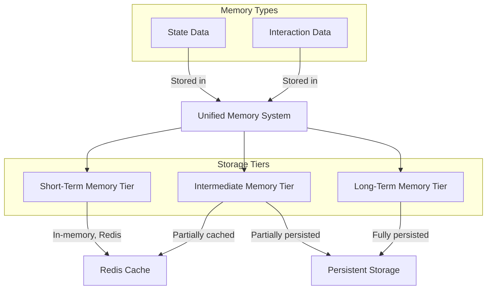
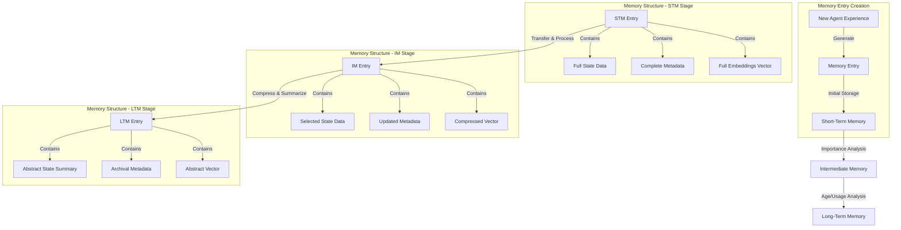
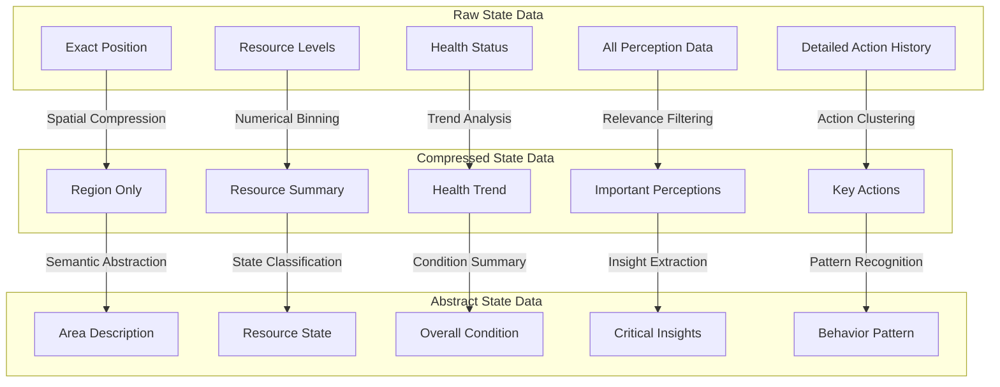

# Memory Tiers Documentation

## Overview

The Agent Memory System implements a three-tier hierarchical memory architecture that mimics cognitive memory processes. Each tier serves a specific purpose and has distinct characteristics in terms of storage duration, access speed, and data resolution.



The unified memory system handles both State Data and Interaction Data through the same architecture. All memory types flow through three tiers with different storage characteristics. Short-Term Memory is kept entirely in Redis for fast access, Intermediate Memory uses a hybrid approach with partial caching, and Long-Term Memory relies on persistent storage for complete data preservation.

## Memory Entry Transformation



Memory entries transform as they move through the memory tiers. When an agent has a new experience, a memory entry is created with full state data, complete metadata, and full embedding vectors in Short-Term Memory. As important memories transfer to Intermediate Memory, they undergo processing where only selected state data is retained and vectors are compressed. Long-Term Memory entries contain highly abstract summaries with minimal metadata and simplified vector representations.

## Tier Structure

### 1. Short-Term Memory (STM)

#### Implementation
- **Storage**: Redis in-memory store
- **Resolution**: Full resolution (no compression)
- **Typical Retention**: ~1000 most recent steps
- **Access Speed**: Fastest (microseconds)

#### Key Features
- Stores raw memory entries without compression
- Fastest access times for recent memories
- Automatic cleanup based on age and capacity
- Priority-based retention for important memories

#### Configuration
```python
STMConfig(
    memory_limit=1000,  # Maximum number of memories
    ttl=3600,          # Time-to-live in seconds
    priority_threshold=0.5,  # Minimum priority to retain
    cleanup_interval=100     # Check every N insertions
)
```

### 2. Intermediate Memory (IM)

#### Implementation
- **Storage**: Redis with TTL
- **Resolution**: Medium (level 1 compression)
- **Typical Retention**: ~10,000 steps
- **Access Speed**: Fast (milliseconds)

#### Key Features
- Stores compressed memories with medium resolution
- Balances storage efficiency with detail preservation
- TTL-based automatic expiration
- Selective detail retention based on importance

#### Configuration
```python
IMConfig(
    memory_limit=10000,
    compression_level=1,
    ttl=86400,  # 24 hours
    priority_threshold=0.3
)
```

### 3. Long-Term Memory (LTM)

#### Implementation
- **Storage**: SQLite database
- **Resolution**: Low (level 2 compression)
- **Typical Retention**: Entire agent history
- **Access Speed**: Moderate (milliseconds to seconds)

#### Key Features
- Permanent storage of highly compressed memories
- Efficient indexing for various query types
- Batch operations for performance
- Automatic vacuuming and optimization

#### Configuration
```python
LTMConfig(
    db_path="ltm.db",
    compression_level=2,
    batch_size=100,
    vacuum_interval=10000
)
```

## Memory Transition Flow

### STM → IM Transition
```python
def _transition_to_im(memory_entry: Dict[str, Any]) -> Dict[str, Any]:
    """
    1. Apply level 1 compression
    2. Update metadata
    3. Store in IM
    4. Remove from STM
    """
```

### IM → LTM Transition
```python
def _transition_to_ltm(memory_entry: Dict[str, Any]) -> Dict[str, Any]:
    """
    1. Apply level 2 compression
    2. Update metadata
    3. Batch store in LTM
    4. Remove from IM
    """
```

## Compression Levels

### Level 0 (STM)
- No compression
- Full feature vectors (384d)
- Complete metadata
- Raw content storage

### Level 1 (IM)
- Medium compression
- Reduced feature vectors (128d)
- Selective metadata
- Summarized content

### Level 2 (LTM)
- High compression
- Minimal feature vectors (32d)
- Essential metadata only
- Abstract content representation



Progressive compression techniques transform state data as memories move through tiers. Raw data in Short-Term Memory contains precise information like exact positions and detailed resource levels. In Intermediate Memory, this data undergoes initial compression: positions become regions, resources are summarized, and only important perceptions and key actions are retained. In Long-Term Memory, the data reaches its most abstract form: regions become general area descriptions, resource details become simplified state classifications, and specific actions evolve into behavioral patterns.

## Memory Importance Scoring

The system uses a sophisticated scoring system to determine memory importance:

```python
def calculate_importance(memory: Dict[str, Any]) -> float:
    """
    Components:
    - Reward magnitude (40%)
    - Retrieval frequency (30%)
    - Recency (20%)
    - Surprise factor (10%)
    """
    return weighted_score
```

## Query Optimization

### STM Queries
- In-memory hash lookups
- Vector similarity search
- Attribute filtering

### IM Queries
- Redis sorted sets
- Compressed vector matching
- TTL-aware retrieval

### LTM Queries
- SQLite indexes
- Batch retrieval
- Cached frequent queries

## Performance Considerations

### Memory Usage
- Automatic tier transitions
- Configurable limits per tier
- Priority-based retention

### Access Patterns
- Frequent STM access
- Periodic IM consolidation
- Batch LTM operations

### Optimization Strategies
- Redis pipelining
- SQLite index optimization
- Compression ratio tuning

## Accessing Memory Tiers

The memory system provides a unified interface for accessing all memory tiers through the central API:

```python
from agent_memory.core import AgentMemorySystem
from agent_memory.config import MemoryConfig

# Initialize the memory system
memory_system = AgentMemorySystem.get_instance(MemoryConfig())

# Store in STM (default tier)
memory_system.store_agent_state(
    agent_id="agent1",
    state_data={"position": [10, 20], "health": 95},
    step_number=100
)

# Force memory maintenance to transition memories between tiers
memory_system.force_memory_maintenance(agent_id="agent1")
```

## See Also
- [Redis STM Store](redis_stm_store.md)
- [SQLite LTM Store](sqlite_ltm_store.md)
- [Agent Memory System](agent_memory_system.md) 