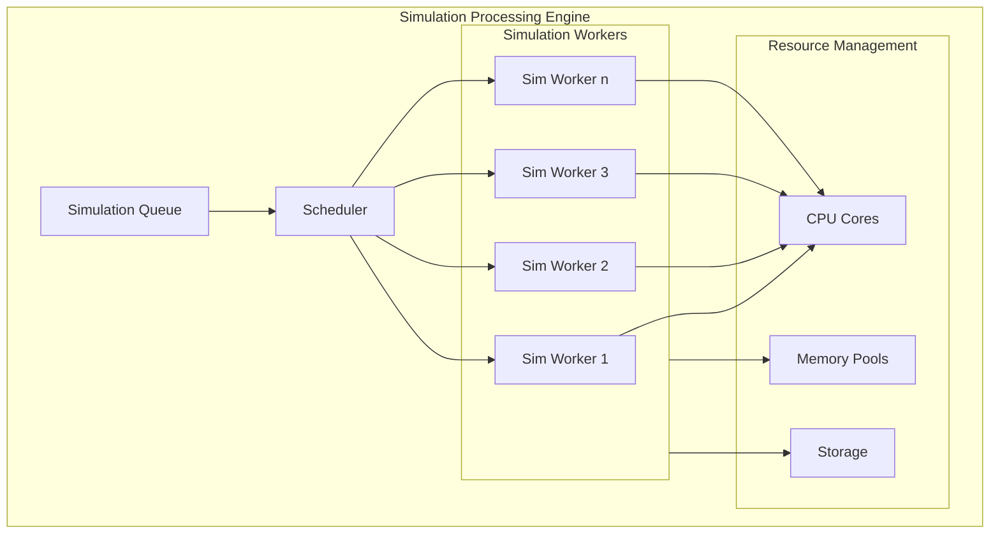

# Parallel Simulation Architecture

## Overview

This document outlines an optimized multi-threaded architecture specifically designed for running multiple parallel simulations. The architecture prioritizes efficient resource allocation, simulation isolation, and robust state management.

## Core Components

### 1. Simulation Processing Engine



#### Key Features
- One dedicated core per simulation
- Isolated memory spaces
- Independent state management
- Separate I/O channels

### 2. Memory Management

Each simulation gets its own memory management system:

```python
memory_allocation = {
    'hot_data': '20%',    # Current simulation state
    'checkpoints': '30%', # Recent checkpoints
    'analysis': '30%',    # Analysis and metrics
    'overhead': '20%'     # System overhead
}
```

### 3. Resource Allocation

#### CPU Allocation
- N-1 cores for simulations (where N = total physical cores)
- 1 core reserved for system operations
- Dynamic core reallocation based on priority

#### Memory Allocation
```python
per_simulation_memory = total_system_ram / number_of_parallel_sims
```

### 4. Simulation States

Each simulation maintains its own state:

1. **Active State**
   - Current simulation step
   - Active variables
   - Runtime metrics

2. **Checkpoint State**
   - Regular state snapshots
   - Configurable frequency
   - Compressed storage

3. **Analysis State**
   - Performance metrics
   - Resource utilization
   - Progress indicators

## Implementation Guidelines

### 1. Simulation Worker Configuration

```python
class SimulationWorker:
    def __init__(self, core_id, memory_limit):
        self.core_id = core_id
        self.memory_limit = memory_limit
        self.current_step = 0
        self.checkpoints = []
```

### 2. Resource Management

```python
def allocate_resources(simulation_id):
    return {
        'core': get_available_core(),
        'memory': calculate_memory_allocation(),
        'storage': initialize_storage_space()
    }
```

### 3. Checkpoint System

```python
def create_checkpoint(simulation_state):
    return {
        'step': simulation_state.current_step,
        'data': compress(simulation_state.data),
        'timestamp': current_time(),
        'metrics': collect_metrics()
    }
```

## Best Practices

1. **Simulation Isolation**
   - Keep simulations completely independent
   - No shared memory between simulations
   - Separate logging and metrics

2. **Resource Management**
   - Monitor resource usage per simulation
   - Implement automatic cleanup
   - Regular garbage collection

3. **Performance Optimization**
   - Batch I/O operations
   - Compress checkpoint data
   - Clean up old checkpoints

4. **Error Handling**
   - Graceful simulation failure handling
   - Automatic checkpoint recovery
   - Resource cleanup on failure

## Monitoring and Metrics

### 1. Per-Simulation Metrics
- Steps completed
- Memory usage
- Processing speed
- Checkpoint sizes

### 2. System-Wide Metrics
- Total resource utilization
- Queue lengths
- System health
- Overall throughput

## Configuration Example

```python
simulation_config = {
    'max_parallel_sims': cpu_cores - 1,
    'memory_per_sim': total_ram / max_parallel_sims,
    'checkpoint_frequency': 10000,
    'compression_level': 'high',
    'priority_levels': ['high', 'normal', 'background']
}
```

## Scaling Considerations

1. **Vertical Scaling**
   - Add more CPU cores
   - Increase memory
   - Faster storage

2. **Horizontal Scaling**
   - Distribute simulations across machines
   - Network-based coordination
   - Distributed storage

## Troubleshooting

Common issues and solutions:

1. **Memory Pressure**
   - Increase checkpoint intervals
   - Compress more aggressively
   - Clean up old data

2. **CPU Bottlenecks**
   - Adjust number of parallel simulations
   - Optimize simulation code
   - Review priority settings

3. **I/O Bottlenecks**
   - Batch checkpoint operations
   - Use faster storage
   - Optimize data formats 