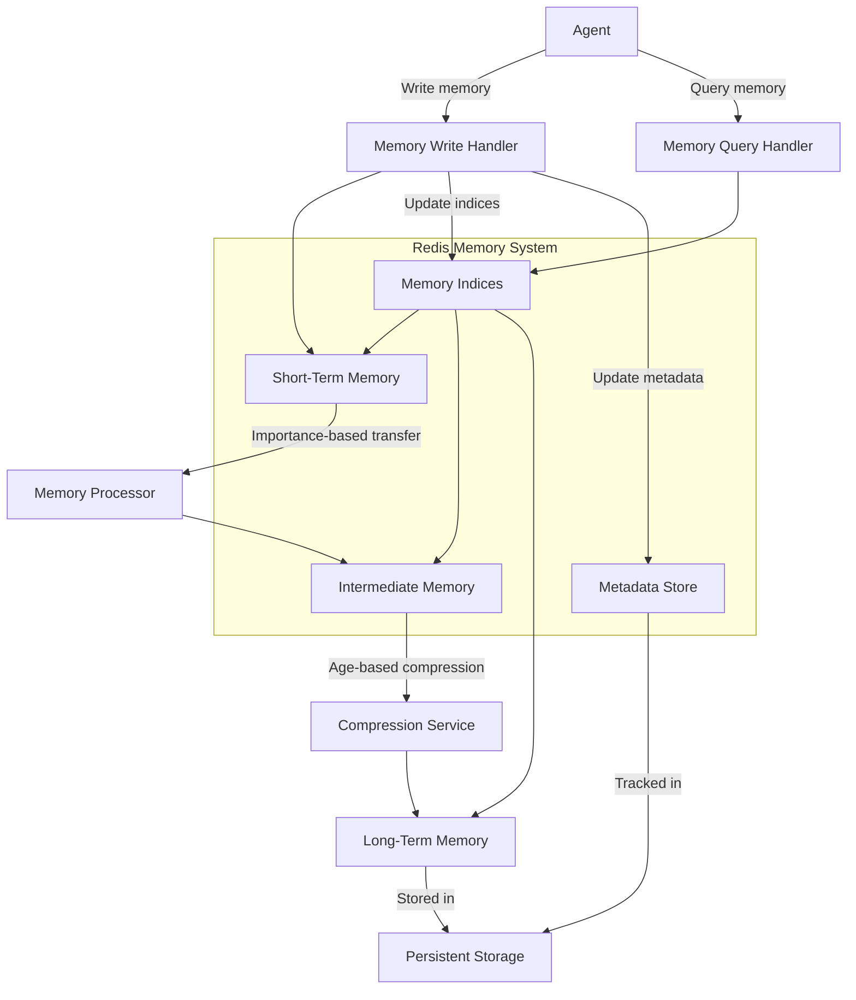
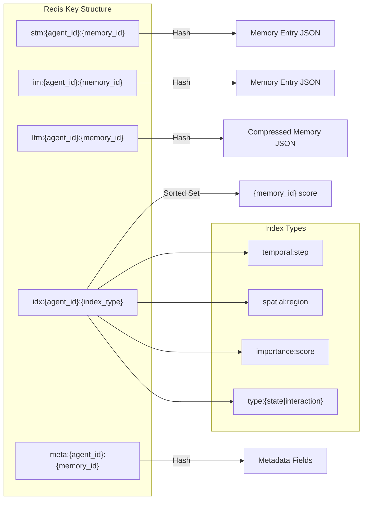

# **RedisSTMStore Documentation**

## **1. Overview**

The `RedisSTMStore` is a Redis-based implementation of the Short-Term Memory (STM) storage tier in the agent memory system. It provides high-performance, in-memory storage for recent agent memory entries with comprehensive error handling, indexing capabilities, and automatic metadata management.

## **2. Redis Memory Architecture**



The Redis-based memory architecture consists of several interconnected components that manage memory storage and retrieval. Agents interact with the system through Write and Query handlers. When storing memories, the Write handler saves data to Short-Term Memory while simultaneously updating indices and metadata. The Memory Processor periodically evaluates STM entries and transfers important ones to Intermediate Memory based on configurable criteria. A Compression Service handles further movement to Long-Term Memory, which is ultimately persisted to stable storage.

## **3. Redis Data Organization**



The Redis implementation uses a structured key naming system for efficient data organization. Memory entries are stored as Redis hashes, with keys following the pattern `{tier}:{agent_id}:{memory_id}`. Various indices implemented as sorted sets enable efficient querying across different dimensions - temporal indices for time-based retrieval, spatial indices for location queries, importance indices for priority-based access, and type indices for filtering by memory category. This key structure allows for rapid access while maintaining logical organization of data.

## **4. Key Features**

- **Resilient Redis Operations**: Leverages circuit breaker pattern and retry mechanisms for reliable storage
- **Multi-Index Design**: Maintains specialized indices for different query patterns
- **TTL Management**: Automatic expiry of memory entries based on configuration
- **Access-Based Metadata Updates**: Tracks and updates retrieval count and access patterns
- **Priority-Based Operations**: Support for different operation priorities
- **Comprehensive Error Handling**: Graceful degradation under failure conditions

## **5. Class Structure**

### **5.1 RedisSTMStore**

```python
class RedisSTMStore:
    def __init__(self, config: RedisSTMConfig):
        """Initialize the Redis STM store.
        
        Args:
            config: Configuration for STM Redis storage
        """
        # ...
```

## **6. Key Methods**

### **6.1 Memory Storage and Retrieval**

| Method | Purpose |
|--------|---------|
| `store(agent_id, memory_entry, priority)` | Store a memory entry in STM |
| `get(agent_id, memory_id)` | Retrieve a memory entry by ID |
| `get_by_timerange(agent_id, start_time, end_time, limit)` | Retrieve memories within a time range |
| `get_by_importance(agent_id, min_importance, max_importance, limit)` | Retrieve memories by importance score |
| `delete(agent_id, memory_id)` | Delete a memory entry |
| `count(agent_id)` | Get the number of memories for an agent |
| `clear(agent_id)` | Clear all memories for an agent |
| `check_health()` | Check Redis connection health |

### **6.2 Internal Methods**

| Method | Purpose |
|--------|---------|
| `_store_memory_entry(agent_id, memory_entry)` | Internal storage implementation |
| `_update_access_metadata(agent_id, memory_id, memory_entry)` | Update access statistics |

## **7. Data Organization**

### **7.1 Memory Entry Structure**

Each memory entry is stored as a JSON string with this structure:

```json
{
  "memory_id": "unique-identifier",
  "agent_id": "agent-123",
  "timestamp": 1679233344,
  
  "contents": {
    // Agent state or action data
  },
  
  "metadata": {
    "creation_time": 1679233344,
    "last_access_time": 1679233400,
    "retrieval_count": 3,
    "importance_score": 0.75
  },
  
  "embeddings": {
    "full_vector": [...],  // 384d embedding vector
  }
}
```

### **7.2 Redis Key Structure**

| Key Pattern | Purpose | Example |
|-------------|---------|---------|
| `{namespace}:{agent_id}:memory:{memory_id}` | Individual memory entries | `agent_memory:stm:agent123:memory:mem456` |
| `{namespace}:{agent_id}:memories` | Set of all agent's memories | `agent_memory:stm:agent123:memories` |
| `{namespace}:{agent_id}:timeline` | Chronological index | `agent_memory:stm:agent123:timeline` |
| `{namespace}:{agent_id}:importance` | Importance-based index | `agent_memory:stm:agent123:importance` |
| `{namespace}:{agent_id}:vector:{memory_id}` | Vector embeddings | `agent_memory:stm:agent123:vector:mem456` |

## **8. Indexing Strategy**

The `RedisSTMStore` maintains multiple indices for efficient retrieval:

### **8.1 Timeline Index**

```
{namespace}:{agent_id}:timeline (Sorted Set)
```

- **Key**: Memory ID
- **Score**: Timestamp
- **Purpose**: Chronological retrieval and time-range queries

### **8.2 Importance Index**

```
{namespace}:{agent_id}:importance (Sorted Set)
```

- **Key**: Memory ID
- **Score**: Importance score (0.0-1.0)
- **Purpose**: Retrieving important memories first

### **8.3 Vector Storage**

```
{namespace}:{agent_id}:vector:{memory_id} (String)
```

- **Value**: JSON array of embedding vector
- **Purpose**: Semantic similarity search and vector retrieval

## **9. Error Handling Strategy**

### **9.1 Resilient Storage**

The store uses the `ResilientRedisClient` for all operations, providing:

1. **Circuit Breaker**: Prevents cascading failures when Redis is unreliable
2. **Operation Retries**: Automatic retries for transient errors
3. **Priority-Based Handling**: Different approaches for different priority levels

### **9.2 Graceful Degradation**

In failure scenarios, the system:

1. Returns reasonable defaults (e.g., empty lists for retrieval operations)
2. Logs errors with appropriate detail
3. Attempts to continue normal operation when possible

## **10. Memory Metadata Management**

### **10.1 Automatic Updates**

Each time a memory is accessed:

1. **Retrieval Count**: Incremented to track access frequency
2. **Last Access Time**: Updated to the current timestamp
3. **Importance Score**: Adjusted based on access patterns

### **10.2 Importance Calculation**

Importance is influenced by:

1. **Initial Score**: Set during memory creation
2. **Access Patterns**: More frequently accessed memories gain importance
3. **Recency**: Recently accessed memories are considered more important

## **11. Usage Examples**

### **11.1 Basic Memory Storage and Retrieval**

```python
from memory.agent_memory.config import RedisSTMConfig
from memory.agent_memory.storage.redis_stm import RedisSTMStore

# Initialize store
config = RedisSTMConfig(
    host="localhost",
    port=6379,
    db=0,
    ttl=86400  # 1 day
)
stm_store = RedisSTMStore(config)

# Store a memory
memory_entry = {
    "memory_id": "mem123",
    "timestamp": time.time(),
    "contents": {"position": [10, 20], "health": 0.9},
    "metadata": {"importance_score": 0.75}
}
stm_store.store("agent123", memory_entry)

# Retrieve the memory
retrieved_memory = stm_store.get("agent123", "mem123")
```

### **11.2 Time-Based Retrieval**

```python
# Get memories from the last hour
end_time = time.time()
start_time = end_time - 3600  # 1 hour ago

recent_memories = stm_store.get_by_timerange(
    "agent123",
    start_time,
    end_time,
    limit=20
)
```

### **11.3 Importance-Based Retrieval**

```python
# Get important memories (score >= 0.7)
important_memories = stm_store.get_by_importance(
    "agent123",
    min_importance=0.7,
    max_importance=1.0,
    limit=10
)
```

## **12. Configuration Options**

### **12.1 Redis Connection Settings**

| Parameter | Description | Default |
|-----------|-------------|---------|
| `host` | Redis server host | "localhost" |
| `port` | Redis server port | 6379 |
| `db` | Redis database number | 0 |
| `password` | Redis password | None |

### **12.2 Memory Settings**

| Parameter | Description | Default |
|-----------|-------------|---------|
| `ttl` | Time-to-live for memories (seconds) | 86400 (24 hours) |
| `memory_limit` | Maximum memories per agent | 1000 |
| `namespace` | Redis key namespace | "agent_memory:stm" |

## **13. Performance Considerations**

### **13.1 Optimization Techniques**

1. **TTL Management**: Automatic expiry prevents memory accumulation
2. **Index Pruning**: Sorted sets maintain high query performance
3. **JSON Serialization**: Efficient storage format for complex structures
4. **Circuit Breaker**: Prevents performance degradation during Redis issues

### **13.2 Memory Usage**

Approximate memory usage per entry:

- Basic memory entry: ~1-2 KB
- With embedding vector: ~3-5 KB
- Indices: ~100-200 bytes per memory entry

## **14. Integration with Memory System**

The `RedisSTMStore` integrates with:

1. **Memory Agent**: Provides storage for the memory agent's operations
2. **API Layer**: Used by the API to fulfill retrieval requests
3. **Memory Tiers**: Part of the hierarchical memory architecture
4. **Memory Hooks**: Used by agent hooks to store state snapshots

## **15. Future Enhancements**

### **15.1 Planned Improvements**

1. **Redis Cluster Support**: Distributed memory storage across multiple Redis instances
2. **Compression**: Automatic compression for large memory entries
3. **Partial Updates**: Support for updating specific fields without full replacement
4. **Query Caching**: Local caching of frequent queries
5. **Batch Operations**: Performance optimizations for bulk storage and retrieval

### **15.2 Implementation Roadmap**

| Feature | Priority | Complexity | Status |
|---------|----------|------------|--------|
| Redis Cluster Support | Medium | High | Planned |
| Memory Compression | High | Medium | Planned |
| Partial Updates | Medium | Low | Backlog |
| Query Caching | Low | Medium | Backlog |
| Batch Operations | High | Medium | Planned |

## **16. Additional Resources**

- [Core Concepts](../../core_concepts.md)
- [Agent State Storage](../../agent_state_storage.md)
- [Redis Integration](../../redis_integration.md)
- [ResilientRedisClient](resilient_redis_client.md)
- [Memory Agent](memory_agent.md)
- [Agent Memory API](agent_memory_api.md) 