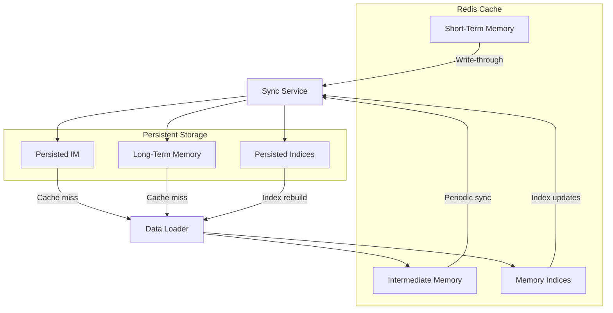
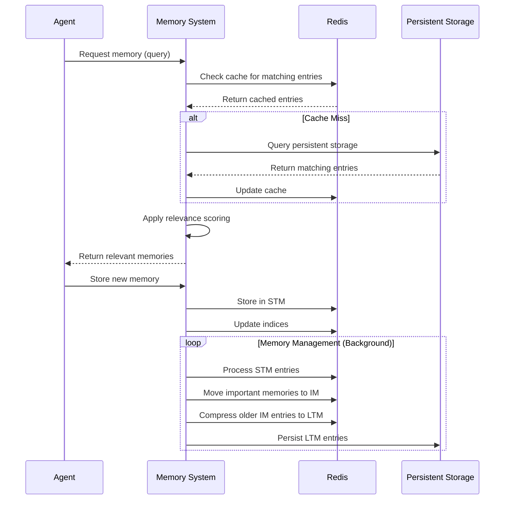

# **ResilientRedisClient Documentation**

## **1. Overview**

The `ResilientRedisClient` is a resilient wrapper around Redis operations that implements robust error handling, automatic retries, and circuit breaker patterns to ensure reliable Redis operations in the AgentMemory system.

## **2. Data Consistency Architecture**



Data consistency between Redis and persistent storage is maintained through a two-way synchronization system. The Sync Service moves data from Redis to persistent storage using different strategies for each memory tier. Short-Term Memory uses write-through for immediate persistence of critical data, while Intermediate Memory and indices use periodic syncing to balance performance with data durability. When cache misses occur, the Data Loader retrieves information from persistent storage and populates Redis accordingly. This architecture enables the system to recover from Redis failures while preserving data integrity across both transient and permanent storage layers.

## **3. Memory Access Patterns**



Memory access follows a consistent pattern designed for performance and reliability. When an agent requests information, the system first queries Redis for cached entries, providing fast responses for frequently accessed data. Cache misses trigger queries to persistent storage, and Redis is updated afterward to improve future access times. For storage operations, new memories are immediately placed in Short-Term Memory with index updates. A background process continuously manages memory transfers between tiers based on importance and age. The ResilientRedisClient ensures all Redis interactions remain reliable by implementing retries and circuit breaking when the Redis server experiences instability.

## **4. Key Features**

- **Circuit Breaker Pattern**: Prevents cascading failures by stopping operations when Redis is unreliable
- **Automatic Retries**: Configurable retry policies for transient errors
- **Recovery Queue**: Enqueues failed operations for later retry based on priority
- **Priority-Based Operation Handling**: Different handling for critical vs. normal operations
- **Comprehensive Redis Method Coverage**: Full set of Redis operations with error handling

## **5. Class Structure**

### **5.1 ResilientRedisClient**

```python
class ResilientRedisClient:
    def __init__(
        self,
        client_name: str,
        host: str = "localhost",
        port: int = 6379,
        db: int = 0,
        password: Optional[str] = None,
        socket_timeout: float = 2.0,
        socket_connect_timeout: float = 2.0,
        retry_policy: Optional[RetryPolicy] = None,
        circuit_threshold: int = 3,
        circuit_reset_timeout: int = 300
    ):
        # ...
```

## **6. Key Methods**

### **6.1 Core Redis Operations**

All basic Redis operations are wrapped with circuit breaker pattern:

| Method | Purpose | Redis Command |
|--------|---------|---------------|
| `ping()` | Check connection | PING |
| `get(key)` | Get value | GET |
| `set(key, value, ...)` | Set value | SET |
| `delete(*keys)` | Delete keys | DEL |
| `exists(*keys)` | Check key existence | EXISTS |
| `expire(key, time)` | Set key expiry | EXPIRE |
| `hset(name, key, value)` | Set hash field | HSET |
| `hget(name, key)` | Get hash field | HGET |
| `hgetall(name)` | Get all hash fields | HGETALL |
| `hmset(name, mapping)` | Set multiple hash fields | HSET (mapping) |
| `hdel(name, *keys)` | Delete hash fields | HDEL |
| `zadd(name, mapping, ...)` | Add to sorted set | ZADD |
| `zrange(name, start, end, ...)` | Get range from sorted set | ZRANGE |
| `zrangebyscore(name, min, max, ...)` | Get score range from sorted set | ZRANGEBYSCORE |
| `zrem(name, *values)` | Remove from sorted set | ZREM |
| `zcard(name)` | Count sorted set members | ZCARD |

### **6.2 Error Handling Methods**

| Method | Purpose |
|--------|---------|
| `_execute_with_circuit_breaker(operation_name, operation)` | Wrap operation with circuit breaker |
| `_create_redis_client()` | Create Redis client with error handling |
| `store_with_retry(agent_id, state_data, store_func, priority)` | Store with priority-based retry |

## **7. Error Handling Strategy**

### **7.1 Circuit Breaker Pattern**

The client uses a circuit breaker to prevent repeated failed attempts to Redis:

1. **Closed State**: Normal operation, all requests pass through
2. **Open State**: After `circuit_threshold` failures, requests are blocked
3. **Half-Open State**: After `circuit_reset_timeout` seconds, a test request is allowed

### **7.2 Priority-Based Handling**

Operations are handled differently based on priority:

| Priority | Handling on Failure |
|----------|---------------------|
| **CRITICAL** | Immediate retry with exponential backoff (3 attempts) |
| **HIGH/NORMAL** | Enqueue for background retry |
| **LOW** | Log and continue |

### **7.3 Error Categories**

| Error | Description | Handling |
|-------|-------------|----------|
| `RedisUnavailableError` | Connection failures | Circuit breaker, retry |
| `RedisTimeoutError` | Operation timeouts | Circuit breaker, retry |
| Other exceptions | Various errors | Logged and propagated |

## **8. Integration with Memory System**

### **8.1 Memory Tier Support**

The client is designed to support the memory tier architecture:

- **STM (Short-Term Memory)**: Fast, recent, high-detail memory storage
- **IM (Intermediate Memory)**: Medium-term storage with compression

### **8.2 Memory Operations**

The client facilitates these memory operations:

1. **Storage**: Reliably storing agent states with priority
2. **Retrieval**: Fast access to recent memory entries
3. **Indexing**: Supporting the Redis schema for efficient queries
4. **Memory Transitions**: Enabling data flow between memory tiers

## **9. Usage Examples**

### **9.1 Basic Redis Operations**

```python
# Create client
client = ResilientRedisClient(
    client_name="agent_stm",
    host="redis.example.com",
    port=6379,
    db=0
)

# Basic operations
client.set("agent:123:name", "Agent Smith")
name = client.get("agent:123:name")

# Hash operations
client.hset("agent:123:state", "health", "100")
client.hset("agent:123:state", "position", "10,20")
state = client.hgetall("agent:123:state")
```

### **9.2 Priority-Based Storage**

```python
def store_agent_state(agent_id, state_data):
    """Store agent state in Redis."""
    key = f"agent:{agent_id}:state"
    try:
        client.hmset(key, state_data)
        return True
    except Exception as e:
        logger.error(f"Failed to store state: {e}")
        return False

# Store with priority
client.store_with_retry(
    agent_id="agent123",
    state_data={"position": "10,20", "health": "100"},
    store_func=store_agent_state,
    priority=Priority.CRITICAL
)
```

## **10. Configuration**

### **10.1 Connection Parameters**

| Parameter | Description | Default |
|-----------|-------------|---------|
| `host` | Redis host | "localhost" |
| `port` | Redis port | 6379 |
| `db` | Redis database number | 0 |
| `password` | Redis password | None |
| `socket_timeout` | Timeout for operations | 2.0 seconds |
| `socket_connect_timeout` | Connection timeout | 2.0 seconds |

### **10.2 Circuit Breaker Settings**

| Parameter | Description | Default |
|-----------|-------------|---------|
| `circuit_threshold` | Failures before circuit opens | 3 |
| `circuit_reset_timeout` | Seconds before circuit reset | 300 |

### **10.3 Retry Policy**

| Parameter | Description | Default |
|-----------|-------------|---------|
| `max_retries` | Maximum retry attempts | 3 |
| `base_delay` | Base delay between retries | 1.0 second |
| `backoff_factor` | Multiplier for backoff | 2.0 |

## **11. Future Enhancements**

### **11.1 Potential Improvements**

1. **Health Monitoring System**: Implement proactive health checks for Redis servers
2. **Metrics Collection**: Track operation latencies, error rates, and circuit breaker state
3. **Multiple Redis Servers**: Support for Redis clusters and replicas
4. **Lua Script Support**: Add support for Lua script execution with error handling
5. **Caching Layer**: Add local caching for frequently accessed items
6. **Tier Fallback Mechanism**: Implement automatic fallback between memory tiers

### **11.2 Implementation Roadmap**

| Feature | Priority | Complexity | Status |
|---------|----------|------------|--------|
| Health Monitoring | High | Medium | Planned |
| Metrics Collection | Medium | Low | Planned |
| Redis Cluster Support | Medium | High | Backlog |
| Lua Script Support | Low | Medium | Backlog |
| Local Caching | Medium | Medium | Backlog |
| Tier Fallback | High | High | Planned |

## **12. Additional Resources**

- [Redis Integration](../../redis_integration.md)
- [Error Handling Strategy](../../error_handling_strategy.md)
- [Agent State Redis Schema](../../agent_state_redis_schema.md)
- [Memory Agent Implementation](../memory_agent.py) 