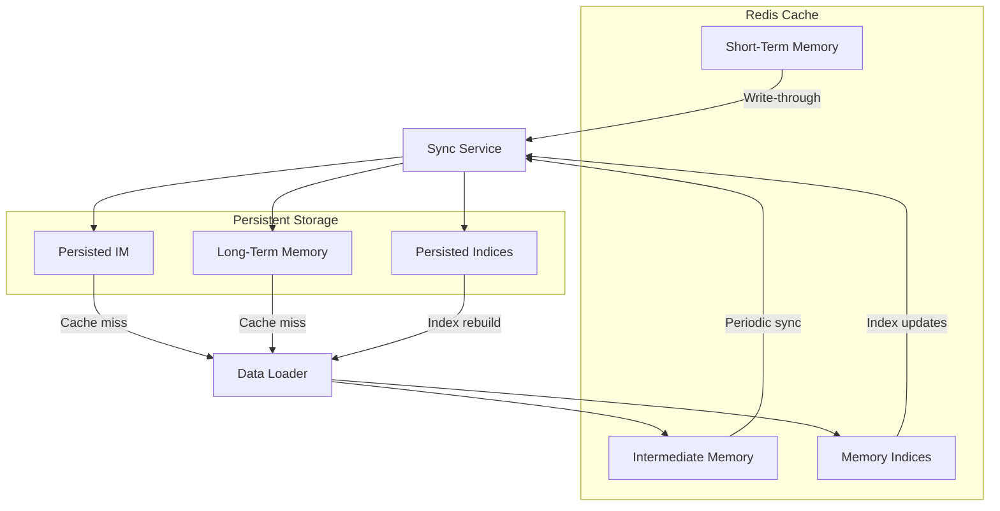
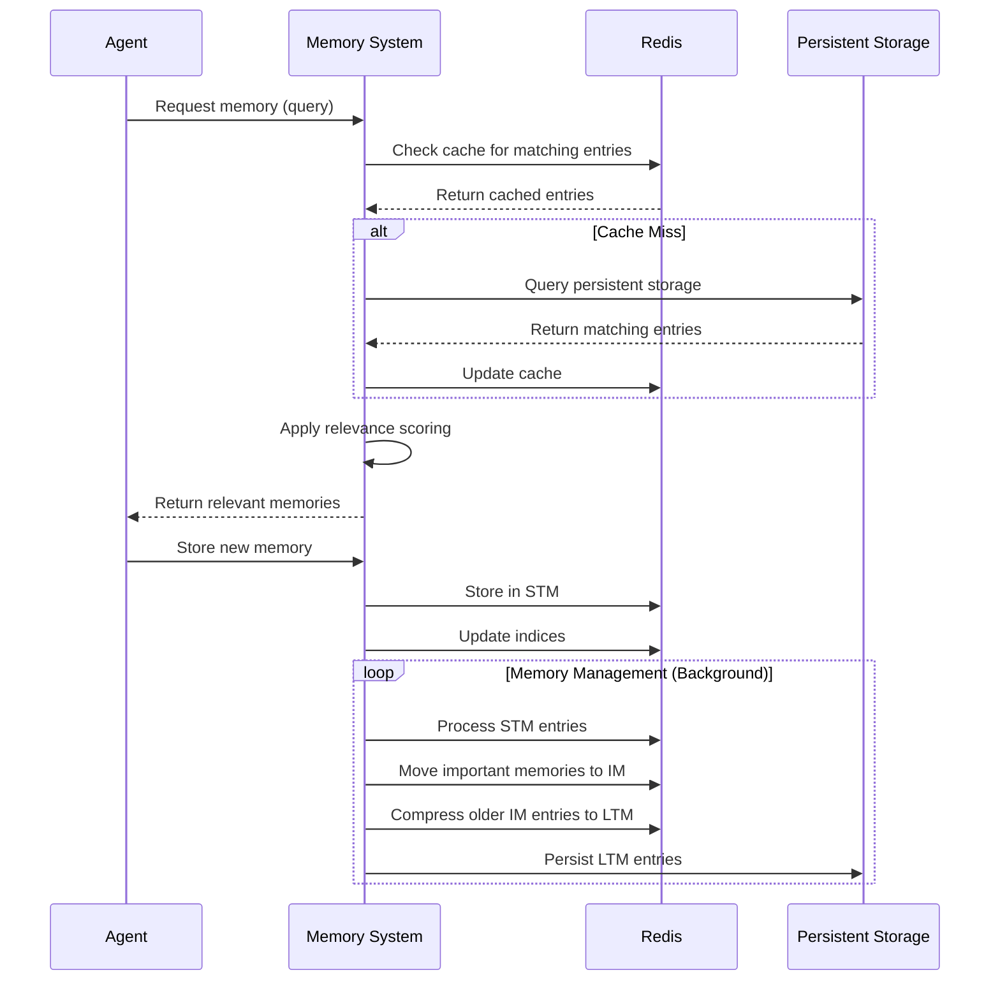
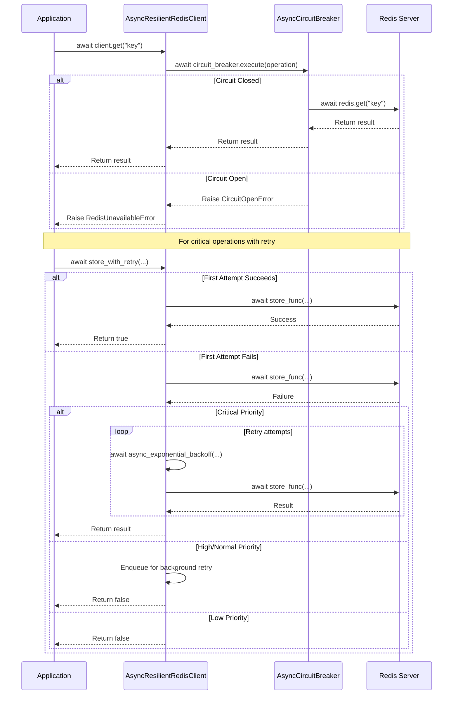

# **ResilientRedisClient Documentation**

## **1. Overview**

The `ResilientRedisClient` is a resilient wrapper around Redis operations that implements robust error handling, automatic retries, and circuit breaker patterns to ensure reliable Redis operations in the AgentMemory system.

## **2. Data Consistency Architecture**



Data consistency between Redis and persistent storage is maintained through a two-way synchronization system. The Sync Service moves data from Redis to persistent storage using different strategies for each memory tier. Short-Term Memory uses write-through for immediate persistence of critical data, while Intermediate Memory and indices use periodic syncing to balance performance with data durability. When cache misses occur, the Data Loader retrieves information from persistent storage and populates Redis accordingly. This architecture enables the system to recover from Redis failures while preserving data integrity across both transient and permanent storage layers.

## **3. Memory Access Patterns**



Memory access follows a consistent pattern designed for performance and reliability. When an agent requests information, the system first queries Redis for cached entries, providing fast responses for frequently accessed data. Cache misses trigger queries to persistent storage, and Redis is updated afterward to improve future access times. For storage operations, new memories are immediately placed in Short-Term Memory with index updates. A background process continuously manages memory transfers between tiers based on importance and age. The ResilientRedisClient ensures all Redis interactions remain reliable by implementing retries and circuit breaking when the Redis server experiences instability.

## **4. Key Features**

- **Circuit Breaker Pattern**: Prevents cascading failures by stopping operations when Redis is unreliable
- **Automatic Retries**: Configurable retry policies for transient errors
- **Recovery Queue**: Enqueues failed operations for later retry based on priority
- **Priority-Based Operation Handling**: Different handling for critical vs. normal operations
- **Comprehensive Redis Method Coverage**: Full set of Redis operations with error handling
- **Decorator-Based Error Handling**: Consistent error handling across all operations using decorators
- **Configurable Exponential Backoff**: Flexible configuration of retry attempts and delays
- **Modern Redis API Support**: Up-to-date methods aligned with current Redis client practices

## **5. Class Structure**

### **5.1 Helper Functions**

```python
def resilient_operation(operation_name: str):
    """Decorator to wrap Redis operations with circuit breaker pattern."""
    # ...

def exponential_backoff(attempt: int, base_delay: float = 0.5, max_delay: float = 30.0) -> float:
    """Calculate delay for exponential backoff strategy."""
    # ...
```

### **5.2 ResilientRedisClient**

```python
class ResilientRedisClient:
    def __init__(
        self,
        client_name: str,
        host: str = "localhost",
        port: int = 6379,
        db: int = 0,
        password: Optional[str] = None,
        socket_timeout: float = 2.0,
        socket_connect_timeout: float = 2.0,
        retry_policy: Optional[RetryPolicy] = None,
        circuit_threshold: int = 3,
        circuit_reset_timeout: int = 300,
        critical_retry_attempts: int = 3,
        retry_base_delay: float = 0.5,
        retry_max_delay: float = 30.0,
    ):
        # ...
```

## **6. Key Methods**

### **6.1 Core Redis Operations**

All basic Redis operations are wrapped with the `@resilient_operation` decorator for consistent error handling:

| Method                               | Purpose                         | Redis Command  |
| ------------------------------------ | ------------------------------- | -------------- |
| `ping()`                             | Check connection                | PING           |
| `get(key)`                           | Get value                       | GET            |
| `set(key, value, ...)`               | Set value                       | SET            |
| `delete(*keys)`                      | Delete keys                     | DEL            |
| `exists(*keys)`                      | Check key existence             | EXISTS         |
| `expire(key, time)`                  | Set key expiry                  | EXPIRE         |
| `hset(name, key, value)`             | Set hash field                  | HSET           |
| `hget(name, key)`                    | Get hash field                  | HGET           |
| `hgetall(name)`                      | Get all hash fields             | HGETALL        |
| `hset_dict(name, mapping)`           | Set multiple hash fields        | HSET (mapping) |
| `hmset(name, mapping)`               | Set multiple hash fields (deprecated) | HSET (mapping) |
| `hdel(name, *keys)`                  | Delete hash fields              | HDEL           |
| `zadd(name, mapping, ...)`           | Add to sorted set               | ZADD           |
| `zrange(name, start, end, ...)`      | Get range from sorted set       | ZRANGE         |
| `zrangebyscore(name, min, max, ...)` | Get score range from sorted set | ZRANGEBYSCORE  |
| `zrem(name, *values)`                | Remove from sorted set          | ZREM           |
| `zcard(name)`                        | Count sorted set members        | ZCARD          |
| `scan_iter(match, count)`            | Scan keys matching pattern      | SCAN           |

### **6.2 Error Handling Methods**

| Method                                                                                                | Purpose                                  |
| ----------------------------------------------------------------------------------------------------- | ---------------------------------------- |
| `_execute_with_circuit_breaker(operation_name, operation)`                                            | Wrap operation with circuit breaker      |
| `_create_redis_client()`                                                                              | Create Redis client with error handling  |
| `store_with_retry(agent_id, state_data, store_func, priority, retry_attempts, base_delay, max_delay)` | Store with configurable retry parameters |

## **7. Error Handling Strategy**

### **7.1 Circuit Breaker Pattern**

The client uses a circuit breaker to prevent repeated failed attempts to Redis:

1. **Closed State**: Normal operation, all requests pass through
2. **Open State**: After `circuit_threshold` failures, requests are blocked
3. **Half-Open State**: After `circuit_reset_timeout` seconds, a test request is allowed

### **7.2 Decorator-Based Protection**

The `@resilient_operation` decorator wraps all Redis operations with circuit breaker protection:

```python
@resilient_operation("get")
def get(self, key: str) -> Optional[str]:
    """Get value from Redis."""
    return self.client.get(key)
```

This provides consistent error handling across all operations without code duplication.

### **7.3 Priority-Based Handling**

Operations are handled differently based on priority:

| Priority        | Handling on Failure                                   |
| --------------- | ----------------------------------------------------- |
| **CRITICAL**    | Immediate retry with configurable exponential backoff |
| **HIGH/NORMAL** | Enqueue for background retry                          |
| **LOW**         | Log and continue                                      |

### **7.4 Exponential Backoff**

The `exponential_backoff` function calculates delays between retry attempts:

```python
def exponential_backoff(attempt: int, base_delay: float = 0.5, max_delay: float = 30.0) -> float:
    """Calculate delay for exponential backoff strategy."""
    delay = base_delay * (2**attempt)
    return min(delay, max_delay)
```

- `attempt`: Current attempt number (0-based)
- `base_delay`: Starting delay in seconds
- `max_delay`: Maximum delay cap in seconds

### **7.5 Error Categories**

| Error                   | Description         | Handling               |
| ----------------------- | ------------------- | ---------------------- |
| `RedisUnavailableError` | Connection failures | Circuit breaker, retry |
| `RedisTimeoutError`     | Operation timeouts  | Circuit breaker, retry |
| Other exceptions        | Various errors      | Logged and propagated  |

## **8. Integration with Memory System**

### **8.1 Memory Tier Support**

The client is designed to support the memory tier architecture:

- **STM (Short-Term Memory)**: Fast, recent, high-detail memory storage
- **IM (Intermediate Memory)**: Medium-term storage with compression

### **8.2 Memory Operations**

The client facilitates these memory operations:

1. **Storage**: Reliably storing agent states with priority
2. **Retrieval**: Fast access to recent memory entries
3. **Indexing**: Supporting the Redis schema for efficient queries
4. **Memory Transitions**: Enabling data flow between memory tiers

## **9. Usage Examples**

### **9.1 Basic Redis Operations**

```python
# Create client with default retry settings
client = ResilientRedisClient(
    client_name="agent_stm",
    host="redis.example.com",
    port=6379,
    db=0
)

# Basic operations
client.set("agent:123:name", "Agent Smith")
name = client.get("agent:123:name")

# Hash operations
client.hset("agent:123:state", "health", "100")
client.hset("agent:123:state", "position", "10,20")
state = client.hgetall("agent:123:state")

# Set multiple hash fields (recommended way)
client.hset_dict("agent:123:state", {
    "health": "100",
    "position": "10,20",
    "status": "active"
})
```

### **9.2 Priority-Based Storage with Retry Configuration**

```python
def store_agent_state(agent_id, state_data):
    """Store agent state in Redis."""
    key = f"agent:{agent_id}:state"
    try:
        client.hset_dict(key, state_data)  # Use the recommended method
        return True
    except Exception as e:
        logger.error(f"Failed to store state: {e}")
        return False

# Store with priority and custom retry parameters
client.store_with_retry(
    agent_id="agent123",
    state_data={"position": "10,20", "health": "100"},
    store_func=store_agent_state,
    priority=Priority.CRITICAL,
    retry_attempts=5,        # Override default attempts
    base_delay=0.2,          # Start with shorter delays
    max_delay=10.0           # Cap maximum delay
)
```

### **9.3 Custom Client Configuration**

```python
# Create client with custom retry/backoff settings
client = ResilientRedisClient(
    client_name="critical_operations",
    host="redis.example.com",
    port=6379,
    db=0,
    # Circuit breaker settings
    circuit_threshold=5,
    circuit_reset_timeout=60,
    # Retry settings
    critical_retry_attempts=5,
    retry_base_delay=0.1,
    retry_max_delay=15.0
)
```

## **10. Configuration**

### **10.1 Connection Parameters**

| Parameter                | Description            | Default     |
| ------------------------ | ---------------------- | ----------- |
| `host`                   | Redis host             | "localhost" |
| `port`                   | Redis port             | 6379        |
| `db`                     | Redis database number  | 0           |
| `password`               | Redis password         | None        |
| `socket_timeout`         | Timeout for operations | 2.0 seconds |
| `socket_connect_timeout` | Connection timeout     | 2.0 seconds |

### **10.2 Circuit Breaker Settings**

| Parameter               | Description                   | Default |
| ----------------------- | ----------------------------- | ------- |
| `circuit_threshold`     | Failures before circuit opens | 3       |
| `circuit_reset_timeout` | Seconds before circuit reset  | 300     |

### **10.3 Retry Policy**

| Parameter        | Description                | Default    |
| ---------------- | -------------------------- | ---------- |
| `max_retries`    | Maximum retry attempts     | 3          |
| `base_delay`     | Base delay between retries | 1.0 second |
| `backoff_factor` | Multiplier for backoff     | 2.0        |

### **10.4 Exponential Backoff Settings**

| Parameter                 | Description                            | Default      |
| ------------------------- | -------------------------------------- | ------------ |
| `critical_retry_attempts` | Retry attempts for critical operations | 3            |
| `retry_base_delay`        | Base delay for exponential backoff     | 0.5 seconds  |
| `retry_max_delay`         | Maximum delay cap                      | 30.0 seconds |

## **11. Future Enhancements**

### **11.1 Potential Improvements**

1. **Health Monitoring System**: Implement proactive health checks for Redis servers
2. **Metrics Collection**: Track operation latencies, error rates, and circuit breaker state
3. **Multiple Redis Servers**: Support for Redis clusters and replicas
4. **Lua Script Support**: Add support for Lua script execution with error handling
5. **Caching Layer**: Add local caching for frequently accessed items
6. **Tier Fallback Mechanism**: Implement automatic fallback between memory tiers
7. **Enhanced Retry Strategies**: Support for more retry strategies beyond exponential backoff
8. **Custom Retry Logic**: Allow custom retry logic for specific operations

### **11.2 Implementation Roadmap**

| Feature                   | Priority | Complexity | Status  |
| ------------------------- | -------- | ---------- | ------- |
| Health Monitoring         | High     | Medium     | Planned |
| Metrics Collection        | Medium   | Low        | Planned |
| Redis Cluster Support     | Medium   | High       | Backlog |
| Lua Script Support        | Low      | Medium     | Backlog |
| Local Caching             | Medium   | Medium     | Backlog |
| Tier Fallback             | High     | High       | Planned |
| Enhanced Retry Strategies | Medium   | Medium     | Planned |

## **12. Additional Resources**

- [Redis Integration](../../redis_integration.md)
- [Error Handling Strategy](../../error_handling_strategy.md)
- [Agent State Redis Schema](../../agent_state_redis_schema.md)
- [Memory Agent Implementation](../memory_agent.py)

## **13. AsyncResilientRedisClient**

### **13.1 Overview**

The `AsyncResilientRedisClient` is an asynchronous version of the `ResilientRedisClient`, designed to work with asyncio for I/O-bound applications. It implements the same resilient patterns (circuit breaker, retries) but with async/await syntax for non-blocking operation.

### **13.2 Asynchronous Operation Diagram**



### **13.3 Key Features**

- **Non-blocking I/O**: All Redis operations are fully asynchronous
- **Asynchronous Circuit Breaker**: Prevents cascading failures with async pattern
- **Async/Await Pattern**: Modern Python async syntax for better performance
- **Double Await Handling**: Helper method to simplify working with nested coroutines
- **Automatic Connection Management**: Explicit `init()` and `close()` methods

### **13.4 Class Structure**

```python
async def async_exponential_backoff(attempt: int, base_delay: float = 0.5, max_delay: float = 30.0) -> float:
    """Calculate and sleep for exponential backoff delay."""
    # ...

def resilient_operation(operation_name: str):
    """Decorator to wrap Redis operations with circuit breaker pattern."""
    # ...

class AsyncResilientRedisClient:
    def __init__(
        self,
        client_name: str,
        host: str = "localhost",
        port: int = 6379,
        db: int = 0,
        password: Optional[str] = None,
        socket_timeout: float = 2.0,
        socket_connect_timeout: float = 2.0,
        retry_policy: Optional[RetryPolicy] = None,
        circuit_threshold: int = 3,
        circuit_reset_timeout: int = 300,
        critical_retry_attempts: int = 3,
        retry_base_delay: float = 0.5,
        retry_max_delay: float = 30.0,
        max_connections: int = 10,
        health_check_interval: int = 30,
    ):
        # ...
        
    async def init(self):
        """Initialize the Redis connection."""
        # ...
        
    async def close(self):
        """Close the Redis connection."""
        # ...
        
    @staticmethod
    async def execute_with_double_await(coro: Awaitable[Awaitable[T]]) -> T:
        """Helper method to handle double awaits from resilient operations."""
        # ...
```

### **13.5 Working with Asynchronous Operations**

All Redis operations in `AsyncResilientRedisClient` return coroutines that must be awaited. When using methods decorated with `@resilient_operation`, there are two patterns for handling the nested coroutines:

#### **13.5.1 Double Await Pattern**

```python
# First await gets the coroutine from the circuit breaker
coroutine = client.get("key")
# Second await executes the Redis operation
intermediate = await coroutine
result = await intermediate

# Or more concisely:
result = await (await client.get("key"))
```

#### **13.5.2 Helper Method**

```python
# Using the helper method to handle double awaits
result = await client.execute_with_double_await(client.get("key"))
```

### **13.6 Usage Examples**

#### **13.6.1 Basic Async Redis Operations**

```python
# Create and initialize the client
client = AsyncResilientRedisClient(
    client_name="agent_stm_async",
    host="redis.example.com",
    port=6379,
    db=0
)
await client.init()

try:
    # Basic operations
    await client.execute_with_double_await(
        client.set("agent:123:name", "Agent Smith")
    )
    name = await client.execute_with_double_await(
        client.get("agent:123:name")
    )

    # Hash operations
    await client.execute_with_double_await(
        client.hset_dict("agent:123:state", {
            "health": "100",
            "position": "10,20",
            "status": "active"
        })
    )
    state = await client.execute_with_double_await(
        client.hgetall("agent:123:state")
    )
finally:
    # Always close the client when done
    await client.close()
```

#### **13.6.2 Async Context Manager Pattern**

```python
# Example showing how you could implement a context manager
from contextlib import asynccontextmanager

@asynccontextmanager
async def get_redis_client(client_name="default", host="localhost", port=6379):
    client = AsyncResilientRedisClient(client_name=client_name, host=host, port=port)
    await client.init()
    try:
        yield client
    finally:
        await client.close()

# Usage
async with get_redis_client("agent_stm_async", "redis.example.com") as client:
    # Operations within context manager - client will be closed automatically
    await client.execute_with_double_await(
        client.set("key", "value")
    )
```

#### **13.6.3 Async Store with Retry**

```python
async def store_agent_state(agent_id, state_data):
    """Store agent state in Redis asynchronously."""
    key = f"agent:{agent_id}:state"
    try:
        result = await client.execute_with_double_await(
            client.hset_dict(key, state_data)
        )
        return bool(result)
    except Exception as e:
        logger.error(f"Failed to store state: {e}")
        return False

# Store with priority and custom retry parameters
await client.store_with_retry(
    agent_id="agent123",
    state_data={"position": "10,20", "health": "100"},
    store_func=store_agent_state,
    priority=Priority.CRITICAL,
    retry_attempts=5
)
```

### **13.7 Integration with Asyncio Applications**

The `AsyncResilientRedisClient` is designed to work well with asyncio-based web frameworks and applications:

#### **13.7.1 FastAPI Integration**

```python
from fastapi import FastAPI, Depends
from agent_memory.storage.async_redis_client import AsyncResilientRedisClient

app = FastAPI()
redis_client = None

@app.on_event("startup")
async def startup():
    global redis_client
    redis_client = AsyncResilientRedisClient(client_name="api_cache")
    await redis_client.init()

@app.on_event("shutdown")
async def shutdown():
    if redis_client:
        await redis_client.close()

@app.get("/agent/{agent_id}")
async def get_agent(agent_id: str):
    key = f"agent:{agent_id}:data"
    data = await redis_client.execute_with_double_await(
        redis_client.get(key)
    )
    if not data:
        return {"error": "Agent not found"}
    return {"agent_id": agent_id, "data": data}
```

### **13.8 Error Handling in Async Context**

Error handling in the async client follows the same pattern as the synchronous client but within async/await patterns:

```python
try:
    result = await client.execute_with_double_await(
        client.get("key")
    )
except RedisUnavailableError:
    # Handle connection error
    logger.error("Redis unavailable")
except RedisTimeoutError:
    # Handle timeout
    logger.error("Redis operation timed out")
except Exception as e:
    # Handle other errors
    logger.error(f"Unexpected error: {e}")
```

### **13.9 Performance Considerations**

- **Connection Pooling**: For high-throughput applications, consider implementing connection pooling
- **Task Scheduling**: Use `asyncio.gather()` to run multiple Redis operations concurrently
- **Backpressure Handling**: Implement rate limiting in high-volume write scenarios
- **Event Loop Management**: Be mindful of the event loop when integrating with web frameworks

### **13.10 Testing Async Redis Operations**

Testing the `AsyncResilientRedisClient` requires asyncio-aware testing frameworks:

```python
import pytest
import pytest_asyncio
from unittest.mock import AsyncMock, patch

@pytest_asyncio.fixture
async def mock_redis():
    with patch('redis.asyncio.Redis') as mock:
        mock_instance = AsyncMock()
        mock.return_value = mock_instance
        yield mock, mock_instance

@pytest_asyncio.fixture
async def async_client(mock_redis):
    mock_factory, mock_instance = mock_redis
    client = AsyncResilientRedisClient(client_name="test-client")
    await client.init()
    yield client
    await client.close()

@pytest.mark.asyncio
async def test_get_operation(async_client, mock_redis):
    _, mock_redis_instance = mock_redis
    mock_redis_instance.get.return_value = "value"
    
    result = await async_client.execute_with_double_await(
        async_client.get("key")
    )
    
    assert result == "value"
    mock_redis_instance.get.assert_called_once_with("key")
``` 