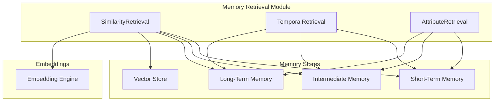

# Memory Retrieval Module Documentation

## Overview

The Memory Retrieval Module is a core component of the Agent Memory System designed to provide flexible and efficient access to agent memories across different storage tiers. It implements multiple retrieval mechanisms that allow agents to recall information using different criteria, including semantic similarity, temporal attributes, and specific content characteristics.



## Key Components

The retrieval module consists of three primary retrieval mechanisms:

### 1. Similarity Retrieval

`SimilarityRetrieval` provides methods for finding memories based on semantic similarity using vector embeddings. It allows the agent to recall information that is conceptually related to current contexts or queries.

#### Key Features:
- **State-based retrieval**: Find memories similar to the current agent state
- **Memory-based retrieval**: Find memories similar to a reference memory
- **Example-based retrieval**: Find memories matching an example pattern
- **Configurable threshold**: Filter results by minimum similarity score

### 2. Temporal Retrieval

`TemporalRetrieval` enables access to memories based on time-related characteristics, allowing the agent to recall information from specific time periods or sequences.

#### Key Features:
- **Recency-based access**: Retrieve most recent or oldest memories
- **Time window queries**: Access memories from specific time ranges
- **Step-based access**: Retrieve memories by simulation step number
- **Narrative sequences**: Build contextual sequences of related memories

### 3. Attribute Retrieval

`AttributeRetrieval` provides targeted memory access based on specific attributes, metadata, and content patterns, enabling precise filtering of memories.

#### Key Features:
- **Type-based retrieval**: Filter memories by type (state, action, interaction)
- **Importance-based retrieval**: Find memories above an importance threshold
- **Metadata filtering**: Retrieve memories with specific metadata values
- **Content pattern matching**: Search for specific patterns within memories
- **Tag-based retrieval**: Filter memories by associated tags
- **Compound queries**: Combine multiple conditions for complex filtering

## Usage Examples

### Setting Up Retrieval Mechanisms

```python
from memory.retrieval import SimilarityRetrieval, TemporalRetrieval, AttributeRetrieval
from memory.embeddings.autoencoder import AutoencoderEmbeddingEngine
from memory.embeddings.vector_store import VectorStore
from memory.storage.redis_stm import RedisSTMStore
from memory.storage.redis_im import RedisIMStore
from memory.storage.sqlite_ltm import SQLiteLTMStore

# Initialize storage and embedding components
vector_store = VectorStore()
embedding_engine = AutoencoderEmbeddingEngine()
stm_store = RedisSTMStore()
im_store = RedisIMStore()
ltm_store = SQLiteLTMStore()

# Initialize retrieval mechanisms
similarity_retrieval = SimilarityRetrieval(
    vector_store, 
    embedding_engine, 
    stm_store, 
    im_store, 
    ltm_store
)

temporal_retrieval = TemporalRetrieval(
    stm_store, 
    im_store, 
    ltm_store
)

attribute_retrieval = AttributeRetrieval(
    stm_store, 
    im_store, 
    ltm_store
)
```

### Similarity-Based Retrieval Examples

```python
# Find memories similar to current state
current_state = {
    "location": "kitchen",
    "time_of_day": "morning",
    "current_task": "making breakfast"
}

similar_state_memories = similarity_retrieval.retrieve_similar_to_state(
    state=current_state,
    limit=5,
    min_score=0.7,
    memory_type="state",
    tier="stm"
)

# Find memories similar to a reference memory
reference_memory_id = "memory-xyz123"
similar_memories = similarity_retrieval.retrieve_similar_to_memory(
    memory_id=reference_memory_id,
    limit=10,
    min_score=0.8,
    exclude_self=True,
    tier="im"
)

# Find memories matching an example pattern
example_pattern = {
    "dialog": {
        "speaker": "user",
        "intent": "request_information"
    }
}

pattern_matches = similarity_retrieval.retrieve_by_example(
    example=example_pattern,
    limit=5,
    min_score=0.6,
    tier="ltm"
)
```

### Temporal Retrieval Examples

```python
# Get recent memories
recent_memories = temporal_retrieval.retrieve_recent(
    count=10,
    memory_type="interaction",
    tier="stm"
)

# Get memories from a specific step range
step_memories = temporal_retrieval.retrieve_step_range(
    start_step=1000,
    end_step=1100,
    memory_type="state",
    tier="im"
)

# Get memories from the last hour
recent_time_memories = temporal_retrieval.retrieve_last_n_minutes(
    minutes=60,
    memory_type="observation",
    tier="stm"
)

# Get a narrative sequence around a specific memory
narrative = temporal_retrieval.retrieve_narrative_sequence(
    memory_id="memory-xyz456",
    context_before=3,
    context_after=3,
    tier="im"
)
```

### Attribute Retrieval Examples

```python
# Get memories by type
action_memories = attribute_retrieval.retrieve_by_memory_type(
    memory_type="action",
    limit=10,
    tier="stm"
)

# Get important memories
important_memories = attribute_retrieval.retrieve_by_importance(
    min_importance=0.8,
    limit=5,
    tier="ltm"
)

# Get memories with specific metadata
metadata_memories = attribute_retrieval.retrieve_by_metadata(
    metadata_filters={
        "emotion": "surprise",
        "source": "user_interaction"
    },
    limit=10,
    tier="im"
)

# Get memories with specific content value
location_memories = attribute_retrieval.retrieve_by_content_value(
    path="location.name",
    value="kitchen",
    limit=5,
    tier="stm"
)

# Get memories matching content pattern
dialog_memories = attribute_retrieval.retrieve_by_content_pattern(
    path="dialog.text",
    pattern="how.*work",
    limit=10,
    tier="ltm"
)

# Get memories with specific tag
tagged_memories = attribute_retrieval.retrieve_by_tag(
    tag="important_interaction",
    limit=5,
    tier="im"
)

# Get memories with compound query
compound_results = attribute_retrieval.retrieve_by_compound_query(
    queries=[
        {"field": "metadata.memory_type", "value": "interaction"},
        {"field": "content.location", "value": "kitchen", "operator": "=="},
        {"field": "metadata.importance", "value": 0.7, "operator": ">="}
    ],
    operator="AND",
    limit=5,
    tier="stm"
)
```

### Combining Retrieval Methods

Different retrieval methods can be combined to create powerful and precise memory queries:

```python
# First get recent memories
recent_memories = temporal_retrieval.retrieve_last_n_minutes(
    minutes=30,
    tier="stm"
)

# Then filter by metadata
filtered_memories = []
for memory in recent_memories:
    if attribute_retrieval._matches_metadata_filters(memory, {"emotion": "surprise"}):
        filtered_memories.append(memory)

# Finally, sort by similarity to current state
similar_filtered_memories = []
for memory in filtered_memories:
    # Calculate similarity using embedding engine
    memory_vector = memory.get("embeddings", {}).get("full_vector")
    current_state_vector = embedding_engine.encode_stm(current_state)
    if memory_vector:
        similarity = vector_store.calculate_similarity(memory_vector, current_state_vector)
        memory["metadata"]["similarity_score"] = similarity
        similar_filtered_memories.append(memory)

# Sort by similarity
similar_filtered_memories.sort(key=lambda x: x["metadata"]["similarity_score"], reverse=True)
```

## Memory Entry Structure

The retrieval mechanisms work with memory entries that typically have this structure:

```json
{
  "memory_id": "unique-identifier",
  "step_number": 1234,
  "timestamp": 1679233344,
  "contents": {
    "field1": "value1",
    "nested": {
      "field2": "value2"
    }
  },
  "embeddings": {
    "full_vector": [0.1, 0.2, 0.3, ...],
    "compressed_vector": [0.5, 0.6, ...],
    "abstract_vector": [0.7, 0.8, ...]
  },
  "metadata": {
    "memory_type": "state|interaction|observation",
    "importance": 0.85,
    "emotion": "surprise",
    "tags": ["important", "user_interaction"]
  }
}
```

## Performance Considerations

- **Tier Selection**: Choose the appropriate memory tier (STM, IM, LTM) based on the time horizon needed. STM queries are fastest, LTM are typically slower.
- **Limit Results**: Always provide a reasonable limit to prevent retrieving an excessive number of memories.
- **Vector vs. Attribute**: Similarity searches using vectors can be more computationally intensive than attribute-based filtering.
- **Memory Transfer**: Consider transferring memories between tiers based on importance or relevance to optimize access patterns.

## See Also

- [Memory Tiers](memory_tiers.md)
- [Embedding System](embeddings.md)
- [Redis STM Store](redis_stm_store.md)
- [Redis IM Store](redis_im_store.md)
- [SQLite LTM Store](sqlite_ltm_store.md)
- [Temporal Retrieval Model](temporal_retrieval_model.md)
- [Memory API](memory_api.md) 