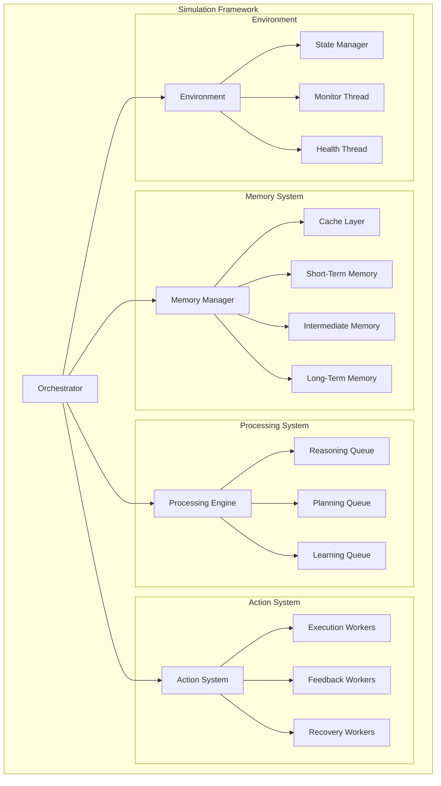

# How The Simulation Framework Works

## Simple Overview

Think of this framework like a smart factory for running simulations. Instead of trying to run everything at once or managing it manually, the framework automatically handles running multiple simulations efficiently.

## System Components and Their Interactions

### Core Components Overview


### 1. Orchestrator
The brain of the system that:
- Coordinates all other components
- Handles message routing
- Manages system state
- Monitors overall health

### 2. Memory Manager
Handles data across four tiers:
```
Memory Hierarchy:
├── Cache Layer
│   └── Hot simulation data (fastest access)
├── Short-Term Memory
│   └── Recent results and states
├── Intermediate Memory
│   └── Checkpoint data and analysis
└── Long-Term Memory
    └── Historical data and completed sims
```

### 3. Processing Engine
Manages computation with specialized queues:
- **Reasoning Queue**: For simulation logic
- **Planning Queue**: For resource allocation
- **Learning Queue**: For optimization
- **Worker Pool**: Distributes tasks across cores

### 4. Action System
Handles execution with three worker types:
1. **Execution Workers**
   - Run simulation steps
   - Manage core resources
   - Handle direct computation

2. **Feedback Workers**
   - Monitor progress
   - Collect metrics
   - Update status

3. **Recovery Workers**
   - Handle failures
   - Manage checkpoints
   - Restore from crashes

### 5. Environment
Manages the simulation space:
```
Environment Components:
├── State Manager
│   ├── Current state tracking
│   ├── Resource allocation
│   └── System boundaries
├── Monitor Thread
│   ├── Performance metrics
│   ├── Resource usage
│   └── Health checks
└── Health Thread
    ├── Error detection
    ├── Recovery triggers
    └── System stability
```

### Component Interactions

1. **Data Flow**
```
Simulation Step Flow:
1. Orchestrator receives simulation request
2. Memory Manager allocates space
3. Processing Engine assigns worker
4. Action System executes steps
5. Environment tracks state
6. Results flow back through Memory Manager
```

2. **Resource Management**
```
Resource Flow:
├── Orchestrator
│   └── Decides resource allocation
├── Memory Manager
│   └── Manages memory distribution
├── Processing Engine
│   └── Handles CPU allocation
└── Action System
    └── Executes within boundaries
```

3. **Error Handling**
```
Error Flow:
1. Component detects error
2. Reports to Orchestrator
3. Action System pauses affected sim
4. Memory Manager saves state
5. Recovery Workers handle restart
6. System resumes operation
```

## Key Parts Explained

### 1. The Queue System
Imagine a smart waiting line:
- New simulations join the queue
- Each simulation gets a priority (high, normal, or background)
- The scheduler (like a traffic controller) decides which simulation runs next
- When a core becomes free, the highest priority simulation starts running

### 2. Worker System
Like dedicated workers in a factory:
- Each worker gets their own CPU core
- Workers only focus on one simulation at a time
- If you have 8 CPU cores, you could run 7 simulations (keeping 1 core for system tasks)
- Each worker is isolated from others to prevent interference

### 3. Memory Management
Like giving each worker their own workspace:
```
Worker's Memory Space:
├── Hot Data (20%) - Current simulation data
├── Checkpoints (30%) - Safety backups
├── Analysis (30%) - Results and measurements
└── Overhead (20%) - System needs
```

### 4. Checkpointing System
Like taking photos of progress:
- Every X steps, the simulation saves its state
- If something goes wrong, you can restart from the last checkpoint
- Old checkpoints get compressed to save space
- Keeps the last 3 checkpoints by default

## How It Works In Practice

1. **Starting Up**
```python
# Example of starting a new simulation
new_simulation = {
    'id': 'sim_123',
    'priority': 'high',
    'parameters': {...},
    'checkpoint_frequency': 10000
}
scheduler.submit(new_simulation)
```

2. **Running**
- Framework checks for available cores
- Assigns simulation to a free worker
- Worker starts running simulation steps
- Progress is monitored and recorded

3. **Resource Management**
```
Available Resources
├── CPU: 8 cores
│   ├── 7 cores for simulations
│   └── 1 core for system
└── Memory: 32GB
    └── ~4.5GB per simulation
```

4. **Handling Problems**
If something goes wrong:
- Simulation automatically saves state
- System cleans up resources
- Can restart from last checkpoint
- Other simulations keep running unaffected

## Real World Example

Let's say you're running climate simulations:

```python
climate_sims = [
    {
        'id': 'climate_2030',
        'priority': 'high',
        'steps': 1_000_000,
        'checkpoint_every': 10000
    },
    {
        'id': 'climate_2040',
        'priority': 'normal',
        'steps': 1_000_000,
        'checkpoint_every': 10000
    },
    {
        'id': 'climate_2050',
        'priority': 'normal',
        'steps': 1_000_000,
        'checkpoint_every': 10000
    }
]

# Framework handles these automatically:
# - Runs on separate cores
# - Manages memory for each
# - Saves progress regularly
# - Collects results
```

## Benefits

1. **Efficiency**
   - Maximum use of your computer's resources
   - No simulation interferes with others
   - Automatic resource cleanup

2. **Reliability**
   - Regular checkpoints prevent data loss
   - Automatic error recovery
   - System stays stable during long runs

3. **Flexibility**
   - Run different types of simulations
   - Adjust priorities on the fly
   - Scale up or down as needed

## Monitoring Your Simulations

You can check on your simulations:
```python
# Get progress of all simulations
status = framework.get_status()

# Example output:
{
    'climate_2030': {
        'progress': '45%',
        'steps_done': 450000,
        'memory_used': '3.2GB',
        'last_checkpoint': '10 mins ago'
    },
    'climate_2040': {
        'progress': '30%',
        'steps_done': 300000,
        'memory_used': '2.8GB',
        'last_checkpoint': '5 mins ago'
    }
}
```

## When Things Go Wrong

The framework handles common problems:

1. **If a simulation crashes:**
   - Automatically restarts from last checkpoint
   - Frees up resources
   - Logs what went wrong

2. **If memory gets full:**
   - Compresses old checkpoints
   - Cleans up unnecessary data
   - Warns you if needed

3. **If CPU is overloaded:**
   - Adjusts simulation scheduling
   - Maintains system responsiveness
   - Keeps high-priority simulations running

## Tips for Best Use

1. **Planning Your Simulations**
   - Group similar simulations together
   - Set appropriate priorities
   - Choose checkpoint frequency based on simulation length

2. **Resource Management**
   - Leave one core free for system tasks
   - Monitor memory usage
   - Clean up completed simulations

3. **Data Handling**
   - Use compression for long-term storage
   - Regular backup of important results
   - Clean up old checkpoints you don't need 