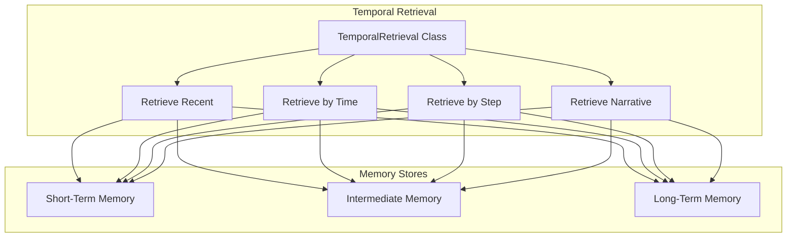

# Temporal Retrieval Model Documentation

## Overview

The Temporal Retrieval Model is a specialized component of the Agent Memory System designed to retrieve memories based on time-related characteristics. It provides mechanisms for accessing agent memories through temporal queries such as recency, specific time periods, and simulation step ranges.

## Core Functionality



The Temporal Retrieval Model connects to all memory tiers (STM, IM, LTM) and provides various temporal access methods. This includes retrieving recent memories, querying specific time periods, accessing memories by step numbers, and constructing narrative sequences from the agent's memory timeline.

## Key Features

### 1. Recency-Based Retrieval

Retrieve the most recent memories from any memory tier:

```python
# Get the 5 most recent memories from STM
recent_memories = temporal_retrieval.retrieve_recent(
    count=5,
    memory_type="state",
    tier="stm"
)

# Get the 10 oldest memories from LTM
oldest_memories = temporal_retrieval.retrieve_oldest(
    count=10,
    tier="ltm"
)
```

### 2. Step-Based Retrieval

Retrieve memories based on simulation step numbers:

```python
# Get a specific step
step_memory = temporal_retrieval.retrieve_by_step(
    step=1234,
    tier="stm"
)

# Get a range of steps
step_range = temporal_retrieval.retrieve_step_range(
    start_step=1000,
    end_step=1500,
    memory_type="interaction",
    tier="im"
)
```

### 3. Time-Based Retrieval

Retrieve memories within specific time periods:

```python
# Get memories from a time range (Unix timestamps)
time_range_memories = temporal_retrieval.retrieve_time_range(
    start_time=1679233344,
    end_time=1679236944,
    tier="stm"
)

# Get memories from the last hour
recent_time_memories = temporal_retrieval.retrieve_last_n_minutes(
    minutes=60,
    memory_type="state",
    tier="stm"
)
```

### 4. Narrative Sequence Retrieval

Retrieve a memory and its context to build a narrative sequence:

```python
# Get a memory with context before and after
narrative = temporal_retrieval.retrieve_narrative_sequence(
    memory_id="memory-xyz",
    context_before=3,
    context_after=3,
    tier="stm"
)
```

## Implementation Details

### Memory Entry Structure

Temporal retrieval operations rely on these key fields in memory entries:

```json
{
  "memory_id": "unique-identifier",
  "step_number": 1234,
  "timestamp": 1679233344,
  "metadata": {
    "memory_type": "state|interaction|observation"
  }
}
```

### Filter Capabilities

The retrieval methods support various filtering options:

- **Time window**: Retrieve memories from the last N seconds
- **Before/After**: Retrieve memories before or after a specific timestamp
- **Step number**: Retrieve memories from a specific simulation step
- **Memory type**: Filter by the type of memory (state, interaction, etc.)
- **Tier selection**: Choose which memory tier to query (STM, IM, LTM)

### Integration with Other Retrieval Models

The Temporal Retrieval Model can be combined with other retrieval models to create powerful queries:

```python
# First get memories from a time range
time_memories = temporal_retrieval.retrieve_time_range(
    start_time=1679233344,
    end_time=1679236944
)

# Then filter them using similarity
similar_memories = similarity_retrieval.retrieve(
    memories=time_memories,
    query=current_state,
    limit=5
)
```

## API Reference

### Main Class

- `TemporalRetrieval`: Core class for temporal retrieval operations

### Key Methods

| Method | Description |
|--------|-------------|
| `retrieve` | General retrieval method with temporal query parameters |
| `retrieve_recent` | Get the most recent memories |
| `retrieve_by_step` | Get memory for a specific step |
| `retrieve_step_range` | Get memories within a step range |
| `retrieve_time_range` | Get memories within a time range |
| `retrieve_last_n_minutes` | Get memories from the last N minutes |
| `retrieve_oldest` | Get the oldest memories |
| `retrieve_narrative_sequence` | Get a memory with context around it |

## See Also
- [Memory Tiers](memory_tiers.md)
- [Similarity Retrieval Model](similarity_retrieval_model.md)
- [Attribute Retrieval Model](attribute_retrieval_model.md)
- [Agent Memory API](agent_memory_api.md)
- [Redis STM Store](redis_stm_store.md)
- [SQLite LTM Store](sqlite_ltm_store.md) 